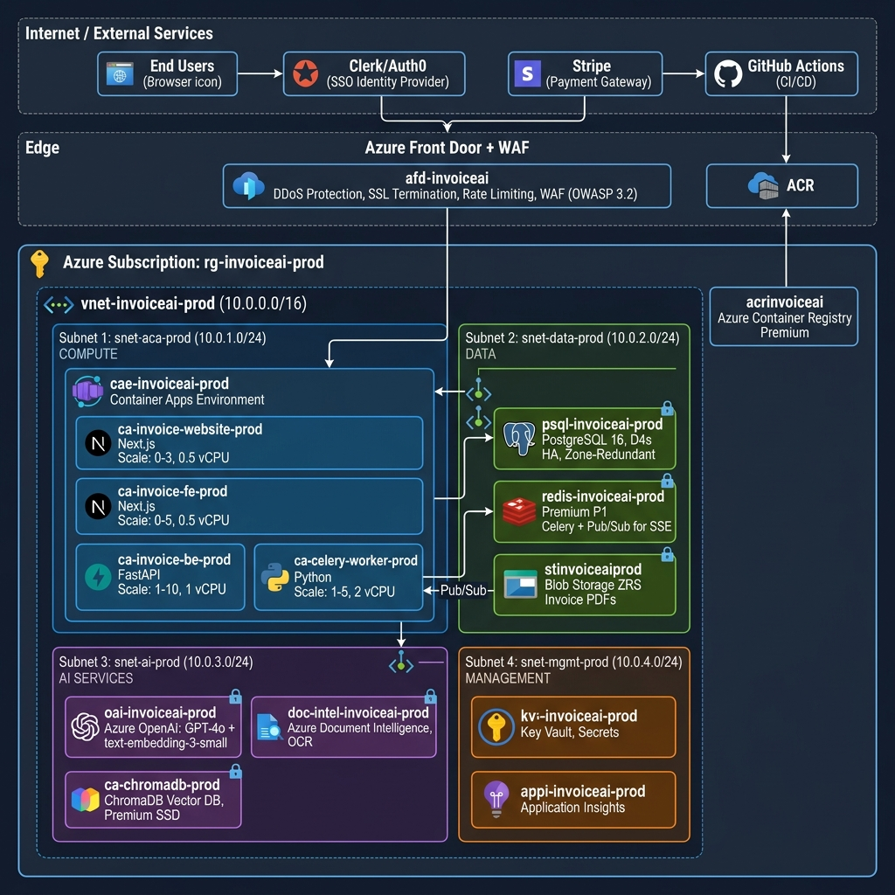
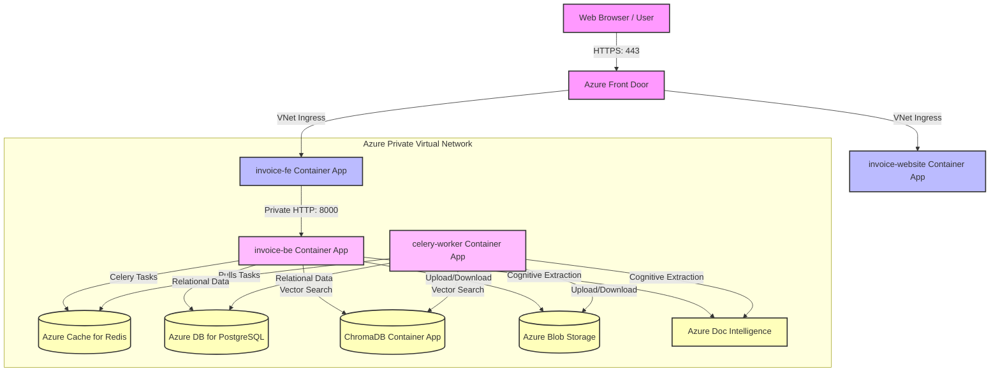

# Cloud Architecture Document



## Invoice AI SaaS Platform — Azure Cloud Infrastructure

| Attribute         | Detail                                          |
|-------------------|-------------------------------------------------|
| **Project**       | Invoice AI SaaS (Multi-Tenant LLM Platform)     |
| **Cloud Provider**| Microsoft Azure                                 |
| **IaC Tool**      | Azure Bicep / Terraform                         |
| **Version**       | 1.0                                             |
| **Date**          | 25 June 2026                                    |
| **Classification**| Internal — DevOps & Engineering Team            |

---

## Table of Contents

1. [Design Principles](#1-design-principles)
2. [Cloud Architecture Overview](#2-cloud-architecture-overview)
3. [Network Architecture (VNet & Private Endpoints)](#3-network-architecture-vnet--private-endpoints)
4. [Compute Layer (Azure Container Apps)](#4-compute-layer-azure-container-apps)
5. [Data Layer](#5-data-layer)
6. [AI & Cognitive Services](#6-ai--cognitive-services)
7. [Identity & Access Management](#7-identity--access-management)
8. [CI/CD Pipeline Architecture (GitHub Actions)](#8-cicd-pipeline-architecture-github-actions)
9. [Environment Strategy (Dev / UAT / Production)](#9-environment-strategy-dev--uat--production)
10. [Container & Registry Strategy](#10-container--registry-strategy)
11. [Monitoring & Observability](#11-monitoring--observability)
12. [Security Architecture](#12-security-architecture)
13. [Disaster Recovery & Business Continuity](#13-disaster-recovery--business-continuity)
14. [Cost Estimation & Optimization](#14-cost-estimation--optimization)
15. [Infrastructure as Code — Repository Layout](#15-infrastructure-as-code--repository-layout)
16. [Deployment Runbook](#16-deployment-runbook)
17. [DevOps Engineer Tasking (Phase 1)](#17-devops-engineer-tasking-phase-1)

---

## 1. Design Principles

The cloud architecture is governed by five non-negotiable principles derived from the project's enterprise requirements:

| #  | Principle                  | Description                                                                                          |
|----|----------------------------|------------------------------------------------------------------------------------------------------|
| 1  | **No Manual Configuration**| All infrastructure provisioned via IaC (Bicep/Terraform). Zero ad-hoc portal changes.               |
| 2  | **Environment Parity**     | Dev, UAT, and Production run identical IaC templates. Behaviour is identical across environments.     |
| 3  | **Private by Default**     | All backend services accessed via Azure Private Endpoints. Data never traverses the public internet.  |
| 4  | **Zero-Touch Deployment**  | Entire stack deployable into a new client's Azure subscription in under 15 minutes via pipeline.      |
| 5  | **Full Auditability**      | Every infrastructure change committed to Git — perfect audit trail of who changed what and when.      |

---

## 2. Cloud Architecture Overview

```
┌─────────────────────────────────────────────────────────────────────────────────────┐
│                                INTERNET / USERS                                    │
│                                                                                     │
│   ┌──────────────┐    ┌──────────────┐    ┌────────────────┐    ┌──────────────┐    │
│   │  Clerk/Auth0 │    │   Stripe     │    │  GitHub        │    │  End Users   │    │
│   │  (SSO IdP)   │    │  (Payments)  │    │  (Source/CI)   │    │  (Browser)   │    │
│   └──────┬───────┘    └──────┬───────┘    └───────┬────────┘    └──────┬───────┘    │
└──────────┼───────────────────┼────────────────────┼─────────────────────┼────────────┘
           │                   │                    │                     │
           ▼                   ▼                    ▼                     ▼
┌─────────────────────────────────────────────────────────────────────────────────────┐
│                          AZURE SUBSCRIPTION                                        │
│                                                                                     │
│  ┌───────────────────────────────────────────────────────────────────────────────┐   │
│  │                    AZURE FRONT DOOR / WAF (Layer 7)                          │   │
│  │              ┌─────────────────────────────────────────┐                     │   │
│  │              │  DDoS Protection  │  SSL Termination    │                     │   │
│  │              │  Rate Limiting    │  Geo-Filtering      │                     │   │
│  │              └─────────────────────────────────────────┘                     │   │
│  └───────────────────────────────────────┬───────────────────────────────────────┘   │
│                                          │                                          │
│  ┌───────────────────────────────────────┼───────────────────────────────────────┐   │
│  │                    VIRTUAL NETWORK (VNet)     10.0.0.0/16                     │   │
│  │                                               │                               │   │
│  │  ┌────────────────────────────────────────────┼──────────────────────────┐    │   │
│  │  │          SUBNET: aca-subnet (10.0.1.0/24)  │                          │    │   │
│  │  │                                            │                          │    │   │
│  │  │  ┌──────────────────────────────────────────────────────────────────┐  │    │   │
│  │  │  │            AZURE CONTAINER APPS ENVIRONMENT                     │  │    │   │
│  │  │  │                                                                 │  │    │   │
│  │  │  │  ┌───────────┐  ┌───────────┐  ┌───────────┐  ┌─────────────┐  │  │    │   │
│  │  │  │  │ invoice-  │  │ invoice-  │  │ invoice-  │  │  celery-    │  │  │    │   │
│  │  │  │  │ website   │  │ fe        │  │ be        │  │  worker     │  │  │    │   │
│  │  │  │  │ (Next.js) │  │ (Next.js) │  │ (FastAPI) │  │  (Python)   │  │  │    │   │
│  │  │  │  │           │  │           │  │           │  │             │  │  │    │   │
│  │  │  │  │ Scale:    │  │ Scale:    │  │ Scale:    │  │ Scale:      │  │  │    │   │
│  │  │  │  │ 0-3       │  │ 0-5       │  │ 1-10      │  │ 1-5         │  │  │    │   │
│  │  │  │  └───────────┘  └───────────┘  └───────────┘  └─────────────┘  │  │    │   │
│  │  │  └─────────────────────────────────────────────────────────────────┘  │    │   │
│  │  └──────────────────────────────────────────────────────────────────────┘    │   │
│  │                                                                              │   │
│  │  ┌──────────────────────────────────────────────────────────────────────┐    │   │
│  │  │          SUBNET: data-subnet (10.0.2.0/24)                          │    │   │
│  │  │                                                                      │    │   │
│  │  │  ┌───────────────┐  ┌───────────────┐  ┌────────────────────────┐   │    │   │
│  │  │  │ PostgreSQL    │  │ Redis Cache   │  │ Azure Blob Storage     │   │    │   │
│  │  │  │ Flexible      │  │ for Azure     │  │ (Invoice PDFs)         │   │    │   │
│  │  │  │ Server        │  │               │  │                        │   │    │   │
│  │  │  │ (Private EP)  │  │ (Private EP)  │  │ (Private EP)           │   │    │   │
│  │  │  └───────────────┘  └───────────────┘  └────────────────────────┘   │    │   │
│  │  └──────────────────────────────────────────────────────────────────────┘    │   │
│  │                                                                              │   │
│  │  ┌──────────────────────────────────────────────────────────────────────┐    │   │
│  │  │          SUBNET: ai-subnet (10.0.3.0/24)                            │    │   │
│  │  │                                                                      │    │   │
│  │  │  ┌───────────────────┐  ┌───────────────────┐  ┌────────────────┐   │    │   │
│  │  │  │ Azure OpenAI      │  │ Azure Document    │  │ ChromaDB       │   │    │   │
│  │  │  │ (GPT-4 + Embed.)  │  │ Intelligence      │  │ (Managed /     │   │    │   │
│  │  │  │                   │  │ (OCR)             │  │  Containerized)│   │    │   │
│  │  │  │ (Private EP)      │  │ (Private EP)      │  │ (Private EP)   │   │    │   │
│  │  │  └───────────────────┘  └───────────────────┘  └────────────────┘   │    │   │
│  │  └──────────────────────────────────────────────────────────────────────┘    │   │
│  └──────────────────────────────────────────────────────────────────────────────┘   │
│                                                                                     │
│  ┌──────────────────────────────────────────────────────────────────────────────┐   │
│  │                    MANAGEMENT & OBSERVABILITY                                │   │
│  │  ┌──────────────────┐  ┌──────────────────┐  ┌─────────────────────────┐    │   │
│  │  │ Azure Monitor    │  │ Log Analytics    │  │ Azure Container         │    │   │
│  │  │ + App Insights   │  │ Workspace        │  │ Registry (ACR)          │    │   │
│  │  └──────────────────┘  └──────────────────┘  └─────────────────────────┘    │   │
│  └──────────────────────────────────────────────────────────────────────────────┘   │
└─────────────────────────────────────────────────────────────────────────────────────┘
```

---

## 3. Network Architecture (VNet & Private Endpoints)

### 3.1 Virtual Network Design

| Parameter               | Value                        |
|-------------------------|------------------------------|
| **VNet Address Space**  | `10.0.0.0/16`                |
| **Region**              | (Client-specified, e.g., East US / Central India) |

### 3.2 Subnet Allocation

| Subnet Name     | CIDR Block       | Purpose                                            | NSG Rules                                   |
|-----------------|------------------|----------------------------------------------------|---------------------------------------------|
| `aca-subnet`    | `10.0.1.0/24`    | Azure Container Apps (FE, BE, Workers)              | Allow 443 inbound from Front Door only      |
| `data-subnet`   | `10.0.2.0/24`    | PostgreSQL, Redis, Blob Storage                     | Allow inbound from `aca-subnet` only        |
| `ai-subnet`     | `10.0.3.0/24`    | Azure OpenAI, Document Intelligence, ChromaDB       | Allow inbound from `aca-subnet` only        |
| `mgmt-subnet`   | `10.0.4.0/24`    | Bastion Host (emergency access), Log Analytics      | Allow inbound from admin IPs only           |

### 3.3 Private Endpoints

> **Rule**: All backend services are accessed via Azure Private Endpoints. **No service exposes a public IP.**

| Azure Service               | Private Endpoint DNS Zone                     | Connected Subnet |
|-----------------------------|-----------------------------------------------|-------------------|
| PostgreSQL Flexible Server   | `privatelink.postgres.database.azure.com`    | `data-subnet`     |
| Azure Cache for Redis        | `privatelink.redis.cache.windows.net`        | `data-subnet`     |
| Azure Blob Storage           | `privatelink.blob.core.windows.net`          | `data-subnet`     |
| Azure OpenAI                 | `privatelink.openai.azure.com`               | `ai-subnet`       |
| Azure Document Intelligence  | `privatelink.cognitiveservices.azure.com`    | `ai-subnet`       |
| Azure Container Registry     | `privatelink.azurecr.io`                     | `aca-subnet`      |

### 3.4 DNS Resolution

Private DNS Zones are linked to the VNet to resolve private endpoint FQDNs from within the network. No custom DNS servers required for baseline deployment.

---

## 4. Compute Layer (Azure Container Apps)

### 4.1 Why Azure Container Apps?

- **Scale-to-Zero** capability to meet enterprise baseline cost requirements
- Managed Kubernetes under the hood — no cluster management overhead
- Built-in HTTPS ingress, traffic splitting, and revision management
- Native Dapr integration for service-to-service invocation (future extensibility)

### 4.2 Container App Definitions

| App Name           | Source Code              | Container Image           | Min/Max Replicas | Ingress       | CPU/Memory   |
|--------------------|--------------------------|---------------------------|------------------|---------------|--------------|
| `invoice-website`  | `/apps/invoice-website`  | `acr.azurecr.io/invoice-website:latest` | 0 / 3  | External (443)| 0.5 vCPU / 1Gi |
| `invoice-fe`       | `/apps/invoice-fe`       | `acr.azurecr.io/invoice-fe:latest`      | 0 / 5  | External (443)| 0.5 vCPU / 1Gi |
| `invoice-be`       | `/apps/invoice-be`       | `acr.azurecr.io/invoice-be:latest`      | 1 / 10 | Internal (8000)| 1 vCPU / 2Gi  |
| `celery-worker`    | `/apps/invoice-be`       | `acr.azurecr.io/celery-worker:latest`   | 1 / 5  | None (worker) | 2 vCPU / 4Gi  |

### 4.3 Scaling Rules

| App               | Scaling Trigger                          | Threshold                          |
|--------------------|------------------------------------------|------------------------------------|
| `invoice-be`       | HTTP concurrent requests                 | Scale up at > 50 concurrent        |
| `celery-worker`    | Redis queue depth (`celery` queue)       | Scale up at > 10 pending tasks     |
| `invoice-fe`       | HTTP concurrent requests                 | Scale up at > 30 concurrent        |
| `invoice-website`  | HTTP concurrent requests                 | Scale to zero when idle             |

### 4.4 Environment Variables & Secrets

All secrets are stored in **Azure Key Vault** and injected into Container Apps as secret references:

| Secret Name                  | Description                          | Used By                    |
|------------------------------|--------------------------------------|----------------------------|
| `DATABASE_URL`               | PostgreSQL connection string         | `invoice-be`, `celery-worker` |
| `REDIS_URL`                  | Redis connection string              | `invoice-be`, `celery-worker` |
| `AZURE_OPENAI_API_KEY`       | OpenAI API key                       | `invoice-be`, `celery-worker` |
| `AZURE_OPENAI_ENDPOINT`      | OpenAI endpoint URL                  | `invoice-be`, `celery-worker` |
| `AZURE_STORAGE_CONNECTION`   | Blob Storage connection string       | `invoice-be`, `celery-worker` |
| `STRIPE_SECRET_KEY`          | Stripe API secret key                | `invoice-website`           |
| `STRIPE_WEBHOOK_SECRET`      | Stripe webhook signing secret        | `invoice-website`           |
| `CLERK_SECRET_KEY`           | Clerk/Auth0 backend key              | `invoice-be`, `invoice-website` |
| `NEXT_PUBLIC_CLERK_KEY`      | Clerk/Auth0 publishable key          | `invoice-fe`, `invoice-website` |
| `CHROMA_HOST`                | ChromaDB connection host             | `invoice-be`, `celery-worker` |
| `TOKEN_ENCRYPTION_KEY`       | AES-256 key for encrypting OAuth tokens | `invoice-be`, `celery-worker` |

---

## 5. Data Layer

### 5.1 PostgreSQL (Azure Database for PostgreSQL — Flexible Server)

| Parameter                | Value                                               |
|--------------------------|-----------------------------------------------------|
| **SKU**                  | Burstable B2s (Dev/UAT), General Purpose D4s (Prod) |
| **Storage**              | 128 GB (auto-grow enabled)                          |
| **Version**              | PostgreSQL 16                                       |
| **High Availability**    | Zone-redundant (Production only)                    |
| **Backup**               | Automated daily, 35-day retention                   |
| **Access**               | Private Endpoint only (no public access)            |
| **Encryption**           | TLS 1.2 in-transit, AES-256 at-rest (Microsoft-managed keys) |
| **Tenant Isolation**     | Row-level via `tenant_id` column on all tables      |

### 5.2 Azure Cache for Redis

| Parameter                | Value                                    |
|--------------------------|------------------------------------------|
| **SKU**                  | Standard C1 (Dev/UAT), Premium P1 (Prod) |
| **Use Case 1**           | Celery task broker + result backend      |
| **Use Case 2**           | **Pub/Sub channel** for SSE real-time notifications (bulk upload status) |
| **Access**               | Private Endpoint only                    |
| **Persistence**          | AOF enabled (Production)                 |
| **Eviction Policy**      | `volatile-lru`                           |

> **SSE Integration**: When Celery workers finish processing an invoice, they publish a completion event to a Redis Pub/Sub channel (`batch:{batch_id}`). The FastAPI SSE endpoint subscribes to this channel and streams events to the browser in real-time. This avoids excessive polling when users upload 50–100 PDFs in bulk.

### 5.3 Azure Blob Storage

| Parameter                | Value                                         |
|--------------------------|-----------------------------------------------|
| **Account Type**         | StorageV2, LRS (Dev/UAT), ZRS (Prod)          |
| **Access Tier**          | Hot (active invoices), Cool (archived, >90 days) |
| **Container Structure**  | `invoices/{tenant_id}/{invoice_id}/file.pdf`   |
| **Access**               | Private Endpoint only (no public access)       |
| **Encryption**           | AES-256 at-rest (Microsoft-managed keys)       |
| **Lifecycle Policy**     | Move to Cool tier after 90 days, delete after 2 years |
| **Soft Delete**          | 14-day retention for accidental deletion recovery |

### 5.4 ChromaDB (Vector Database)

| Parameter                | Value                                           |
|--------------------------|-------------------------------------------------|
| **Deployment**           | Containerized within Azure Container Apps        |
| **Persistence**          | Backed by Azure Managed Disk (Premium SSD)       |
| **Access**               | Internal ingress only (`ai-subnet`)              |
| **Tenant Isolation**     | Metadata-level filtering (`tenant_id` on every vector chunk) |

---

## 6. AI & Cognitive Services

### 6.1 Azure OpenAI Service

| Parameter                | Value                                    |
|--------------------------|------------------------------------------|
| **Models Deployed**      | `gpt-4o` (inference only)                |
| **Region**               | Same region as primary deployment        |
| **Access**               | Private Endpoint only                    |
| **Rate Limiting**        | Per-model TPM (tokens per minute) quotas |
| **Content Filtering**    | Default Azure content safety filters     |
| **Data Privacy**         | Opt-out of abuse monitoring (enterprise) — **No data used for model training** |

### 6.2 Azure AI Document Intelligence (Form Recognizer)

| Parameter                | Value                                    |
|--------------------------|------------------------------------------|
| **Model**                | Prebuilt Invoice model (`prebuilt-invoice`) |
| **Use Case**             | PDF → structured text extraction (OCR)   |
| **Access**               | Private Endpoint only                    |
| **SKU**                  | S0 (Standard)                            |

### 6.3 Data Flow Through AI Services

```
PDF Upload → Blob Storage
                │
                ▼
     Azure Document Intelligence
     (OCR → Raw Structured Text)
                │
                ▼
     Azure OpenAI (GPT-4)
     Extraction Agent (JSON Schema & Verification)
                │
                ▼
     Local Hugging Face (BAAI/bge-m3)
     Semantic Chunking & Vectorization
                │
                ▼
     ChromaDB (Private endpoint vector store)
                │
                ▼
     PostgreSQL (status update)
```

---

## 7. Identity & Access Management

### 7.1 Developer & Pipeline Access

| Principal Type        | Authentication Method             | Access Scope                                    |
|----------------------|-----------------------------------|-------------------------------------------------|
| **Developers**       | Azure AD + Service Principal      | Read-only on Dev resource group, no Prod access  |
| **CI/CD Pipeline**   | Service Principal (GitHub Secret)  | Scoped to specific resource group per environment|
| **DevOps Engineer**  | Azure AD (Privileged Identity)    | Full access to all environments (with PIM elevation) |

> **Rule**: No root/admin password access is permitted for individual developers. All access via Service Principals with least-privilege scoping.

### 7.2 Application-Level Identity

| Service                | Identity Mechanism                        |
|------------------------|--------------------------------------------|
| Container Apps → PostgreSQL | Managed Identity (passwordless)       |
| Container Apps → Blob Storage | Managed Identity (RBAC: Storage Blob Data Contributor) |
| Container Apps → Azure OpenAI | API Key (stored in Key Vault)       |
| Container Apps → Redis  | Access Key (stored in Key Vault)          |
| Users → Application    | Clerk/Auth0 JWT (SSO with Google/Microsoft)|

### 7.3 Role-Based Access Control (Azure RBAC)

| Azure Role                       | Assigned To              | Scope              |
|----------------------------------|--------------------------|---------------------|
| `Contributor`                    | CI/CD Service Principal  | Resource Group      |
| `AcrPush`                        | CI/CD Service Principal  | Container Registry  |
| `Storage Blob Data Contributor`  | Container App MI         | Storage Account     |
| `Cognitive Services User`        | Container App MI         | OpenAI Resource     |
| `Reader`                         | Developers               | Dev Resource Group  |
| `Key Vault Secrets User`         | Container App MI         | Key Vault           |

---

## 8. CI/CD Pipeline Architecture (GitHub Actions)

### 8.1 Pipeline Overview

```
┌─────────────────────────────────────────────────────────────────────────┐
│                      GITHUB ACTIONS CI/CD PIPELINE                     │
│                                                                         │
│  ┌─────────────────────────────────────────────────────────────────┐    │
│  │  STAGE 1: BUILD & TEST                                          │    │
│  │                                                                 │    │
│  │  ┌──────────┐  ┌──────────┐  ┌──────────┐  ┌──────────────┐   │    │
│  │  │ Lint     │  │ Unit     │  │ Type     │  │ Security     │   │    │
│  │  │ (ESLint/ │  │ Tests    │  │ Check    │  │ Scan         │   │    │
│  │  │  Ruff)   │  │ (pytest/ │  │ (tsc/    │  │ (Trivy/      │   │    │
│  │  │          │  │  vitest) │  │  mypy)   │  │  Snyk)       │   │    │
│  │  └──────────┘  └──────────┘  └──────────┘  └──────────────┘   │    │
│  └─────────────────────────────────────────────────────────────────┘    │
│                              │ Pass                                     │
│                              ▼                                          │
│  ┌─────────────────────────────────────────────────────────────────┐    │
│  │  STAGE 2: CONTAINERIZE                                          │    │
│  │                                                                 │    │
│  │  ┌──────────────────┐  ┌──────────────────────────────────┐    │    │
│  │  │ Docker Build     │  │ Push to Azure Container Registry │    │    │
│  │  │ (Multi-stage)    │  │ (invoice-be:v1.x, invoice-fe:v1.x)│   │    │
│  │  └──────────────────┘  └──────────────────────────────────┘    │    │
│  └─────────────────────────────────────────────────────────────────┘    │
│                              │ Pass                                     │
│                              ▼                                          │
│  ┌─────────────────────────────────────────────────────────────────┐    │
│  │  STAGE 3: INFRASTRUCTURE VALIDATION                             │    │
│  │                                                                 │    │
│  │  ┌──────────────────┐  ┌──────────────────────────────────┐    │    │
│  │  │ bicep validate   │  │ terraform plan                   │    │    │
│  │  │ (syntax check)   │  │ (drift detection)                │    │    │
│  │  └──────────────────┘  └──────────────────────────────────┘    │    │
│  └─────────────────────────────────────────────────────────────────┘    │
│                              │ Pass                                     │
│                              ▼                                          │
│  ┌─────────────────────────────────────────────────────────────────┐    │
│  │  STAGE 4: DEPLOY                                                │    │
│  │                                                                 │    │
│  │  ┌──────────────────────┐    ┌─────────────────────────────┐   │    │
│  │  │  UAT (Auto)          │    │  PRODUCTION (Manual Gate)   │   │    │
│  │  │  Trigger: merge to   │    │  Trigger: merge to main     │   │    │
│  │  │  uat branch          │    │  Requires: DevOps approval  │   │    │
│  │  └──────────────────────┘    └─────────────────────────────┘   │    │
│  └─────────────────────────────────────────────────────────────────┘    │
└─────────────────────────────────────────────────────────────────────────┘
```

### 8.2 Pipeline Stages Detail

| Stage                         | Trigger                             | Actions                                                    |
|-------------------------------|--------------------------------------|------------------------------------------------------------|
| **Build & Test**              | Every push / PR                      | Lint, unit tests, type checks, security scan               |
| **Containerize**              | On successful build                  | Docker multi-stage build, push tagged images to ACR         |
| **Infrastructure Validation** | When `/bicep` or `/infra` files change| `bicep validate` / `terraform plan` for compliance          |
| **Deploy to UAT**             | Merge to `uat` branch                | Auto-deploy all container apps to UAT environment           |
| **Deploy to Production**      | Merge to `main` branch               | Manual approval by DevOps engineer, then auto-deploy        |

### 8.3 Image Tagging Strategy

```
acr.azurecr.io/invoice-be:latest        ← Always points to latest build
acr.azurecr.io/invoice-be:v1.0.0        ← Semantic version (Production)
acr.azurecr.io/invoice-be:sha-abc123    ← Git commit SHA (traceability)
acr.azurecr.io/invoice-be:uat           ← Current UAT revision
```

---

## 9. Environment Strategy (Dev / UAT / Production)

### 9.1 Environment Separation

| Aspect                  | Development                | UAT                        | Production                 |
|-------------------------|----------------------------|----------------------------|----------------------------|
| **Azure Resource Group**| `rg-invoiceai-dev`         | `rg-invoiceai-uat`         | `rg-invoiceai-prod`        |
| **Subscription**        | Shared dev subscription    | Shared dev subscription    | Client's own subscription  |
| **IaC Templates**       | Same Bicep/Terraform       | Same Bicep/Terraform       | Same Bicep/Terraform       |
| **PostgreSQL SKU**      | Burstable B2s              | Burstable B2s              | General Purpose D4s (HA)   |
| **Redis SKU**           | Standard C1                | Standard C1                | Premium P1                 |
| **Blob Redundancy**     | LRS                        | LRS                        | ZRS                        |
| **Min Replicas**        | 0 (scale-to-zero)          | 0 (scale-to-zero)          | 1 (always-on)              |
| **Access Control**      | Developers (Reader)        | DevOps (Contributor)       | DevOps only (Contributor)  |
| **Deployment Trigger**  | Manual / feature branch    | Auto on merge to `uat`     | Manual gate on merge to `main` |

### 9.2 Environment Parity Enforcement

> **Rule**: The same Bicep/Terraform files used for Dev **must** be used for Production. This ensures "Environment Parity" — the system behaves exactly the same way in the client's cloud as it does in the test environment.

Parameters that differ between environments are externalized into `.env` files and parameter files (`params.dev.json`, `params.uat.json`, `params.prod.json`).

---

## 10. Container & Registry Strategy

### 10.1 Azure Container Registry (ACR)

| Parameter                | Value                                 |
|--------------------------|---------------------------------------|
| **SKU**                  | Premium (geo-replication for Prod)    |
| **Access**               | Private Endpoint                      |
| **Admin User**           | Disabled (use Service Principal)      |
| **Vulnerability Scanning**| Microsoft Defender for Containers    |
| **Retention Policy**     | Keep last 30 tagged images per repo   |

### 10.2 Docker Images Architecture

We maintain separate `Dockerfiles` inside the `/docker` directory to containerize our stateless app layers. 

| Image Name           | Dockerfile Location          | Base Image            | Build Stage & Rationale |
|----------------------|------------------------------|-----------------------|-------------------------|
| `invoice-website`    | `/docker/Dockerfile.website` | `node:20-alpine`      | **Multi-stage**: Builds static assets and serves the Next.js marketing website. |
| `invoice-fe`         | `/docker/Dockerfile.fe`      | `node:20-alpine`      | **Multi-stage**: Builds the frontend dashboard client, optimizing file size. |
| `invoice-be`         | `/docker/Dockerfile.be`      | `python:3.12-slim`    | **Multi-stage**: Installs python environment using `uv` and runs the FastAPI API. |
| `celery-worker`      | `/docker/Dockerfile.worker`  | `python:3.12-slim`    | **Shared Image**: Reuses the `invoice-be` environment, overriding the startup command to launch the Celery task consumer (`celery -A workers.tasks worker`). |

#### Why separate Dockerfiles?
1. **Isolation of Concerns**: The website, frontend, and backend use different runtimes (Node.js vs. Python). 
2. **Security**: Keeping the backend dependencies separate from frontend UI assets minimizes the attack surface area of the individual containers.
3. **Optimized Scaling**: Azure Container Apps scales each container independently. For example, `celery-worker` can scale up to 5 instances under heavy background jobs without duplicating memory footprints of the web frontends.

---

### 10.3 CD YAML Workflow Mapping

The CD process is managed by GitHub Actions `.yml` workflow files (such as `.github/workflows/deploy-uat.yml`). Here is how the pipeline knows where to route and place each container:

1. **Building & Tagging**:
   * The CD `.yml` file triggers on merges to target branches (`uat` or `main`).
   * It logs into the Azure Container Registry (ACR) using a Service Principal.
   * It builds all 3 Dockerfiles in parallel and tags them with the git commit SHA:
     ```bash
     docker build -f docker/Dockerfile.be -t acr.azurecr.io/invoice-be:sha-123456 .
     docker push acr.azurecr.io/invoice-be:sha-123456
     ```
2. **Infrastructure Deployment & Mapping**:
   * The workflow uses the **`Azure/arm-deploy`** action to run the Bicep template ([infra/main.bicep](file:///c:/Users/S%20Banerjee/Desktop/Invoice_LLM/Prod_Invoice_LLM/infra/main.bicep)).
   * It passes parameters containing the newly pushed image tags (e.g. `backendImageTag=sha-123456`).
3. **Container Placement & Ingress Rules**:
   * The Bicep template defines individual **Azure Container Apps** and applies specific network ingress bindings:
     * **`invoice-website` & `invoice-fe`**: Deployed with `ingress.external = true` (exposed to port 443 via Front Door).
     * **`invoice-be`**: Deployed with `ingress.external = false` and `ingress.targetPort = 8000`. This locks the API inside the VNet, making it accessible only to the frontend.
     * **`celery-worker`**: Deployed with `ingress = null` (no ports open). It pulls tasks from Redis, making ingress unnecessary.

---

### 10.4 Production Network Connection Topology

The diagram below visualizes how the containers connect to each other and the data layer within the private Azure Virtual Network (VNet):



---

### 10.5 Step-by-Step Azure Portal click-through setup (1st Time Provisioning)

Before automating deployments with Bicep, you can provision the cloud workspace manually through the Azure Portal:

#### Step 1: Create the Resource Group
1. Navigate to the **Azure Portal**.
2. Click **Resource Groups** $\rightarrow$ **+ Create**.
3. Choose your Subscription. Enter Resource Group name: `rg-invoiceai-prod` (or `rg-invoiceai-uat`).
4. Select region (e.g. `East US 2`). Click **Review + create** $\rightarrow$ **Create**.

#### Step 2: Create Azure Container Registry (ACR)
1. In the search bar, search for **Container Registries** $\rightarrow$ **+ Create**.
2. Set Resource Group to `rg-invoiceai-prod`. Registry name: `acrinvoiceaiprod`.
3. Choose SKU: **Premium** (required for Private Endpoints).
4. Select **Networking** tab $\rightarrow$ Set Connectivity to **Private Endpoint**.
5. Click **Review + create** $\rightarrow$ **Create**.

#### Step 3: Create the Virtual Network (VNet)
1. Search for **Virtual Networks** $\rightarrow$ **+ Create**.
2. Use Resource Group `rg-invoiceai-prod`. VNet name: `vnet-invoiceai-prod`.
3. Under **IP Addresses**:
   * Address space: `10.0.0.0/16`
   * Add Subnet: `snet-aca` (Range: `10.0.1.0/24`) $\rightarrow$ delegate to **Azure Container Apps**.
   * Add Subnet: `snet-pe` (Range: `10.0.2.0/24`) $\rightarrow$ for Private Endpoints (Postgres, Redis, Storage).
4. Click **Review + create** $\rightarrow$ **Create**.

#### Step 4: Create the Managed Databases & Storage
* **Azure Database for PostgreSQL (Flexible Server)**:
  1. Search for **Azure Database for PostgreSQL** $\rightarrow$ **+ Create** $\rightarrow$ Select **Flexible Server**.
  2. Server name: `db-invoiceai-prod`. Configure Compute: **General Purpose D4s**.
  3. Under **Networking**: Select **Private Access** $\rightarrow$ Associate with `vnet-invoiceai-prod` and subnet `snet-pe`.
  4. Click **Review + create** $\rightarrow$ **Create**.
* **Azure Cache for Redis**:
  1. Search for **Azure Cache for Redis** $\rightarrow$ **+ Create**.
  2. DNS Name: `redis-invoiceai-prod`. SKU: **Premium P1**.
  3. Under **Networking**: Set Connectivity to **Private Endpoint** and attach to subnet `snet-pe`.
  4. Click **Review + create** $\rightarrow$ **Create**.
* **Azure Blob Storage Account**:
  1. Search for **Storage Accounts** $\rightarrow$ **+ Create**.
  2. Name: `stinvoiceaiprod`. SKU: **Standard LRS**.
  3. Under **Networking**: Disable public access. Set up a **Private Endpoint** linking blob service to subnet `snet-pe`.
  4. Click **Review + create** $\rightarrow$ **Create**.

#### Step 5: Provision the Azure Container Apps (ACA) Environment
1. Search for **Container Apps** $\rightarrow$ **+ Create**.
2. Resource Group: `rg-invoiceai-prod`. App name: `ca-invoice-be-prod`.
3. Under **Container Apps Environment**: Click **Create new**.
4. In the Environment creation wizard:
   * **Networking** tab $\rightarrow$ Set **Virtual Network** to `vnet-invoiceai-prod` $\rightarrow$ Associate with subnet `snet-aca`.
   * Set **Virtual IP** to **Internal** (for backend VNet encapsulation).
5. Click **Create** to provision the environment.
6. Once the environment is ready, deploy the backend (`invoice-be`), frontend (`invoice-fe`), website (`invoice-website`), and ChromaDB containers into it, passing the respective container images built during GitHub actions.

---


---

## 11. Monitoring & Observability

### 11.1 Tooling Stack

| Tool                        | Purpose                                          |
|-----------------------------|--------------------------------------------------|
| **Azure Monitor**           | Infrastructure metrics, alerts                    |
| **Application Insights**    | Application-level telemetry (request traces, exceptions) |
| **Log Analytics Workspace** | Centralized log aggregation & KQL queries         |
| **Azure Dashboard**         | Custom operational dashboard                      |

### 11.2 Alert Configuration

| Alert                                | Severity | Threshold                          | Notification          |
|--------------------------------------|----------|------------------------------------|-----------------------|
| High error rate (FastAPI 5xx)         | Sev 1    | > 5% of requests in 5 min window  | Email + Teams webhook |
| High error rate (Celery worker)       | Sev 1    | > 3 task failures in 10 min       | Email + Teams webhook |
| Anomalous DB connection spikes        | Sev 2    | > 80% connection pool utilization  | Email                 |
| VNet security group violations        | Sev 1    | Any denied flow log               | Email + Teams webhook |
| Container App restart loop            | Sev 1    | > 3 restarts in 5 minutes         | Email + Teams webhook |
| Redis memory utilization              | Sev 2    | > 80% used memory                 | Email                 |
| Blob storage egress anomaly           | Sev 3    | > 2x baseline daily egress        | Email                 |

### 11.3 DevOps Weekly Status Report

The DevOps engineer produces a weekly report covering:

| Metric                                | Target                      |
|---------------------------------------|-----------------------------|
| Successful deployments                 | Track trend                 |
| Pipeline build failure rate            | < 5%                        |
| Infrastructure drift detection         | Zero unplanned changes      |
| Security audit findings                | Zero critical/high          |
| Service uptime (Container Apps)        | > 99.5%                     |

### 11.4 Observability Dashboard Panels

```
┌─────────────────────────────────────────────────────────────────┐
│                   OPERATIONS DASHBOARD                          │
│                                                                 │
│  ┌──────────────┐  ┌──────────────┐  ┌──────────────────────┐  │
│  │ Container    │  │ API Latency  │  │ Celery Queue Depth   │  │
│  │ Health (FE/  │  │ P50/P95/P99  │  │ (Pending/Active/     │  │
│  │ BE/Worker)   │  │              │  │  Failed)             │  │
│  └──────────────┘  └──────────────┘  └──────────────────────┘  │
│                                                                 │
│  ┌──────────────┐  ┌──────────────┐  ┌──────────────────────┐  │
│  │ DB Connection│  │ Redis Memory │  │ Blob Storage          │  │
│  │ Pool Usage   │  │ + Hit Rate   │  │ Ingress/Egress       │  │
│  └──────────────┘  └──────────────┘  └──────────────────────┘  │
│                                                                 │
│  ┌──────────────┐  ┌──────────────┐  ┌──────────────────────┐  │
│  │ OpenAI Token │  │ Doc Intel    │  │ Error Rate            │  │
│  │ Usage (TPM)  │  │ API Calls    │  │ (4xx / 5xx)          │  │
│  └──────────────┘  └──────────────┘  └──────────────────────┘  │
└─────────────────────────────────────────────────────────────────┘
```

---

## 12. Security Architecture

### 12.1 Security Layers

```
Layer 1: NETWORK          Azure Front Door + WAF → DDoS protection, geo-filtering
Layer 2: NETWORK          VNet + NSGs → subnet-level traffic control
Layer 3: NETWORK          Private Endpoints → no public IP on any backend service
Layer 4: TRANSPORT        TLS 1.2+ enforced on all connections
Layer 5: IDENTITY         Service Principals + Managed Identities (no passwords)
Layer 6: APPLICATION      JWT validation (Clerk/Auth0) on every API request
Layer 7: DATA             tenant_id enforcement → row-level data isolation
Layer 8: ENCRYPTION       AES-256 at-rest, TLS in-transit
Layer 9: AUDIT            Git-tracked IaC changes, Azure Activity Log
```

### 12.2 Key Security Controls

| Control                          | Implementation                                                 |
|----------------------------------|----------------------------------------------------------------|
| **DDoS Protection**             | Azure Front Door (L7) + Azure DDoS Protection Standard        |
| **WAF**                         | Azure Web Application Firewall (OWASP 3.2 ruleset)            |
| **Network Isolation**           | VNet + Private Endpoints on all data/AI services               |
| **No Public IPs**               | All backend services accessible only within VNet               |
| **Secrets Management**          | Azure Key Vault (no secrets in code or env files)              |
| **Identity**                    | Managed Identities for service-to-service, no passwords       |
| **SSL/TLS**                     | Enforced TLS 1.2+ on all endpoints                            |
| **Data Isolation**              | `tenant_id` on every DB table, vector chunk, and blob path    |
| **No Data Training Guarantee**  | Azure OpenAI enterprise terms — client data never used for model training |
| **Audit Trail**                 | All infra changes in Git, all API actions in `audit_logs` table |
| **Container Scanning**          | Microsoft Defender for Containers on ACR                       |
| **Dependency Scanning**         | GitHub Dependabot + Snyk integration                           |

### 12.3 Data Sovereignty

- All data resides in the client-specified Azure region
- Private Endpoints ensure data traffic never leaves the VNet boundary
- No cross-region data replication without explicit client consent
- Azure OpenAI configured with "opt-out" of abuse monitoring (enterprise tier)

---

## 13. Disaster Recovery & Business Continuity

### 13.1 RPO/RTO Targets

| Component          | RPO (Recovery Point)  | RTO (Recovery Time)   |
|--------------------|-----------------------|-----------------------|
| PostgreSQL         | < 5 minutes (WAL)     | < 30 minutes (HA)     |
| Blob Storage       | 0 (ZRS, synchronous)  | < 15 minutes          |
| Redis              | < 1 minute (AOF)      | < 10 minutes          |
| Container Apps     | N/A (stateless)       | < 5 minutes (re-deploy) |
| ChromaDB           | < 1 hour (disk snapshot) | < 30 minutes       |

### 13.2 Backup Strategy

| Resource                  | Method                               | Retention          | Frequency       |
|---------------------------|--------------------------------------|--------------------|-----------------|
| PostgreSQL                | Azure Automated Backup               | 35 days            | Daily + continuous WAL |
| Blob Storage              | Soft Delete + Versioning             | 14 days            | Continuous      |
| Redis                     | AOF Persistence + Snapshots          | 7 days             | Every 1 hour    |
| ChromaDB                  | Azure Managed Disk Snapshots          | 14 days            | Daily           |
| IaC State                 | Git repository                        | Infinite           | Every commit    |
| Container Images          | ACR with retention policy             | 30 tagged images   | Per build       |

### 13.3 Recovery Procedures

| Scenario                        | Procedure                                                              |
|----------------------------------|------------------------------------------------------------------------|
| **Database corruption**         | Restore from point-in-time backup (Azure automated)                    |
| **Region outage**               | Re-deploy full stack to secondary region via IaC pipeline              |
| **Accidental blob deletion**    | Recover from soft delete (14-day window)                               |
| **Container crash loop**        | Automatic rollback to previous healthy revision                        |
| **Full environment rebuild**    | Run IaC pipeline against a new resource group (< 15 minutes)           |

---

## 14. Cost Estimation & Optimization

### 14.1 Monthly Cost Estimate (Per Environment)

| Resource                          | Dev/UAT (Approx.)    | Production (Approx.) |
|-----------------------------------|----------------------|----------------------|
| Azure Container Apps (4 apps)     | $50 – $100           | $200 – $500          |
| PostgreSQL Flexible Server        | $30 (B2s)            | $250 (D4s HA)        |
| Azure Cache for Redis             | $25 (Standard C1)    | $250 (Premium P1)    |
| Azure Blob Storage                | $5 – $10             | $20 – $50            |
| Azure OpenAI (GPT-4 + Embeddings) | $50 – $150           | $200 – $800          |
| Azure Document Intelligence       | $10 – $30            | $50 – $200           |
| Azure Container Registry          | $5 (Basic)           | $50 (Premium)        |
| Azure Monitor + Log Analytics     | $10 – $20            | $50 – $100           |
| Azure Front Door + WAF            | —                    | $50 – $100           |
| Azure Key Vault                   | $1                   | $5                   |
| **Estimated Total**               | **$186 – $366**      | **$1,125 – $2,055**  |

### 14.2 Cost Optimization Strategies

| Strategy                                     | Savings Impact    |
|----------------------------------------------|-------------------|
| **Scale-to-Zero** on non-production container apps | 40-60% on compute |
| **Reserved Instances** for PostgreSQL (1-year) | 30-40% on database |
| **Cool storage tier** for invoices > 90 days   | 50% on storage    |
| **Lifecycle policies** to auto-delete old blobs | Ongoing reduction |
| **Token budgets** on Azure OpenAI per tenant   | Prevents overrun  |
| **Burstable SKUs** for Dev/UAT databases       | 60-70% vs GP tier |

### 14.3 Team Licensing Costs

| Item                          | Monthly Cost              |
|-------------------------------|---------------------------|
| Cursor IDE (5 developers)     | $100 USD (~₹8,400)       |
| GitHub Teams / Enterprise     | $20 – $40 USD             |
| Clerk/Auth0 (Developer Plan)  | $0 – $25 USD              |
| Stripe (per-transaction)      | 2.9% + $0.30 per charge  |

---

## 15. Infrastructure as Code — Repository Layout

```
/bicep (or /infra)
├── main.bicep                    # Orchestrator — deploys all modules
├── params.dev.json               # Environment-specific parameters (Dev)
├── params.uat.json               # Environment-specific parameters (UAT)
├── params.prod.json              # Environment-specific parameters (Production)
│
├── modules/
│   ├── network/
│   │   ├── vnet.bicep            # VNet + Subnet definitions
│   │   ├── nsg.bicep             # Network Security Groups
│   │   └── private-endpoints.bicep # All Private Endpoint configs
│   │
│   ├── compute/
│   │   ├── container-env.bicep   # Container Apps Environment
│   │   ├── invoice-website.bicep # Website Container App
│   │   ├── invoice-fe.bicep      # Frontend Container App
│   │   ├── invoice-be.bicep      # Backend Container App
│   │   └── celery-worker.bicep   # Worker Container App
│   │
│   ├── data/
│   │   ├── postgresql.bicep      # PostgreSQL Flexible Server
│   │   ├── redis.bicep           # Azure Cache for Redis
│   │   ├── storage.bicep         # Blob Storage Account
│   │   └── chromadb.bicep        # ChromaDB Container App
│   │
│   ├── ai/
│   │   ├── openai.bicep          # Azure OpenAI account + model deployments
│   │   └── doc-intelligence.bicep# Azure Document Intelligence
│   │
│   ├── security/
│   │   ├── keyvault.bicep        # Key Vault + secrets
│   │   ├── managed-identities.bicep # System/user-assigned MIs
│   │   └── rbac-assignments.bicep   # Role assignments
│   │
│   └── monitoring/
│       ├── log-analytics.bicep   # Log Analytics Workspace
│       ├── app-insights.bicep    # Application Insights
│       ├── alerts.bicep          # Alert rules
│       └── dashboard.bicep       # Azure Dashboard definition
│
└── scripts/
    ├── deploy.sh                 # Deployment helper script
    └── seed-keyvault.sh          # Initial secret seeding
```

---

## 16. Deployment Runbook

### 16.1 New Client Onboarding (< 15 Minutes)

```
Step 1:  Create new Azure Resource Group in client's subscription
         └── az group create --name rg-invoiceai-{client} --location {region}

Step 2:  Create Service Principal for CI/CD
         └── az ad sp create-for-rbac --name sp-invoiceai-{client}

Step 3:  Configure GitHub Secrets
         └── AZURE_CLIENT_ID, AZURE_TENANT_ID, AZURE_SUBSCRIPTION_ID

Step 4:  Run IaC deployment
         └── az deployment group create \
               --resource-group rg-invoiceai-{client} \
               --template-file main.bicep \
               --parameters params.prod.json

Step 5:  Seed Key Vault with initial secrets
         └── ./scripts/seed-keyvault.sh {client}

Step 6:  Trigger CI/CD pipeline to deploy container apps
         └── Merge to main branch with production tag

Step 7:  Configure DNS (CNAME to Azure Front Door)
         └── {client}.yourinvoiceai.com → Front Door endpoint

Step 8:  Verify health endpoints
         └── curl https://{client}.yourinvoiceai.com/api/health
```

### 16.2 Routine Deployment

| Step | Action                                    | Who              | When                            |
|------|-------------------------------------------|------------------|---------------------------------|
| 1    | Developer pushes feature branch            | Any developer    | Anytime                         |
| 2    | Pipeline runs build + test                 | Automated        | On every push                   |
| 3    | Developer creates PR to `develop`          | Developer        | When feature is complete        |
| 4    | Peer reviews and approves PR               | Another developer| Within 24 hours                 |
| 5    | DevOps merges `develop` → `uat`            | DevOps engineer  | After integration review        |
| 6    | Pipeline auto-deploys to UAT               | Automated        | On merge to `uat`               |
| 7    | UAT sign-off                               | Product/QA       | After testing                   |
| 8    | DevOps merges `uat` → `main`               | DevOps engineer  | After UAT sign-off              |
| 9    | Pipeline deploys to Production (with gate) | Automated + Gate | On merge to `main` + approval   |

---

## 17. DevOps Engineer Tasking (Phase 1)

The following tasks should be assigned to the DevOps engineer to kick off the cloud infrastructure setup:

### Task 1: Repository & IaC Structure
> "Configure the `/infra` directory. Implement Bicep modules for the VNet, PostgreSQL, Blob Storage, and Azure Container Apps."

### Task 2: Container Registry
> "Set up the private Azure Container Registry (ACR). Ensure the CI/CD pipeline correctly handles Docker image versioning (e.g., `invoice-be:latest` vs `invoice-be:v1.0.0`)."

### Task 3: Security Gate
> "Implement the Service Principal credentials for GitHub Actions. Ensure no developer has direct access to the Production Resource Group secrets."

### Task 4: Observability
> "Set up Azure Monitor and Log Analytics. Create a dashboard that shows the health of the container apps and the queue depth of the Redis/Celery background workers."

### Task 5: UAT Gate
> "Define the approval policy for the UAT and Production environments in GitHub. No code reaches UAT without a PR review, and no code reaches Production without your sign-off."

### Task 6: Key Vault & Secrets
> "Provision Azure Key Vault. Migrate all environment variables (database URLs, API keys, Stripe secrets) to Key Vault references. Ensure Container Apps pull secrets from Key Vault at runtime."

---

## Appendix A: Azure Resource Naming Convention

| Resource Type            | Naming Pattern                         | Example                        |
|--------------------------|----------------------------------------|--------------------------------|
| Resource Group           | `rg-invoiceai-{env}`                   | `rg-invoiceai-prod`           |
| VNet                     | `vnet-invoiceai-{env}`                 | `vnet-invoiceai-prod`         |
| Subnet                   | `snet-{purpose}-{env}`                 | `snet-aca-prod`               |
| Container App Env        | `cae-invoiceai-{env}`                  | `cae-invoiceai-prod`          |
| Container App            | `ca-{service}-{env}`                   | `ca-invoice-be-prod`          |
| PostgreSQL               | `psql-invoiceai-{env}`                 | `psql-invoiceai-prod`         |
| Redis                    | `redis-invoiceai-{env}`                | `redis-invoiceai-prod`        |
| Storage Account          | `stinvoiceai{env}`                     | `stinvoiceaiprod`             |
| Key Vault                | `kv-invoiceai-{env}`                   | `kv-invoiceai-prod`           |
| Container Registry       | `acrinvoiceai`                         | `acrinvoiceai`                |
| Log Analytics            | `log-invoiceai-{env}`                  | `log-invoiceai-prod`          |
| App Insights             | `appi-invoiceai-{env}`                 | `appi-invoiceai-prod`         |
| OpenAI                   | `oai-invoiceai-{env}`                  | `oai-invoiceai-prod`          |
| Front Door               | `afd-invoiceai`                        | `afd-invoiceai`               |

---

## Appendix B: Environment Variables Reference

| Variable                           | Service(s)                | Source              |
|------------------------------------|---------------------------|---------------------|
| `DATABASE_URL`                     | BE, Worker                | Key Vault           |
| `REDIS_URL`                        | BE, Worker                | Key Vault           |
| `AZURE_OPENAI_API_KEY`             | BE, Worker                | Key Vault           |
| `AZURE_OPENAI_ENDPOINT`            | BE, Worker                | Key Vault           |
| `AZURE_STORAGE_CONNECTION_STRING`  | BE, Worker                | Key Vault           |
| `CHROMA_HOST`                      | BE, Worker                | App Setting         |
| `CHROMA_PORT`                      | BE, Worker                | App Setting         |
| `STRIPE_SECRET_KEY`                | Website                   | Key Vault           |
| `STRIPE_WEBHOOK_SECRET`            | Website                   | Key Vault           |
| `NEXT_PUBLIC_CLERK_PUBLISHABLE_KEY`| FE, Website               | App Setting         |
| `CLERK_SECRET_KEY`                 | BE, Website               | Key Vault           |
| `BACKEND_API_URL`                  | FE (server-only, no `NEXT_PUBLIC_` prefix) | App Setting |
| `CELERY_BROKER_URL`                | Worker                    | Key Vault (= REDIS_URL) |
| `CELERY_RESULT_BACKEND`            | Worker                    | Key Vault (= REDIS_URL) |
| `AZURE_DOC_INTEL_ENDPOINT`         | Worker                    | Key Vault           |
| `AZURE_DOC_INTEL_KEY`              | Worker                    | Key Vault           |
