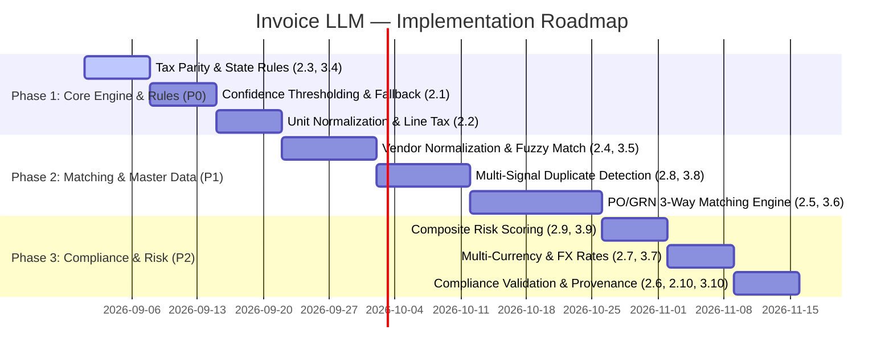

# Invoice LLM — Core Extraction & Chat-Agent Capabilities Roadmap

Consolidated evaluation and implementation roadmap for Core Extraction Features and Chat-Agent Capabilities.

---

## 1. Executive Summary

This document synthesizes two major capability tracks evaluated against the live `Invoice_LLM` system:
1. **Part 1: 10 Core Extraction & Pipeline Processing Capabilities**
2. **Part 2: 10 Chat-Agent Interaction & UI Capabilities**

For every item, this document outlines the **Implementation Steps**, **Measurable Acceptance Criteria**, **Current Code Base Status**, and **Missing Functional Logic**.

---

## 2. Part 1: Core Invoice Processing & Extraction Capabilities

### 2.1 Layout-aware OCR with per-field confidence scores and fallback routing
* **Implementation Steps:** Integrate layout-aware OCR (Azure Document Intelligence) returning bounding boxes + field-level confidence scores. Store confidence scores in database. Add a configurable threshold engine (`confidence < threshold`) that automatically routes low-confidence fields to a human review queue or secondary LLM fallback model.
* **Acceptance Criteria:** Field-level confidence available for every extracted field; any field with confidence < threshold is automatically flagged and appears in the review queue; measured field accuracy on a labeled test set improves by ≥ 10%.
* **Current Status:** 🟡 **Partial** (`azure_doc_intelligence` extracts bounding boxes and confidence).
* **Missing Logic:** Configurable per-field confidence threshold engine and automatic routing of specific low-confidence fields to human review / fallback models.

---

### 2.2 Robust line-item extraction (HSN/SAC, per-line tax rates, quantity/unit)
* **Implementation Steps:** Add dedicated line-item parser grouping contiguous rows by table geometry. Extract SKU/description, quantity, unit, rate, line tax, and HSN/SAC. Normalize non-standard units (e.g., `Nos`, `Pkt` → ISO `EA`) and auto-infer missing per-line tax rates from total tax or HSN rate tables.
* **Acceptance Criteria:** Line-item recall and precision ≥ 90% on labeled samples; HSN/SAC and per-line tax captured for ≥ 95% of invoices containing tables.
* **Current Status:** 🟡 **Partial** (`line_items` schema captures description, qty, rate, total, hsn_sac, tax_rate, tax_amount).
* **Missing Logic:** Unit normalization pipeline (standardizing non-standard unit strings) and missing per-line tax rate auto-inference when line tax is omitted.

---

### 2.3 CGST/SGST/IGST parity and tax-type validation rules
* **Implementation Steps:** Implement rule engine classifying invoices as intra-state or inter-state by comparing Vendor GSTIN state code (first 2 digits) vs Customer GSTIN / Place of Supply state code. Enforce `CGST == SGST` for intra-state and `IGST == Total Tax` for inter-state. Flag mismatches and validate `total_tax == sum(line_taxes)`.
* **Acceptance Criteria:** Parity rules run on 100% of GST invoices; any violation generates an `AUDIT_REQUIRED` alert with explicit reason code; false positive rate < 2% on test data.
* **Current Status:** 🟡 **Partial** (`verify_totals_math` validates total math and Gap 68 CGST/SGST split backfill).
* **Missing Logic:** Automated state-code comparison rule engine (`Vendor State == Customer State` $\rightarrow$ `CGST == SGST`, `IGST == 0`; `Vendor State != Customer State` $\rightarrow$ `IGST == Total Tax`, `CGST == SGST == 0`).

---

### 2.4 Vendor normalization & master-data linking (fuzzy matching)
* **Implementation Steps:** Build vendor master data store. Implement fuzzy matching algorithms (Levenshtein, Jaro-Winkler, Trigram) across Vendor Name, Address, and GSTIN/VAT with configurable confidence thresholds. Present Top-N candidate matches with similarity scores for human confirmation.
* **Acceptance Criteria:** Top candidate match accuracy ≥ 95% at production threshold; ambiguous matches surface similarity scores and require human confirmation before linking in vendor master.
* **Current Status:** 🔴 **Missing** (Only exact string matching exists on `vendors` table).
* **Missing Logic:** Multi-attribute fuzzy matching engine, candidate score ranking, and human confirmation UI workflow.

---

### 2.5 PO/GRN three-way matching with tolerance rules and reason codes
* **Implementation Steps:** Ingest Purchase Order (PO) and Goods Received Note (GRN) line item data. Implement 3-way match logic with configurable tolerance limits (price variance %, quantity over-delivery) and structured mismatch reason codes (`PRICE_VARIANCE`, `QTY_MISMATCH`, `MISSING_GRN`, `UNAPPROVED_PO`).
* **Acceptance Criteria:** Automated matches mark invoices as `MATCHED` and route for payment; unmatched invoices receive specific reason codes; match rate increases by ≥ 30% and reviewer exception processing time decreases by ≥ 40%.
* **Current Status:** 🔴 **Missing** (Basic single PO line extraction placeholder only).
* **Missing Logic:** Full 3-way comparison engine (Invoice vs PO vs GRN), configurable percentage/amount tolerance rules, and structured mismatch reason codes.

---

### 2.6 IRN / e-Way / Peppol ID validation and provenance tracking
* **Implementation Steps:** Parse and normalize compliance IDs. Validate formats via regex (64-char Hex SHA-256 for IRN; 12-digit numeric for e-Way Bill; ISO 6523 for Peppol ID) and optionally verify via government portal APIs. Store issuance timestamp, source connector, and validation status in metadata.
* **Acceptance Criteria:** 100% of compliance IDs parsed have a validation status (`VALID`, `INVALID_FORMAT`, `UNVERIFIED`); invalid/missing IDs flag remediation guidance; provenance metadata available in audit exports.
* **Current Status:** 🟡 **Partial** (`irn` and `eway_bill_number` string columns exist in schema).
* **Missing Logic:** Formal format validation regex rules, compliance status flags, and government portal API verification.

---

### 2.7 Multi-currency handling with timestamped exchange rates
* **Implementation Steps:** Store invoice currency code on every record. Implement `exchange_rates` database table with timestamped FX rates from an official provider (e.g. OpenExchangeRates / ECB). Require explicit user request/consent to convert totals, displaying applied rate and timestamp.
* **Acceptance Criteria:** All reports default to per-currency totals; converted values include source rate and timestamp; conversions match provider rate and are 100% reproducible in audit logs.
* **Current Status:** 🟡 **Partial** (`currency` string field stored per invoice).
* **Missing Logic:** Timestamped `exchange_rates` DB table, provider rate sync background job, base-currency conversion engine, and conversion audit logging.

---

### 2.8 Enhanced duplicate detection with similarity scores and automated suggestions
* **Implementation Steps:** Implement multi-signal duplicate detection combining Total Amount, Vendor ID, Invoice Number (fuzzy match), Invoice Date proximity (±7 days), and Document SHA-256 hash. Produce a composite similarity score % and suggested merge action. Expose UI actions to accept/reject duplicates.
* **Acceptance Criteria:** Suspected duplicates surface similarity score % and key diffs; duplicate precision ≥ 98% and recall ≥ 95%; users can merge or dismiss duplicates in UI with full audit logging.
* **Current Status:** 🟡 **Partial** (Exact hash match & exact `Vendor + InvNo + Date` match exist).
* **Missing Logic:** Multi-signal weighted duplicate scoring engine, similarity percentage calculation, and UI merge/dismiss workflow.

---

### 2.9 Anomaly detection and risk scoring to prioritize AUDIT_REQUIRED items
* **Implementation Steps:** Build a composite risk model combining rule flags, tax anomalies, high total amount outliers, vendor risk history, and OCR confidence scores into a single prioritized Risk Score (0–100). Surface top-risk invoices at the top of the audit review queue.
* **Acceptance Criteria:** Risk score correlates with historical audit outcomes (measured uplift); queue prioritization reduces time-to-resolution for high-risk items by ≥ 25%.
* **Current Status:** 🟡 **Partial** (Static `NEEDS_REVIEW` and `AUDIT_REQUIRED` status flags exist).
* **Missing Logic:** Composite 0–100 risk scoring algorithm combining confidence, amount outliers, tax anomalies, and vendor history.

---

### 2.10 Connectors & source provenance (Google Drive, SFTP, email) with ingestion metadata
* **Implementation Steps:** Enhance connector ingestion to record source type, filepath/URL, ingestion timestamp, authorizing user ID, and raw file SHA-256 checksum. Expose these fields in API endpoints, UI document drawers, and audit report exports.
* **Acceptance Criteria:** Every ingested document carries complete provenance metadata; users can filter/query by connector source and export provenance records for compliance audits.
* **Current Status:** 🟡 **Partial** (Connectors exist and store basic source strings).
* **Missing Logic:** Full standardized provenance metadata schema (`authorized_by_user_id`, `raw_file_sha256_checksum`, `ingestion_timestamp`) in API responses, UI drawer, and CSV/PDF exports.

---

## 3. Part 2: Chat-Agent Interaction & UI Capabilities

### 3.1 Clarifying follow-ups & low-confidence field warnings
* **Implementation Steps:** Extend Chat Agent prompt and decision engine to detect ambiguous user queries (e.g. missing date ranges or vendor names). Return structured clarification prompt cards with option pills and highlight extracted fields with low OCR confidence.
* **Acceptance Criteria:** Chat Agent asks clarifying questions on ambiguous queries instead of making assumptions; low-confidence fields are explicitly listed in chat response cards.
* **Current Status:** 🟡 **Partial** (Legacy SAGE code had `clarification_requested`; current `query_agent.py` returns direct text answers).
* **Missing Logic:** Ambiguity detection classifier in `query_agent.py` and interactive clarification response cards with option pills.

---

### 3.2 Show per-field confidence & inline acceptance from chat
* **Implementation Steps:** Include `field_confidence_map` in the Chat API response payload (`ChatMessage`). Render field confidence badges (Green/Yellow/Red) in chat cards and provide inline `[Accept Value]` button actions.
* **Acceptance Criteria:** Users can view confidence scores per field directly in chat and click to accept/override low-confidence values without navigating away.
* **Current Status:** 🔴 **Missing** (DB has field confidence, but Chat response payload and UI drop confidence scores).
* **Missing Logic:** Chat API payload confidence mapping and inline field acceptance endpoint (`POST /api/v1/invoices/{id}/accept-field`).

---

### 3.3 Jurisdiction tax rules & Reverse Charge Mechanism (RCM) exposure
* **Implementation Steps:** Add jurisdiction-aware tax rules to Chat Agent's context. Automatically detect unregistered vendor GSTINs or import services subject to Reverse Charge Mechanism (RCM) and explicitly surface self-assessed tax liabilities in chat.
* **Acceptance Criteria:** Chat Agent explicitly identifies RCM invoices and calculates self-assessed tax liabilities in response cards.
* **Current Status:** 🔴 **Missing**.
* **Missing Logic:** Tax jurisdiction system prompt context, RCM calculation logic, and self-assessed liability response formatting.

---

### 3.4 Tax provenance & parity violation alerts (CGST ≠ SGST)
* **Implementation Steps:** Map tax values back to the specific invoice fields/lines that produced them. When `verify_totals_math` flags a parity violation (e.g. `CGST != SGST`), format a red alert card in chat explaining the exact mismatch.
* **Acceptance Criteria:** Chat Agent displays tax field provenance and renders visual warning cards for any CGST/SGST/IGST parity violation.
* **Current Status:** 🟡 **Partial** (Backend logs math errors to DB, but Chat does not format parity alert cards).
* **Missing Logic:** Tax provenance field mapping in chat turns and formatted parity alert cards.

---

### 3.5 Vendor ambiguity & interactive confirmation in chat
* **Implementation Steps:** Integrate fuzzy vendor search tool into Chat Agent. When a vendor query returns ambiguous matches, surface the Top-N candidate vendors with similarity scores and render interactive `[Confirm Vendor]` buttons in chat.
* **Acceptance Criteria:** Ambiguous vendor references prompt user with candidate matches and allow one-click confirmation directly inside chat.
* **Current Status:** 🔴 **Missing**.
* **Missing Logic:** Chat tool `search_vendor_candidates()` and interactive vendor confirmation chat action buttons.

---

### 3.6 PO/GRN 3-way match summaries & remediation steps
* **Implementation Steps:** Create a specialized 3-way match tool for Chat Agent. Summarize match status (`MATCHED` vs `MISMATCH`), list structured reason codes (`PRICE_VARIANCE`, `QTY_SHORTAGE`), and suggest concrete remediation steps.
* **Acceptance Criteria:** Chat displays clear 3-way match summaries with reason codes and step-by-step remediation suggestions.
* **Current Status:** 🔴 **Missing**.
* **Missing Logic:** Chat tool `get_three_way_match_details()` and remediation advice formatting.

---

### 3.7 Per-currency defaulting & auditable FX conversions
* **Implementation Steps:** Update SQL query generation rules to group invoice totals by currency by default. Provide an explicit FX conversion tool `convert_currency(amount, from_curr, to_curr)` that applies timestamped rates and logs conversion provenance.
* **Acceptance Criteria:** All chat financial summaries default to per-currency breakdowns; conversions occur only on explicit user request and include rate/timestamp provenance.
* **Current Status:** 🟡 **Partial** (SQL Agent groups by currency if asked, but lacks FX conversion tools).
* **Missing Logic:** SQL Agent prompt rule enforcing default currency grouping and FX conversion tool with audit logging.

---

### 3.8 Duplicate similarity cards & inline merge actions
* **Implementation Steps:** Connect multi-signal duplicate detection engine to Chat Agent. Surface suspected duplicate pairs in chat with similarity scores % and render interactive `[Merge Invoices]` or `[Dismiss Duplicate]` buttons.
* **Acceptance Criteria:** Users can review suspected duplicates with similarity breakdown in chat and execute merge/dismiss actions with one click.
* **Current Status:** 🔴 **Missing**.
* **Missing Logic:** Chat duplicate analysis tool and inline merge/dismiss action buttons in chat payload.

---

### 3.9 High-risk / AUDIT_REQUIRED prioritization & routing in chat
* **Implementation Steps:** Enable Chat Agent to query composite risk scores (0–100). When listing invoices needing review, order by risk score, explain the top risk contributors (e.g. low OCR confidence, tax mismatch), and suggest assignees/reviewers.
* **Acceptance Criteria:** Chat queries prioritize high-risk items, provide human-readable risk explanations, and suggest appropriate review actions.
* **Current Status:** 🟡 **Partial** (Can filter by `status = 'NEEDS_REVIEW'`, but cannot explain risk scores or suggest reviewers).
* **Missing Logic:** Risk breakdown formatting in chat and reviewer assignment suggestions.

---

### 3.10 Compliance evidence validation & document provenance cards
* **Implementation Steps:** Add compliance validation tools (`validate_compliance_ids`) and provenance tools (`get_document_provenance`) to Chat Agent. Validate IRN/e-Way formats, flag missing compliance evidence, and display raw file checksums and connector source details.
* **Acceptance Criteria:** Chat Agent validates IRN/e-Way bill formats, flags compliance risks, and outputs document provenance cards on request.
* **Current Status:** 🟡 **Partial** (Can query `irn` string field, but cannot validate format or format provenance cards).
* **Missing Logic:** Compliance ID regex validation tool, compliance risk warnings, and source provenance response cards.

---

## 4. Implementation Roadmap & Priority Matrix

---

## 5. Architectural Dependency Summary

1. **Database Schema Additions:**
   - `vendors`: Add trigram extension, normalized name/address columns.
   - `exchange_rates`: New table (`id`, `from_currency`, `to_currency`, `rate`, `effective_timestamp`, `provider`).
   - `three_way_matches`: New table (`id`, `invoice_id`, `po_id`, `grn_id`, `match_status`, `reason_code`, `variance_amount`).
   - `invoice_provenance`: New table/columns (`authorized_by_user_id`, `raw_file_sha256_checksum`, `ingestion_timestamp`, `source_url`).

2. **Chat API Payload Extensions (`ChatMessage` / `ChatTurn`):**
   - Add `actions: List[ChatAction]` (`action_type`, `label`, `endpoint`, `payload`).
   - Add `structured_cards: List[Card]` (`card_type`, `title`, `data`, `severity`).

3. **New Chat Agent Tools (`agents/query_tools.py`):**
   - `search_vendor_candidates(vendor_name: str)`
   - `get_three_way_match_details(invoice_id: str)`
   - `convert_currency(amount: float, from_curr: str, to_curr: str)`
   - `validate_compliance_ids(invoice_id: str)`
   - `get_document_provenance(invoice_id: str)`
