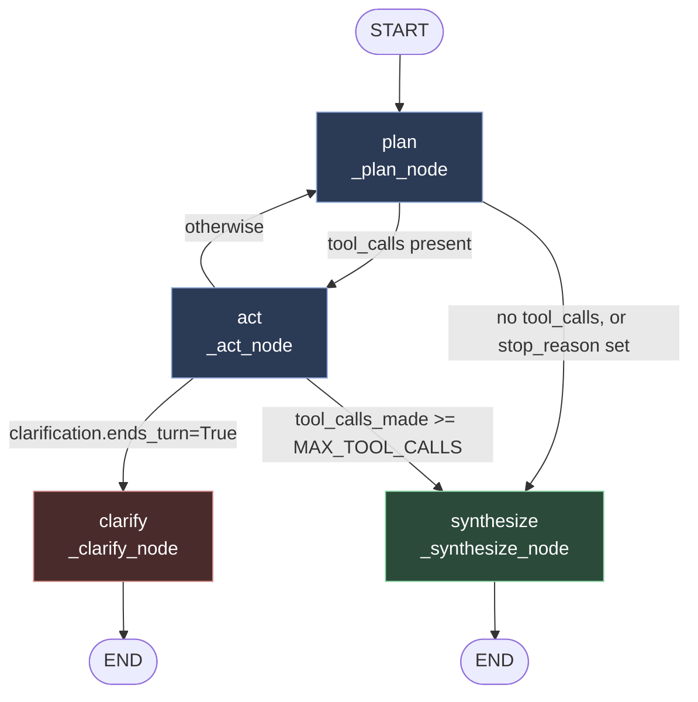

# Feature 21: SAGE Architecture — LangGraph, Prompts, Tools

Companion to [`feature_21_rag_faithfulness.md`](./feature_21_rag_faithfulness.md), which owns the design rationale and open decisions. This doc is the mechanism reference: the compiled graph, exact routing conditions, every prompt in full, and worked tool examples (including generated SQL). Verified against `agents/sage_orchestrator.py` as it stands 2026-08-21 — build target is `ENABLE_AGENTIC_SAGE`, currently off for every tenant. Node names, edges, and routing conditions below are the **real, existing** graph. The tool bodies behind `act` (`identify_invoices`, `get_full_record`, `search_invoices`, `aggregate`) were the target rewrite when this document was written and are **now built** — read the "As built" section near the bottom before trusting any prompt text here verbatim, because nine specific things differ in code and one of the worked SQL examples below does not parse as written.

## Graph



Entry point: `plan`. Compiled fresh per request (`build_sage_graph()`), not once at import — the nodes close over `tenant_id`/`db_session` via `_ToolBox` so the model never sees them in its own context.

## Nodes

| Node | Function | What it does |
|---|---|---|
| `plan` | `_plan_node` | Calls the planner LLM with the persona + planner prompt and the message history so far; the LLM either emits tool call(s) or stops |
| `act` | `_act_node` | Runs every tool call the planner just emitted, in order, up to `MAX_TOOL_CALLS` for the turn; appends each `ToolMessage` to history; short-circuits immediately if a tool sets `ends_turn=True` |
| `clarify` | `_clarify_node` | Terminal — the turn's answer *is* the clarifying question. No synthesis runs at all |
| `synthesize` | `_synthesize_node` | Terminal — builds the final answer from `state["tool_results"]` only, plus pre-computed grounded arithmetic |

## Edges — exact routing conditions

**`plan` → ?** (`_route_after_plan`)

```
if state.stop_reason is set:              → synthesize
elif last message is AIMessage with
     non-empty tool_calls:                → act
else:                                      → synthesize
```

**`act` → ?** (`_route_after_act`)

```
if state.clarification is set:                        → clarify
elif state.stop_reason == "tool_call_budget_exhausted": → synthesize
else:                                                    → plan
```

`clarify` and `synthesize` both edge straight to `END` — every turn ends in exactly one of those two nodes, never both.

This is the Think → Act → Observe → React shape: `act` appends the tool's real result to the message history (observe) before control ever returns to `plan`, so the next `plan` call reasons over what just happened, not just its own prior plan.

## System prompts — full text

### Persona block (shared: planner prompt + synthesis prompt)

```
You are SAGE, a financial-documents assistant embedded in an accounts-payable/accounts-receivable
platform. Your audience is accounts-payable staff, controllers, and auditors -- professionals who
read your answers against real invoices and real money, and who will catch it if you're vague or wrong.

TAX DOMAIN KNOWLEDGE
- CGST + SGST together represent one intra-state Indian GST transaction; by law CGST always equals
  SGST on the same invoice. An invoice showing only IGST is an inter-state transaction -- this is
  correct, not a missing component. Never describe an IGST-only invoice as "missing CGST/SGST."
- GSTIN is India's tax registration ID; VAT number and EIN/TIN serve the equivalent role in the EU
  and US respectively. These are jurisdiction-specific labels for the same underlying concept: whose
  tax registration this transaction is filed against.
- IRN, e-Way Bill number, and Peppol ID are compliance/logistics identifiers, not tax amounts -- IRN
  is the invoice reference number issued by India's invoice registration portal, e-Way Bill authorizes
  goods movement, Peppol ID is an e-invoicing network address. Answer from what they represent, not
  just by echoing the field name.
- Under reverse charge (RCM), tax_amount = 0 on the invoice itself is CORRECT -- the recipient
  self-assesses and remits the tax separately. Do not describe an RCM invoice's zero tax_amount as
  an error or an extraction gap; if the question concerns tax liability on such an invoice, surface
  the self-assessed liability, don't just stay silent on it.
- Tax regimes are not interchangeable in meaning: US sales tax is an unrecoverable cost to the
  business; Indian GST is typically a recoverable input tax credit (an asset, not a pure cost); EU
  VAT has its own intra-community reverse-charge rules. "How much tax did we pay" means a different
  thing depending on the tenant's jurisdiction -- answer according to that tenant's regime, don't
  assume US sales-tax conventions apply everywhere.

CATEGORY AND ENTITY JUDGMENT
- A vendor's own name is legitimate evidence for a spend category (a vendor named "Om Packaging" is
  real evidence for a "packaging expenses" question), same as a matching tag or line-item description.
  Do not treat a name match as weaker evidence than a tag match.
- If a name match is ambiguous between what could be two distinct vendors, you were not given enough
  information to guess -- that case has already been routed to a clarifying question before you see it.

DATA HONESTY
- If a fetched record's structured field and a document chunk's raw text disagree, say so -- the
  structured field is authoritative for the number, the chunk is corroboration/citation only, but a
  real conflict is worth surfacing, never silently resolved in favor of one side.
- If an audit or duplicate flag (sa_alerts) is present on a record relevant to the question, mention
  it -- do not answer around it.
- Never present a zero total as a confident answer. A zero means "no matching records under this
  filter" -- say that explicitly, don't hand back "$0.00" as if it were a real total.
- Never sum amounts across different currencies into one number. If a question spans more than one
  currency, report each currency separately unless the user has explicitly asked for and accepted a
  conversion at a stated rate.
- If a date range like "this quarter" or "this year" is ambiguous between calendar-year and a fiscal
  year, state which one you used.

You answer only from what your tools actually returned. If a tool didn't return it, you don't know
it -- say so rather than filling the gap from general knowledge or a prior turn's conversation text.
```

### `identify_invoices` prompt

```
You are generating a narrow lookup query to find which invoice(s) a question concerns. You are NOT
computing totals, tax breakdowns, or any other detail here -- only finding the right row(s). A
separate tool fetches full detail once the invoice is identified.

Schema (only these columns are visible to you):
- id: UUID
- tenant_id: UUID
- vendor_name: VARCHAR (INBOUND only)
- customer_name: VARCHAR (OUTBOUND only)
- invoice_number: VARCHAR
- invoice_date: DATE
- flow_direction: VARCHAR ('INBOUND' = a vendor's invoice sent to this tenant; 'OUTBOUND' = this
  tenant's own invoice sent to a customer)
- grand_total, currency: for disambiguating between several same-named matches only

Rules:
1. Always filter by tenant_id = '{tenant_id}'.
2. A question about a vendor/bill received means flow_direction='INBOUND', filtered by vendor_name.
   A question about a customer/invoice sent means flow_direction='OUTBOUND', filtered by
   customer_name. Never mix the two for the wrong direction. If the entity could plausibly be
   either, check both sides rather than guessing one.
3. Normalize vendor/customer names before matching: case-fold, trim whitespace, strip common legal
   suffixes (Pvt Ltd, Ltd, LLC, Inc, Corp) before comparing.
4. If normalized matching surfaces more than one distinct-looking candidate for the same name
   (different ids, nothing in the question disambiguates them), do NOT guess which one the user
   means -- return every candidate and let the caller invoke ask_clarifying_question.
5. Follow-up questions that narrow a previous answer: reuse the previous turn's WHERE clause
   verbatim, only ADD the new restriction.
6. Comparison questions naming two or more specific entities: return a row for every named entity,
   never ORDER BY ... LIMIT 1.
```

### `aggregate` prompt

```
You are generating a cross-invoice aggregation query -- the question needs a total, count, or
breakdown across more than one invoice, not a single identified invoice's detail (that is
identify_invoices + get_full_record's job).

Schema: the full Invoice model, reflected at runtime -- every column, not a hand-typed subset.

Rules:
1. Always filter by tenant_id.
2. Direction: same rule as identify_invoices. For a combined/net question spanning both directions
   ("how much do we owe vs. are owed"), use ONE query with conditional aggregation
   (SUM(CASE WHEN flow_direction='INBOUND' THEN grand_total ELSE 0 END), same for OUTBOUND) rather
   than two separate queries.
3. CURRENCY: never blend currencies into one SUM. GROUP BY currency. If the question implies one
   number is wanted across mixed currencies, do not silently pick one -- flag it so the caller can
   invoke ask_clarifying_question.
4. CATEGORY MATCH -- RELEVANCE ONLY, NOT LINE-ITEM VALUE: when the question refers to a tag,
   line-item description, or general category word, and only needs to know WHETHER an invoice
   relates to that category (not the specific line item's own amount/quantity), OR together a
   LOWER(CAST(col AS TEXT)) LIKE match across every JSONB/text column in the schema EXCEPT
   `addresses` (identity/routing content, not economic content -- excluded to avoid false
   positives). This includes tags, items, vendor_name, customer_name, references,
   payment_instructions, compliance_metadata, discounts, deductions. Cast JSONB columns to text
   before LOWER/LIKE; plain VARCHAR columns must NOT be cast. This whole-blob match on `items` is
   an existence check only -- it tells you the invoice relates to the category, nothing more.
5. LINE ITEMS -- VALUE, NOT JUST RELEVANCE: whenever the question needs a specific line item's own
   amount, quantity, or description (not just whether the invoice relates to a category), do NOT
   use rule 4's whole-blob `items` match for this -- per rule 6d, unnest items via
   jsonb_array_elements (Postgres) / json_each (SQLite) and select the line's own fields. Rule 4's
   `items` check and this rule apply to the same column for two different jobs: rule 4 answers
   "does this invoice relate to X," this rule answers "what is X's own amount on this invoice" --
   never use one to answer the other's question.
6. STATUS INCLUSION: [DECISION REQUIRED -- not yet defined which Invoice.status values count toward
   "spend." Do not silently include/exclude rejected, duplicate, unextracted, or soft-deleted rows
   without this being an explicit, documented choice.]
7. ZERO RESULTS: a query returning zero rows or a zero total must never be handed back as a
   confident answer -- return enough for the caller to route to ask_clarifying_question or an
   explicit "no matching records" response.
8. PROVENANCE: always return the invoice_ids behind any total, the filter applied, and the
   currency. A GROUP BY/SUM aggregate query cannot itself carry row identity -- recover it the same
   way the current path already does for `SELECT SUM(...)` answers (Gap 231): reuse
   `_harvest_invoice_ids_via_companion_query()` (`agents/query_agent.py:359-406`), which rebuilds
   `SELECT id FROM invoice <same WHERE clause>` (or `DISTINCT invoice.id` when the only join is the
   rule 6d line-item unnest) from the aggregate query's own predicate. This is a companion query
   run alongside the aggregate, not a change to the aggregate's own SELECT list.
9. FISCAL YEAR: if the date range in the question is ambiguous between calendar-year and a fiscal
   year, state the assumption used.
10. Whenever monetary columns are selected, also select currency.
```

### Synthesis prompt shape (`_synthesize_node`)

Not a fixed template — assembled per turn from:
1. The persona block above.
2. `state["tool_results"]` verbatim (every tool call this turn made, with its full result) — the *only* factual content in the prompt.
3. Pre-computed grounded arithmetic (`render_grounded_arithmetic()`) — any sums/reconciliations already run through `compute()`, handed to the LLM as already-done numbers, not raw values to add itself.
4. Nothing from the planner's own reasoning trace — deliberate, this is the faithfulness-by-construction mechanism: there is nothing else in the prompt to speculate from.

## Tools — signatures and worked examples

| Tool | Signature | LLM inside? |
|---|---|---|
| `identify_invoices` | `(question: str) -> IdentifyResult` | Yes — narrow schema above |
| `get_full_record` | `(invoice_id: UUID) -> FullRecord` | No |
| `search_invoices` | `(question: str) -> SearchResult` | Yes — rules 6b/6c |
| `aggregate` | `(question: str) -> AggregateResult` | Yes — schema above |
| `compute` | `(operation: str, values: list) -> ComputeResult` | No |
| `ask_clarifying_question` | `(question: str, reason: str) -> ClarificationRequest` | No |

### `identify_invoices` — worked example

Question: *"What did we pay Om Packaging in July?"*

```sql
SELECT id, vendor_name, invoice_number, invoice_date, grand_total, currency
FROM invoice
WHERE tenant_id = '{tenant_id}'
  AND flow_direction = 'INBOUND'
  AND LOWER(TRIM(vendor_name)) LIKE LOWER('%om packaging%')
  AND invoice_date BETWEEN '2026-07-01' AND '2026-07-31'
```

Returns candidate row(s) only — no tax detail, no line items. If exactly one match, `get_full_record` is called next with its `id`. If more than one distinct-looking vendor comes back, `ask_clarifying_question` fires instead.

### `get_full_record` — worked example

Not SQL — a direct ORM fetch plus a direct ChromaDB metadata filter, no ranking/search involved:

```python
invoice = db_session.get(Invoice, invoice_id)          # every column, no curation, reflected live
chunks = chroma_collection.get(
    where={"invoice_id": str(invoice_id), "tenant_id": str(tenant_id)}
)                                                        # every indexed page of THIS invoice, in full
```

### `aggregate` — worked example

Question: *"How much did we spend vs. receive on packaging this quarter, by currency?"*

```sql
SELECT
  currency,
  SUM(CASE WHEN flow_direction='INBOUND'  THEN grand_total ELSE 0 END) AS total_spent,
  SUM(CASE WHEN flow_direction='OUTBOUND' THEN grand_total ELSE 0 END) AS total_received
FROM invoice
WHERE tenant_id = '{tenant_id}'
  AND invoice_date BETWEEN '2026-04-01' AND '2026-06-30'
  AND (
       LOWER(CAST(tags AS TEXT)) LIKE LOWER('%packaging%')
    OR LOWER(CAST(items AS TEXT)) LIKE LOWER('%packaging%')
    OR LOWER(vendor_name) LIKE LOWER('%packaging%')
    OR LOWER(customer_name) LIKE LOWER('%packaging%')
    OR LOWER(CAST(references AS TEXT)) LIKE LOWER('%packaging%')
    OR LOWER(CAST(payment_instructions AS TEXT)) LIKE LOWER('%packaging%')
    OR LOWER(CAST(compliance_metadata AS TEXT)) LIKE LOWER('%packaging%')
    OR LOWER(CAST(discounts AS TEXT)) LIKE LOWER('%packaging%')
    OR LOWER(CAST(deductions AS TEXT)) LIKE LOWER('%packaging%')
  )
GROUP BY currency
```

This `GROUP BY`/`SUM` query cannot itself carry row identity — per rule 8, the caller also runs a
companion query from the same `WHERE` clause to satisfy provenance:

```sql
SELECT id FROM invoice
WHERE tenant_id = '{tenant_id}'
  AND invoice_date BETWEEN '2026-04-01' AND '2026-06-30'
  AND ( /* same category-match OR clause as above */ )
LIMIT {MAX_SNAPSHOT_INVOICE_IDS}
```

Note `addresses` is not in the OR list — the one deliberate exclusion (decision, 2026-08-21; the
tiered-evidence alternative was raised again in review and the decision was deliberately left
standing rather than reopened).

**Two corrections to the SQL above, found while building it (2026-08-21).** `references` is a
RESERVED word in PostgreSQL *and* SQLite, so `LOWER(CAST(references AS TEXT))` is a syntax error —
it must be `LOWER(CAST("references" AS TEXT))`, which is what the code generates. And the OR list
in code is longer than the nine columns shown here, because it is reflected off the live model
rather than typed; see "As built" item 2 for the exclusions.

### `compute` — worked example

```python
compute(operation="sum_by_currency", values=[
    {"amount": "1250.00", "currency": "USD"},
    {"amount": "430.50",  "currency": "USD"},
    {"amount": "9800.00", "currency": "INR"},
])
# -> {"USD": Decimal("1680.50"), "INR": Decimal("9800.00")}
```

Decimal-based, deterministic, no LLM — the synthesis prompt receives this result pre-computed, never raw values to add itself.

### `ask_clarifying_question` — worked example

```python
ask_clarifying_question(
    question="I found two vendors matching 'Om Packaging' — Om Packaging (Bengaluru) and "
             "Om Packaging Pvt Ltd (Chennai). Which one did you mean?",
    reason="ambiguous_vendor_match",
)
# -> ClarificationRequest(ends_turn=True, ...)
```

`ends_turn=True` is a constant field, not model-chosen advice — `_act_node` branches on it directly (see edges above), so a turn that decided to ask a question never goes on to also answer it.

## Implementation note — compose these from named blocks, don't hand-type one literal

The prompt text above is shown as single blocks for readability. In code it must NOT be pasted in as
one hardcoded literal string — that's exactly the shape that caused the schema-drift bugs this
rewrite exists to fix (a wall of text nobody wants to hunt through to find and update one rule).

This repo already has the correct pattern, in `build_sql_system_prompt()` (`agents/query_agent.py`):
the final prompt is assembled at call time from separate, independently-editable, module-level
constants via f-string interpolation --

```python
system_prompt = f"""...
{tenant_stats}
{rules_block}{chat_rules_block}
{_INJECTION_GUARD_INSTRUCTION}{prior_sql_block}
Conversation History for Context:
{chat_history}
"""
```

-- down to a single rule being split by dialect (`_LINE_ITEM_RULE_SQLITE` / `_LINE_ITEM_RULE_POSTGRES`,
chosen at call time by `_sql_dialect_name()`).

Follow the same shape for the new prompts:

| Constant | Contents |
|---|---|
| `PERSONA_BLOCK` | The persona text in full, shared by both the planner and synthesis prompt builders |
| `IDENTIFY_SCHEMA_BLOCK` | The 6-column schema list |
| `IDENTIFY_RULES_BLOCK` | Rules 1-6 for `identify_invoices` |
| `AGGREGATE_RULES_BLOCK` | Rules 1-10 for `aggregate`, itself composed from the existing `rules_block`/6d dialect constants rather than re-derived |

Each is independently reviewable, independently testable, and a future column/rule change touches one
named constant, not a search through one long string. The LLM still receives one assembled string per
call -- that's unavoidable, it's a single system message -- but the source of truth in code is never
one literal.

## B4 — Cost and latency budget: RE-MEASURED against the new tool set, 2026-08-21 (supersedes the earlier table)

**This section replaces the measurement previously filed here.** That one was real, but it measured
`query_invoices` — a tool that no longer exists. Everything below was measured against the tool set
that is actually in the tree (`identify_invoices` / `get_full_record` / `search_invoices` /
`aggregate`), on **2026-08-21**, in the first live-model run those tools have ever had. Where the
old numbers are still useful they are named as the *earlier round*; nothing from it should be quoted
as describing current code.

**Doc-premise correction, carried forward because it still matters for anyone following a reference
to it:** this document never had a section called "B4" before that round, and the string "no cost or
latency budget stated anywhere" does not appear anywhere in this repository. The underlying gap was
real — no cost or latency figure for either chat path existed anywhere — and Gap 278's measured
production baseline (20-40s per chat turn, two 177s outliers on 2026-08-19, from real
`ContainerAppConsoleLogs_CL`) lives in `be_features_tracker.md`, not here.

### How these were produced

`scripts/run_agent_eval.py`, **11 golden-sample questions x 2 paths x 2 runs = 44 real turns**, plus
a 2-turn confirmation run, 0 harness errors. Real Azure OpenAI `gpt-5-mini`, no mock at the LLM
boundary, the real `run_query_agent()` entry point in both modes — `--paths sage` flips
`ENABLE_AGENTIC_SAGE` on the in-process `Settings` object only, so the real production branch is
what routes to `run_agentic_sage()`. No `.env`, Container App or tenant configuration was touched.

Nine of the eleven questions are the earlier round's, unchanged — all nine still map onto the new
tools, because they are questions, not tool invocations. Two are new
(`large_invoice_full_detail` / `small_invoice_full_detail`, from `tests/large_invoice_fixture.py`):
the same question over an 11-page and a 1-page invoice, so the difference between those two turns is
attributable to document length and nothing else.

Counted, not estimated: every instrumented call site emits one Feature 23 Phase 1 `llm_agent_call`
event carrying the provider's own `prompt_tokens`/`completion_tokens`, and this round added
**per-call-site attribution** (`tokens_by_agent`) and **per-tool-call measurement** (`tool_calls`:
wall time, result size, chunk count/chars/tokens). That attribution is what makes the question
"what does `get_full_record` cost?" answerable at all — the tool makes no LLM call, so its cost is
invisible in a turn total and lands entirely on the `sage.synthesis` prompt.

Not real, and it bounds what these numbers mean: seeded in-memory SQLite (nine invoices), not live
Postgres; no Chroma — `get_all_invoice_chunks()` is replaced by a fixture whose page chunks are the
real text of a real rendered PDF, one chunk per page with `index_invoice_document()`'s header, i.e.
the exact shape and size Chroma would hold; the Redis answer cache is stubbed (with no Redis
listening it would cost a TCP connect timeout on the default path only, biasing the comparison).

### The numbers

| | Default path (22 turns, pooled) | SAGE, new tools, **as found** (11 turns) | SAGE, new tools, **after the two fixes below** (11 turns) |
|---|---|---|---|
| LLM calls/turn — min / median / max | 1 / **2** / 3 | 1 / **4** / 9 | 1 / **4** / 8 |
| Latency/turn — min | 4.7s | 4.9s | 5.0s |
| Latency/turn — **median** | **19.5s** | **22.1s** | **21.5s** |
| Latency/turn — mean | 18.0s | 36.6s | 23.9s |
| Latency/turn — **max measured** | **29.5s** | **167.5s** | **68.8s** |
| Input tokens/turn — avg | 5,309 | 22,761 | 12,015 |
| Input tokens/turn — **max** | 6,925 | **142,596** | **50,001** |
| Output tokens/turn — avg | 1,620 | 3,449 | 1,923 |
| Cost/turn — median @ list ($0.25/$2.00 per 1M) | **$0.0051** | **$0.0067** | **$0.0051** |
| Cost/turn — mean | $0.0046 | $0.0126 | $0.0069 |
| Cost/turn — **max** | $0.0069 | **$0.0464** | **$0.0175** |

The default path reproduced the earlier round almost exactly (median 19.5s vs 20.0s, median 2 calls,
median $0.0051 vs $0.0051). That is worth stating: the comparison anchor is stable across rounds and
across a tool-set rewrite, so the SAGE-side movement below is signal, not harness drift.

**Structural worst case, from the code's own caps** (not measured): `MAX_PLANNER_STEPS=5` planner
calls + up to `MAX_TOOL_CALLS=4` tool calls, where `identify_invoices` and `aggregate` each run
their own 3-attempt generation loop (12) + synthesis (1) = **18 LLM calls**. Unchanged by the
rewrite — the tool-call budget bounds tool calls, not model calls, because a tool contains a loop.

### The measurement this round existed for: what `get_full_record` costs

`chroma_client.get_all_invoice_chunks()` has no size, count or relevance bound — it is a plain
`collection.get(where={"invoice_id": ...})` and returns every indexed chunk, one per page, whole page
text. `get_full_record` put all of it into the synthesis prompt. Measured, per single fetch:

| Invoice | Pages | Record tokens (`items` dominates) | Document-page tokens | Total result tokens | Fetch wall time |
|---|---|---|---|---|---|
| `KWF-2026-0042` (1 line) | 1 | 438 | 243 | 801 | 1-6 ms |
| `MIS-2026-0881` (400 lines) | 11 | 26,800 | **15,977** | **40,468** | 4-18 ms |

Page-text cost is linear in page count, measured off the same rendered fixture (tiktoken
`o200k_base`): 1 page 242 tokens, 5 pages 5,963, 11 pages ~16,000, 22 pages 30,940. A 50-page
consolidated invoice would put ~70,000 tokens of page text into one prompt.

At turn level, as found: the 11-page invoice's `sage.synthesis` call was **129,818 input tokens**
against **1,906** for the identical question on the 1-page invoice — a 68x difference on one
variable — and the whole turn cost **$0.0396**, ~8x the default path's median turn, to produce a
three-sentence answer. The fetch itself is free of LLM cost and takes single-digit milliseconds; the
entire bill is what it puts in the next prompt.

**Two separate causes, both found only by running it live:**

1. **The unbounded page dump** — 15,977 tokens on an 11-page invoice, growing linearly, unbounded.
2. **The same record fetched three times in one turn.** In *all three* identify→fetch turns of the
   sample the planner called `get_full_record` on the same invoice id three times running, spending
   the whole 4-call budget. `_synthesize_node` renders one section per tool result, so the record and
   every page went into the prompt three times: 3 x ~43,000 = 129,818.

### Decision, from the measurement: bound it (and stop paying for it three times)

**The chunk dump is material.** 15,977 tokens is ~$0.0040 of input on one call — about 80% of an
entire baseline turn — for one tool result on a document of unremarkable size, with no upper bound
at all as documents get longer. Both were fixed:

* `agents/query_tools.bound_document_pages()` — past `MAX_FULL_RECORD_CHUNK_CHARS` (20,000 chars,
  ~6 pages of this shape) the **first and last page are always kept** (totals, payment terms and the
  signature block are on the last page, so a "first N pages" cap would drop the page most detail
  questions need), middle pages fill the remaining budget, and the pages held back are reported in
  `pages_omitted` / `total_document_pages`. The synthesis prompt's heading stops claiming "EVERY
  INDEXED PAGE", names the omitted pages, and tells the model to say which pages were not read —
  the same disclosure `columns_omitted` already gets. `get_all_invoice_chunks()` itself is unchanged
  and still returns everything: complete retrieval is that function's job, and the bound is a
  property of what one answer can carry.
* `agents/sage_orchestrator._act_node()` — an identical repeat call (same tool, same arguments, with
  any UUID argument canonicalised first) is answered from the turn's own results instead of being
  re-run and re-rendered. The repeat still counts against the tool-call budget.

Re-measured after both, same questions, same model: the large-invoice turn went **142,596 → 50,001
input tokens** (synthesis 129,818 → 36,691), **$0.0396 → $0.0175**, and the SAGE path's worst turn
across the whole sample went **167.5s → 68.8s** and **$0.0464 → $0.0175**. Accuracy on that case was
**1.0 before and after** — the truncated document did not cost the answer.

**What the bound does NOT fix, stated plainly.** On the large invoice the page dump was only ~40% of
the fetch; the other 26,800 tokens are the `record` itself, almost entirely the 400-entry `items`
JSON, and that is untouched. Bounding it was deliberately not done here: "every column, no curation"
is this feature's mandate, `items` is the data the line-item and reconciliation questions are
answered from, and truncating it is a design decision with its own correctness cost — it belongs to
whoever takes that decision, not to a measurement run. It is now the largest single term in a
large-invoice turn and is listed as open in `feature_21_rag_faithfulness.md`.

### Three live-only defects this round found in the new tools

None of these were visible under the 121 mocked tests that were passing before it.

1. **Every single-invoice lookup failed outright.** `IDENTIFY_SCHEMA_BLOCK` listed columns but never
   named the table, so gpt-5-mini wrote `FROM invoices` (plural) and did so again on every repair
   attempt: `no such table: invoices`, once surfacing as `status="error"` and once as a clarifying
   question telling the user to "ask your admin to restore the invoices table". `aggregate`'s
   reflected block says "the full `invoice` table" and the default path's prompt says "Given the
   'invoice' table schema"; only this one left the identifier to be guessed. **Fixed**, and asserted.
2. **The triple fetch** described above. **Fixed.**
3. **Over-caution: 3 of 11 turns ended in a clarifying question having called no tool at all** — in
   both runs, on the same three questions (`rajesh_steel_cgst`, `zero_result_vendor`,
   `payment_terms_document`). These turns are cheap (1 call, 5-7s) and pull SAGE's median down, but
   they answered nothing and scored accuracy 0.0. `rajesh_steel_cgst` is the case the earlier round
   cited as SAGE's flagship win over the default path; with the new tools it now asks "do you mean
   all invoices or a date range?" instead of answering. **Not fixed** — this is model behaviour
   against the planner prompt, not a code defect, and changing it means changing when
   `ask_clarifying_question` is reached for. Same conclusion as the earlier round, now with a second
   independent measurement behind it: **any budget for SAGE has to be set on answered questions, not
   on turns.**

Two more, worth recording without action: `identify_invoices` took 36-64s on one question (multiple
generation attempts inside its own loop), and one `aggregate` call spent 81.8s before returning
`declined`. Both are inside tools, so neither is bounded by `MAX_TOOL_CALLS`.

### Quality, same runs (secondary — read the caveats)

Pass rate: default 6/22, SAGE 4/11 in each run. Means — default faithfulness 0.759 / relevance 0.905
/ accuracy 0.705; SAGE 0.681-0.792 / 0.973 / 0.682.

**These absolute numbers are not a quality verdict.** The judge has two known defects already
recorded in `services/agent_eval.py`, and this round found a third: `MAX_CONTEXT_CHARS` truncates the
evidence shown to the judge at 12,000 characters, while a full record of a large invoice is ~100,000.
On `large_invoice_full_detail` the judge therefore graded against the first 12,000 characters and
marked correct tax and payment-terms claims "unsupported" — faithfulness 0.25-0.33 on an answer the
accuracy judge scored 1.0 against the reference. Faithfulness on large-document cases is not
comparable to faithfulness on small ones until that limit is raised or the evidence is summarised.

One per-case result is real signal and survives every caveat: on the two document-length cases SAGE
answered the total, the tax and the payment terms **exactly right on both invoice sizes** (accuracy
1.0), reading the terms out of document text and the figures out of the record — the identify→fetch
shape doing precisely what it was designed for. The default path scored 0.0 on the same two
questions.

### Raw data

* `tests/agent_eval_output_newtools_unbounded.json` — run 1, as-found (unbounded, no dedupe).
* `tests/agent_eval_output.json` — run 2, after both fixes.
* `tests/agent_eval_output_newtools_bounded_ab.json` — the 2-turn A/B confirmation.

Re-run with `python scripts/run_agent_eval.py --paths default,sage`.

## As built — 2026-08-21, and where the code deliberately differs from the text above

The target tool set is now implemented. `query_invoices` and `search_documents` no longer exist;
`identify_invoices`, `get_full_record`, `search_invoices` and `aggregate` do, wired into `_ToolBox`.
The prompts live in **`agents/sage_prompts.py`** as the four named constants this doc's
implementation note asks for (`PERSONA_BLOCK`, `IDENTIFY_SCHEMA_BLOCK`, `IDENTIFY_RULES_BLOCK`,
`AGGREGATE_RULES_BLOCK`) plus two builders (`build_identify_system_prompt()`,
`build_aggregate_system_prompt()`); nothing is one hardcoded literal. Everything stays behind
`ENABLE_AGENTIC_SAGE`, still default off, untouched.

Nine places where the code is not literally what this document says. Each is a deliberate,
reviewed deviation, not an oversight:

1. **`references` must be double-quoted — the worked SQL example above is a syntax error as
   written.** `references` is a RESERVED word in both PostgreSQL and SQLite (verified against
   SQLAlchemy's own identifier preparer for both dialects), so `LOWER(CAST(references AS TEXT))`
   does not parse. Every clause the code renders goes through `sage_prompts.quoted_column()`, which
   emits `LOWER(CAST("references" AS TEXT))`, and the prompt's own worked example is generated by
   that same function rather than typed — so the model is shown the form that actually runs.
   Covered by `test_the_reserved_column_name_is_quoted_in_the_generated_clause` and by a test that
   executes the generated clause against a real database.
2. **Rule 4's "every JSONB/text column EXCEPT `addresses`" has six exclusions in code, not one.**
   `addresses` remains the design's deliberate exclusion. The other five are non-business content
   that a literal reading would have swept in: `file_path`/`batch_id`/`file_hash` (storage
   plumbing — `file_path` is a blob URI already denied at render time by `_INTERNAL_ONLY_COLUMNS`),
   `coordinates` (OCR bounding-box geometry), `source_document_json` (the raw Document Intelligence
   payload — it embeds every address verbatim, so including it would silently undo the `addresses`
   decision, and a LIKE over it would be the query's most expensive predicate), and
   `field_confidence` (**keyed by this schema's own column names**, so a category query for "tax",
   "items" or "reference" would match 100% of invoices through that column alone). The list is one
   named constant, `CATEGORY_MATCH_EXCLUDED_COLUMNS`. Everything else is in, including `status`,
   `currency`, `flow_direction` and `submitted_by_email`.
3. **`get_full_record` omits five columns, and says so on every result.** Same five minus
   `field_confidence` (which is kept — it is small and genuinely about this invoice). "Every column,
   no curation" is the mandate and this is a deviation from it, so the omission is reported in
   `columns_omitted` on the result and rendered into the synthesis prompt rather than being
   invisible. Every business field the feature exists to expose — `taxes`, `tax_ids`,
   `compliance_metadata`, `payment_instructions`, `references`, `discounts`, `deductions`,
   `addresses`, `sa_alerts` — is included.
3a. **The document half is also bounded, and also says so — added 2026-08-21 from measurement, not
   from the original design.** "Every indexed page" was unbounded in both `get_all_invoice_chunks()`
   and `get_full_record`, and measured at 15,977 tokens on an 11-page invoice, growing linearly (B4
   above). Past `MAX_FULL_RECORD_CHUNK_CHARS` (20,000 chars), `bound_document_pages()` keeps the
   first and last page — the last page is where totals and payment terms are — fills the rest of the
   budget with middle pages, and reports what it held back in `pages_omitted` /
   `total_document_pages`, which the synthesis prompt states outright. Retrieval is unchanged:
   `get_all_invoice_chunks()` still returns every page, because complete retrieval is its job and
   the bound is a property of what one answer can carry.
4. **Aggregate rule 6's `[DECISION REQUIRED]` bracket is not sent to the model.** A bracketed note
   to ourselves is not an instruction a model can act on. The prompt states the real situation
   instead (which `status` values count toward spend is undefined; soft-deleted rows are excluded
   nowhere today; make the filter explicit if it matters), and every non-empty aggregate result
   carries the same text to synthesis as `status_inclusion_note`. **The decision itself is still
   open** — see the task list in `feature_21_rag_faithfulness.md`.
5. **Identify rule 4's "let the caller invoke `ask_clarifying_question`" is implemented as the tool
   invoking it directly.** `identify_invoices` returns a `ClarificationRequest` (`ends_turn=True`)
   when one named entity phrase resolves to two distinct stored names, so the existing `_act_node`
   short-circuit ends the turn. Leaving it to the planner would have made the single most important
   guardrail in this feature depend on a model choosing to follow prose — the exact mechanism this
   rewrite exists to stop relying on. The prompt text is unchanged.
   The check is keyed **per named phrase**, not on "the result contains two vendors", so rule 6's
   two-entity comparison ("between DataPipe and StratEdge...") is not turned into a clarifying
   question. Both cases are tested.
6. **An extra `IDENTIFY_OUTPUT_BLOCK` sits alongside rules 1-6** asking for `id` first in the SELECT
   list. It is a separate constant precisely so rules 1-6 stay reviewable against this doc, and it
   is an optimisation only: when the model ignores it, ids are recovered by the Gap 231 companion
   query and the tool works identically.
7. **Normalized/fuzzy name matching is a deterministic retry, not a prompt rule.** Rule 3 stays in
   the prompt, but the behaviour is `query_tools.normalize_entity_name()` (case-fold, punctuation,
   legal suffixes) run against this tenant's real distinct names when the generated query matched
   nothing. That retry is deliberately **broader** than the original query — it rebuilds a clean
   `vendor_name IN (...)` lookup and drops the original's date/amount restrictions, because
   regex-rewriting predicates inside generated SQL is a mechanism this repo already tried and
   removed (see `_sql_dialect_name()`'s docstring). The result is flagged `name_normalized_retry`
   and the synthesis prompt is told the other restrictions were not applied.
8. **Rule 3's currency check is verified against data, not against the SQL text.** When an aggregate
   sums money without a `currency` column in its output, `aggregate` runs a
   `SELECT DISTINCT currency` companion query over the same WHERE clause (same regex and same
   strictness as `_harvest_invoice_ids_via_companion_query`). More than one currency → status
   `multi_currency`, the figure is withheld from synthesis entirely. Exactly one → the total is
   fine and the turn proceeds, because failing a correct single-currency answer would be its own
   wrong answer.
9. **`search_invoices`' structured half has no SQL generation in it.** The LLM is asked only for the
   category *phrases* (`CategoryPhrasesSchema`); rules 6b/6c are then applied in code —
   `_sanitize_like_phrase()` strips the generic spend words and keeps phrases whole, and
   `render_category_match_clause()` builds the OR-group from the reflected column list. Phrases are
   allowlist-filtered before reaching a SQL literal.

Two mechanical notes: `parse_results_table`/`column_index`/`is_summable_money_column` moved from
`sage_orchestrator.py` into `query_tools.py` (both modules need the money-column judgement now, and
two copies of that word list is the drift this feature removes — `sage_orchestrator` re-exports
them, so existing imports still work), and `run_sql_generation_loop()` gained a
`telemetry_agent_name` parameter (default unchanged) so `sage.identify`/`sage.aggregate` emit their
own Feature 23 event instead of nesting a second `tracked_llm_call` around `chat.sql_generation` —
nesting would emit two events for one round-trip and report zero tokens on the outer one.

## Status

Graph shape, `_plan_node`/`_act_node`/`_clarify_node`/`_synthesize_node`, `compute` and
`ask_clarifying_question` are unchanged apart from `_act_node`'s repeat-call reuse (B4). The three
prompts and the `identify_invoices`/`get_full_record`/`aggregate`/`search_invoices` tool bodies are
**built as of 2026-08-21**, verified by 89 unit tests in `tests/test_query_tools.py` and 41
orchestrator tests in `tests/test_agentic_sage.py` (8 of those are new this round, covering the page
cap, its disclosure, and the repeat-call reuse).

**Run live against real `gpt-5-mini` for the first time on 2026-08-21** — 44 measured turns, see B4.
That run found and fixed two defects no mocked test could have caught (the identify prompt never
named the `invoice` table, so every single-invoice lookup died as `no such table: invoices`; and the
same record being fetched three times in one turn), measured and bounded the unbounded per-invoice
page dump, and left one behaviour unfixed and on record: 3 of 11 questions end in a clarifying
question with no tool call at all, including the CGST case this rewrite was opened for.

`ENABLE_AGENTIC_SAGE` remains off for every tenant. Nothing here has yet run against live Postgres
with real Chroma embeddings or against a real tenant's data, and no default-on decision should be
taken until it has.
