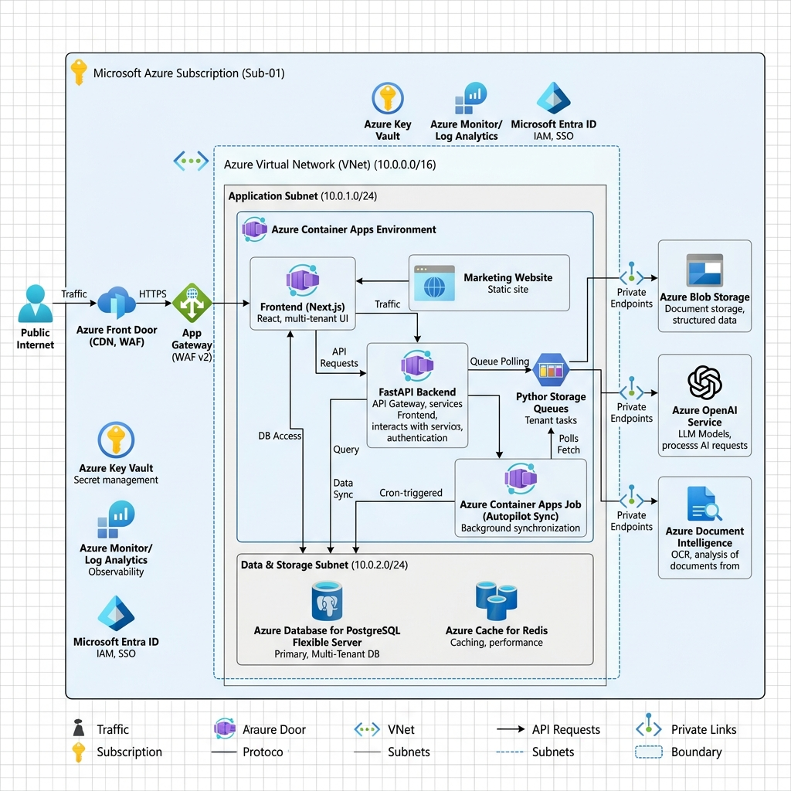
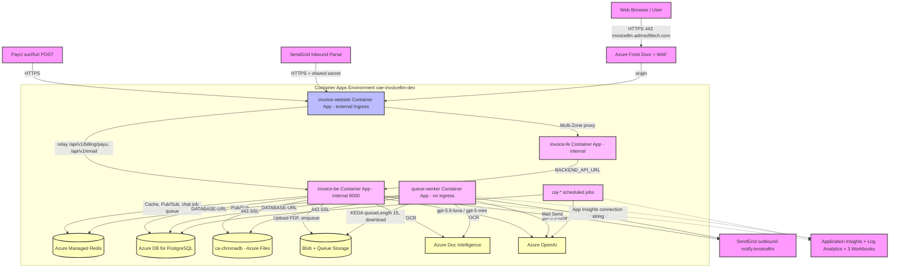

# Cloud Architecture Document



## Invoice AI SaaS Platform — Azure Cloud Infrastructure

> **AI Agent Architecture:** This platform is powered by four named AI agents — **NOVA** (Smart Invoice Extraction), **SENTINEL** (Invoice Risk Detection), **SAGE** (Invoice Intelligence Chat), and **EVOLVE** (Continuous Learning) — each corresponding to a distinct processing layer in the Azure backend.
| Attribute         | Detail                                          |
|-------------------|-------------------------------------------------|
| **Project**       | Invoice AI SaaS (Multi-Tenant LLM Platform)     |
| **Cloud Provider**| Microsoft Azure                                 |
| **IaC Tool**      | Azure Bicep only — 10 staged templates in `infra/` (`01-network` … `10-budget`) plus standalone `*-only.bicep` templates; no Terraform exists |
| **Version**       | 1.1                                             |
| **Date**          | 2026-06-25 (original); last reconciled 2026-09-07 |
| **Classification**| Internal — DevOps & Engineering Team            |

> **Last reconciled 2026-09-07 against `infra/` (bicep, `params.dev.json`, `deploy-all.ps1`), `Invoice_LLM/.github/workflows/*`, `docker/Dockerfile.*`, `docker-compose.yml` and `apps/invoice-be/config.py`.** Where this document previously described a target design that the bicep does not implement, the row now says so explicitly ("target, not declared"). Where bicep and live Azure are known to differ, both are stated. Nothing below was re-verified with `az` on 2026-09-07; "deployed" claims cite the tracker entry that verified them.

---

## Table of Contents

1. [Design Principles](#1-design-principles)
2. [Cloud Architecture Overview](#2-cloud-architecture-overview)
3. [Network Architecture (VNet & Private Endpoints)](#3-network-architecture-vnet--private-endpoints)
4. [Compute Layer (Azure Container Apps)](#4-compute-layer-azure-container-apps)
5. [Data Layer](#5-data-layer)
6. [AI & Cognitive Services](#6-ai--cognitive-services)
7. [Identity & Access Management](#7-identity--access-management)
8. [CI/CD Pipeline Architecture (GitHub Actions)](#8-cicd-pipeline-architecture-github-actions)
9. [Environment Strategy (Dev / UAT / Production)](#9-environment-strategy-dev--uat--production)
10. [Container & Registry Strategy](#10-container--registry-strategy)
11. [Monitoring & Observability](#11-monitoring--observability)
12. [Security Architecture](#12-security-architecture)
13. [Disaster Recovery & Business Continuity](#13-disaster-recovery--business-continuity)
14. [Cost Estimation & Optimization](#14-cost-estimation--optimization)
15. [Infrastructure as Code — Repository Layout](#15-infrastructure-as-code--repository-layout)
16. [Deployment Runbook](#16-deployment-runbook)
17. [DevOps Engineer Tasking (Phase 1)](#17-devops-engineer-tasking-phase-1)

---

## 1. Design Principles

The cloud architecture is governed by five non-negotiable principles derived from the project's enterprise requirements:

| #  | Principle                  | Description                                                                                          |
|----|----------------------------|------------------------------------------------------------------------------------------------------|
| 1  | **No Manual Configuration**| All infrastructure provisioned via IaC (Bicep). Zero ad-hoc portal changes.               |
| 2  | **Environment Parity**     | Dev, UAT, and Production run identical IaC templates. Behaviour is identical across environments.     |
| 3  | **Private by Default**     | All backend services accessed via Azure Private Endpoints. Data never traverses the public internet.  |
| 4  | **Zero-Touch Deployment**  | Entire stack deployable into a new client's Azure subscription in under 15 minutes via pipeline.      |
| 5  | **Full Auditability**      | Every infrastructure change committed to Git — perfect audit trail of who changed what and when.      |

> **Reconciliation note (2026-09-07):** principles 1–3 describe the target. The dev environment (`infra/params.dev.json`) runs with `networkIsolation=false`, so every VNet, NSG and private-endpoint resource in §3 is declared behind `if (networkIsolation)` and is **not deployed on dev** (Consumption CAE with Microsoft-managed networking; Postgres, Redis, Storage, OpenAI, Doc Intelligence and Key Vault all have `publicNetworkAccess: Enabled`). Several live values were set with `az` directly rather than through bicep (see `infra/deployment_tracker.md` "Known live drift" and Gap 298), and no UAT environment exists.

---

## 2. Cloud Architecture Overview

```
┌─────────────────────────────────────────────────────────────────────────────────────┐
│                                INTERNET / USERS                                    │
│                                                                                     │
│   ┌──────────────┐    ┌──────────────┐    ┌────────────────┐    ┌──────────────┐    │
│   │    Clerk     │    │     PayU     │    │  GitHub        │    │  End Users   │    │
│   │  (SSO IdP)   │    │  (Payments)  │    │  (Source/CI)   │    │  (Browser)   │    │
│   └──────┬───────┘    └──────┬───────┘    └───────┬────────┘    └──────┬───────┘    │
└──────────┼───────────────────┼────────────────────┼─────────────────────┼────────────┘
           │                   │                    │                     │
           ▼                   ▼                    ▼                     ▼
┌─────────────────────────────────────────────────────────────────────────────────────┐
│                          AZURE SUBSCRIPTION                                        │
│                                                                                     │
│  ┌───────────────────────────────────────────────────────────────────────────────┐   │
│  │           AZURE FRONT DOOR / WAF (Layer 7) — DESIGNED, NOT YET LIVE          │   │
│  │              ┌─────────────────────────────────────────┐                     │   │
│  │              │  DDoS Protection  │  SSL Termination    │                     │   │
│  │              │  Rate Limiting    │  Geo-Filtering      │                     │   │
│  │              └─────────────────────────────────────────┘                     │   │
│  └───────────────────────────────────────┬───────────────────────────────────────┘   │
│                                          │                                          │
│  ┌───────────────────────────────────────┼───────────────────────────────────────┐   │
│  │                    VIRTUAL NETWORK (VNet)     10.0.0.0/16                     │   │
│  │                                               │                               │   │
│  │  ┌────────────────────────────────────────────┼──────────────────────────┐    │   │
│  │  │          SUBNET: aca-subnet (10.0.1.0/24)  │                          │    │   │
│  │  │                                            │                          │    │   │
│  │  │  ┌──────────────────────────────────────────────────────────────────┐  │    │   │
│  │  │  │            AZURE CONTAINER APPS ENVIRONMENT                     │  │    │   │
│  │  │  │                                                                 │  │    │   │
│  │  │  │  ┌───────────┐  ┌───────────┐  ┌───────────┐  ┌─────────────┐  ┌─────────────┐  │  │    │   │
│  │  │  │  │ invoice-  │  │ invoice-  │  │ invoice-  │  │  queue-     │  │ autopilot-  │  │  │    │   │
│  │  │  │  │ website   │  │ fe        │  │ be        │  │  worker     │  │ sync-job    │  │  │    │   │
│  │  │  │  │ (Next.js) │  │ (Next.js) │  │ (FastAPI) │  │  (Python)   │  │ (ACA Job)   │  │  │    │   │
│  │  │  │  │           │  │           │  │           │  │             │  │             │  │  │    │   │
│  │  │  │  │ Scale:    │  │ Scale:    │  │ Scale:    │  │ Scale:      │  │ Schedule:   │  │  │    │   │
│  │  │  │  │ 1-3       │  │ 1-5       │  │ 1-10      │  │ 1-10        │  │ Cron-based  │  │  │    │   │
│  │  │  │  └───────────┘  └───────────┘  └───────────┘  └─────────────┘  └─────────────┘  │  │    │   │
│  │  │  └────────────────────────────────────────────────────────────────────────────────┘  │    │   │
│  │  └──────────────────────────────────────────────────────────────────────┘    │   │
│  │                                                                              │   │
│  │  ┌──────────────────────────────────────────────────────────────────────┐    │   │
│  │  │          SUBNET: data-subnet (10.0.2.0/24)                          │    │   │
│  │  │                                                                      │    │   │
│  │  │  ┌───────────────┐  ┌───────────────┐  ┌────────────────────────┐   │    │   │
│  │  │  │ PostgreSQL    │  │ Redis Cache   │  │ Azure Blob Storage     │   │    │   │
│  │  │  │ Flexible      │  │ for Azure     │  │ (Invoice PDFs)         │   │    │   │
│  │  │  │ Server        │  │               │  │                        │   │    │   │
│  │  │  │ (Private EP)  │  │ (Private EP)  │  │ (Private EP)           │   │    │   │
│  │  │  └───────────────┘  └───────────────┘  └────────────────────────┘   │    │   │
│  │  └──────────────────────────────────────────────────────────────────────┘    │   │
│  │                                                                              │   │
│  │  ┌──────────────────────────────────────────────────────────────────────┐    │   │
│  │  │          SUBNET: ai-subnet (10.0.3.0/24)                            │    │   │
│  │  │                                                                      │    │   │
│  │  │  ┌───────────────────┐  ┌───────────────────┐  ┌────────────────┐   │    │   │
│  │  │  │ Azure OpenAI      │  │ Azure Document    │  │ ChromaDB       │   │    │   │
│  │  │  │ (GPT-4 + Embed.)  │  │ Intelligence      │  │ (Managed /     │   │    │   │
│  │  │  │                   │  │ (OCR)             │  │  Containerized)│   │    │   │
│  │  │  │ (Private EP)      │  │ (Private EP)      │  │ (Private EP)   │   │    │   │
│  │  │  └───────────────────┘  └───────────────────┘  └────────────────┘   │    │   │
│  │  └──────────────────────────────────────────────────────────────────────┘    │   │
│  └──────────────────────────────────────────────────────────────────────────────┘   │
│                                                                                     │
│  ┌──────────────────────────────────────────────────────────────────────────────┐   │
│  │                    MANAGEMENT & OBSERVABILITY                                │   │
│  │  ┌──────────────────┐  ┌──────────────────┐  ┌─────────────────────────┐    │   │
│  │  │ Azure Monitor    │  │ Log Analytics    │  │ Azure Container         │    │   │
│  │  │ + App Insights   │  │ Workspace        │  │ Registry (ACR)          │    │   │
│  │  └──────────────────┘  └──────────────────┘  └─────────────────────────┘    │   │
│  └──────────────────────────────────────────────────────────────────────────────┘   │
└─────────────────────────────────────────────────────────────────────────────────────┘
```

> **Status note (2026-09-07) — the diagram above is the June 2026 design and is stale in four places:**
> 1. **Front Door / WAF is live** (the "DESIGNED, NOT YET LIVE" label is obsolete). `infra/modules/network/front-door.bicep` (Standard_AzureFrontDoor profile, endpoint, origin group → `ca-invoice-website-<env>`, managed-certificate custom domain, WAF policy in `Prevention` mode with a `RateLimitSupportContact` rule — 20 requests / 5 min per IP on the contact endpoints) is wired into `08-apps.bicep` behind `if (!empty(customDomainName))`. `params.dev.json` sets `customDomainName = invoicellm.admsofttech.com`. Website Gap 185 records the live verification on 2026-08-28 (`az afd custom-domain show` → `Approved` / `ManagedCertificate`, `curl -I https://invoicellm.admsofttech.com/` → 200). Gaps 362/363 (2026-09-01) fixed `08-apps.bicep`'s `publicOrigin` and `deploy-dev.yml`'s `NEXT_PUBLIC_WEBSITE_URL` so OAuth redirect URIs, `FRONTEND_URL`, `BACKEND_PUBLIC_URL`, `PUBLIC_APP_URL` and CORS all derive from the custom domain. DNS is at GoDaddy (`_dnsauth` TXT + CNAME to the Front Door endpoint). See `apps/invoice-website/website_features/feature_6_custom_domain_integration.md`. Not independently re-verified there: Clerk production cutover (dev still runs a `pk_test` instance, `great-baboon-11`).
> 2. **Front Door fronts `invoice-website` only.** `invoice-fe` and `invoice-be` are `ingress.external = false`; the website reverse-proxies FE server-side (Multi-Zone, Gap 12) and relays selected `/api/v1/*` paths to BE (PayU callbacks, SendGrid Inbound Parse).
> 3. **The VNet/subnet/private-endpoint boxes are not deployed on dev** (`networkIsolation=false`, see §1 note). They are what `01-network.bicep` + the `*.bicep` private-endpoint blocks would create for a prod deploy with `networkIsolation=true`.
> 4. **`autopilot-sync-job` does not exist** and "GPT-4" is wrong. The scheduled jobs actually declared are listed in §4.2a; the model deployments in use are `gpt-5.6-luna` and `gpt-5-mini` (§6.1). Email (SendGrid inbound/outbound) and Google Drive OAuth are external integrations not drawn above; email is described in §4.4a.

---

## 3. Network Architecture (VNet & Private Endpoints)

> **Gating (2026-09-07):** everything in §3 is declared by `infra/01-network.bicep` (`modules/network/vnet.bicep`, `nsg.bicep`) and the per-service `*PrivateEndpoint` blocks, all behind `if (networkIsolation)`. `params.dev.json` sets `networkIsolation=false`, so **none of it exists on dev**; `infra/deployment_tracker.md` records an earlier VNet-injected build of this RG (4 subnets, 7 DNS zones, 3 NSGs) that predates that flag. Treat this section as the prod (`networkIsolation=true`) shape, as declared.

### 3.1 Virtual Network Design

| Parameter               | Value                        |
|-------------------------|------------------------------|
| **VNet Name**           | `vnet-<namingPrefix>-<env>` (`vnet-invoicellm-dev`) |
| **VNet Address Space**  | `10.0.0.0/16`                |
| **Region**              | `eastus2` on dev (`params.dev.json`); Redis is placed in `eastus` via `redisLocation` |

### 3.2 Subnet Allocation (as declared in `modules/network/vnet.bicep` / `nsg.bicep`)

| Subnet Name      | CIDR Block       | Purpose                                            | NSG (declared)                                   |
|------------------|------------------|----------------------------------------------------|--------------------------------------------------|
| `snet-aca`       | `10.0.1.0/24`    | Container Apps Environment (delegated `aca-env-delegation`) | `nsg-aca-*`: `AllowHttpsInbound` 443 from `Internet` — there is **no** "Front Door only" rule in bicep |
| `snet-pe`        | `10.0.2.0/24`    | Private endpoints (Redis, Storage blob+queue, ACR, Key Vault) | `nsg-data-*`: `AllowFromAcaSubnet` + `DenyAllOtherInbound` |
| `snet-ai`        | `10.0.3.0/24`    | Azure OpenAI + Document Intelligence private endpoints | `nsg-ai-*`: `AllowFromAcaSubnet` + `DenyAllOtherInbound` |
| `snet-postgres`  | `10.0.4.0/24`    | PostgreSQL Flexible Server (delegated `postgresql-delegation`) | — |

There is no `mgmt-subnet`, Bastion host or admin-IP rule in any bicep file (removed from this table 2026-09-07).

### 3.3 Private Endpoints

> **Target rule**: all backend services reached via Private Endpoints. **On dev every one of these services is public-network-enabled** (`publicNetworkAccess: 'Enabled'` in `storage.bicep`, `redis.bicep`, `postgresql.bicep`, `openai.bicep`, `acr.bicep`, and `keyvault.bicep` when `networkIsolation=false`).

| Azure Service               | Private DNS Zone (declared in `vnet.bicep`)   | Connected Subnet |
|-----------------------------|-----------------------------------------------|-------------------|
| PostgreSQL Flexible Server   | `privatelink.postgres.database.azure.com`    | `snet-postgres` (delegated, no PE) |
| Azure Managed Redis (Redis Enterprise) | `privatelink.redisenterprise.cache.azure.net` | `snet-pe` |
| Azure Storage — blob         | `privatelink.blob.core.windows.net`          | `snet-pe`         |
| Azure Storage — queue        | `privatelink.queue.core.windows.net`         | `snet-pe`         |
| Azure OpenAI                 | `privatelink.openai.azure.com`               | `snet-ai`         |
| Azure Document Intelligence  | `privatelink.cognitiveservices.azure.com`    | `snet-ai`         |
| Azure Container Registry     | `privatelink.azurecr.io`                     | `snet-pe`         |
| Azure Key Vault              | `privatelink.vaultcore.azure.net`            | `snet-pe`         |

### 3.4 DNS Resolution

Eight Private DNS Zones (above) are declared and VNet-linked in `vnet.bicep`. No custom DNS servers. Public DNS for the product lives at **GoDaddy** (`admsofttech.com`): the Front Door custom-domain records (§2 note) and the SendGrid MX/DKIM records (§4.4a).

---

## 4. Compute Layer (Azure Container Apps)

### 4.1 Why Azure Container Apps?

- **Scale-to-Zero** capability to meet enterprise baseline cost requirements
- Managed Kubernetes under the hood — no cluster management overhead
- Built-in HTTPS ingress, traffic splitting, and revision management
- Native Dapr integration for service-to-service invocation (future extensibility)

### 4.2 Container App Definitions

Values below are what `infra/08-apps.bicep` passes to the `modules/compute/*.bicep` modules with `params.dev.json` applied (2026-09-07). Live app names are `ca-<service>-dev` in `rg-invoice-llm-dev`; images come from the shared ACR `acrinvoicellmdev2`.

| App Name           | Source Code / Dockerfile                    | Image (dev)                                       | Min/Max Replicas | Ingress                    | CPU/Memory (dev) |
|--------------------|---------------------------------------------|---------------------------------------------------|------------------|----------------------------|------------------|
| `ca-invoice-website-<env>` | `/apps/invoice-website`, `docker/Dockerfile.website` | `acrinvoicellmdev2.azurecr.io/invoice-website:latest` | 1 / 3 (`websiteMinReplicas` default 1 in `08-apps`; module default 0) | **External**, targetPort 3000 — the only public app | 0.5 vCPU / 1Gi |
| `ca-invoice-fe-<env>`      | `/apps/invoice-fe`, `docker/Dockerfile.fe`   | `.../invoice-fe:latest`      | 1 / 2  | **Internal** (`external: false`), targetPort 3000 — proxied by the website (Gap 12) | 0.5 vCPU / 1Gi |
| `ca-invoice-be-<env>`      | `/apps/invoice-be`, `docker/Dockerfile.be`   | `.../invoice-be:latest`      | 1 / 5  | **Internal**, targetPort 8000, `timeoutInSeconds: 120` (Feature 19) | 2.0 vCPU / 4Gi (`backendCpu`/`backendMemory` in `params.dev.json`; module default 1.0 / 2Gi) |
| `ca-queue-worker-<env>`    | `/apps/invoice-be`, `docker/Dockerfile.worker` | `.../queue-worker:latest`  | 1 / 10 (`workerMinReplicas` default 1 in `08-apps`; module default 0) | None (Storage Queue consumer) | 2.0 vCPU / 4Gi |
| `ca-chromadb-<env>`        | image `chromadb/chroma:latest` (Stage 6, `modules/data/chromadb.bicep`) | Docker Hub | 1 / 1 (stateful, single Azure Files volume) | Internal, targetPort 8000 — **served on 443** to callers (Gap 422, see §5.4) | 0.5 vCPU / 1Gi |

Every app runs as the user-assigned identity `id-<namingPrefix>-<env>` (`id-invoicellm-dev`), pulls from ACR with it, and resolves Key Vault secret references with it. `activeRevisionsMode: Single` on all apps — there is no traffic-split rollback; `_deploy-service.yml` rolls back by redeploying the previous image (2026-08-21 outage).

### 4.2a Scheduled Jobs (`Microsoft.App/jobs`, cron-triggered)

All jobs run the backend image with a command override through `modules/compute/scheduled-job.bicep`, which wires `DATABASE_URL`, `REDIS_URL`, `CHROMA_*`, `CLERK_SECRET_KEY`, `TOKEN_ENCRYPTION_KEY`, `AZURE_STORAGE_CONNECTION_STRING`, the Azure OpenAI role variables and `APPLICATIONINSIGHTS_CONNECTION_STRING` (config.py requires most of these at import time even for scripts that never call the model). `.github/workflows/_deploy-service.yml` updates container *apps* only; jobs keep pulling `:latest` at each execution.

| Job (dev name)              | Cron (UTC)            | Command                                                                                     | Declared in                                          | Status (evidence)                                                                                                                                                                                                       |
|-----------------------------|-----------------------|---------------------------------------------------------------------------------------------|------------------------------------------------------|--------------------------------------------------------------------------------------------------------------------------------------------------------------------------------------------------------------------------|
| `caj-benchmark-eval-dev`    | `0 3 * * *`           | `run_extraction_benchmark.py --mode live --no-write --no-gate --json --run-label nightly --tolerate-fp … && run_agent_eval.py --paths default --run-label nightly` (replica timeout 5400 s, 1.0 vCPU / 2Gi) | `08-apps.bicep` + `benchmark-eval-job-only.bicep`   | **Deployed** (BE tracker 2026-08-30 audit: one of the two jobs present in the RG)                                                                                                                                       |
| `caj-online-signals-dev`    | `15 0,6,12,18 * * *`  | `scripts/emit_online_signals_job.py --window-hours 6` (timeout 600 s)                       | `emit-online-signals-job-only.bicep` **only** (not in `08-apps`) | **Deployed** (same audit)                                                                                                                                                                                       |
| `caj-chat-doc-ttl-dev`      | `0 5 * * *`           | `scripts/sweep_chat_attachments.py` (limit 500, timeout 1800 s)                             | `chat-doc-ttl-job-only.bicep` **only**               | **Deployed** 2026-09-02 (Feature 26 H9); first successful scheduled run 2026-09-03 05:00 (Gap 400)                                                                                                                      |
| `caj-billing-lifecycle-dev` | `0 6 * * *`           | `scripts/sweep_billing_lifecycle.py` (0.25 vCPU / 0.5Gi)                                    | `08-apps.bicep` + `sweep-jobs-only.bicep`            | Declared. 2026-08-30 audit: `ResourceNotFound`. `08-apps.bicep` records it was later deployed via `sweep-jobs-only.bicep` and its first execution (2026-09-04) failed on `Settings` validation, which the template fix addressed. Current live state not re-verified here. |
| `caj-overdue-sweep-dev`     | `0 2 * * *`           | `scripts/sweep_outbound_overdue.py`                                                         | `08-apps.bicep` + `sweep-jobs-only.bicep`            | Declared; **not deployed** as of the 2026-08-30 audit (Gap 126). Not re-verified since.                                                                                                                                 |
| `caj-sandbox-sweep-dev`     | `0 4 * * *`           | `scripts/sweep_sandbox_tenants.py`                                                          | `08-apps.bicep` + `sweep-jobs-only.bicep`            | Declared; **not deployed** as of 2026-08-30 (Gap 357 open). Not re-verified since.                                                                                                                                     |

Why the `*-only.bicep` templates exist: a full Stage 8 (`08-apps.bicep`) deploy against dev is blocked by **Gap 298** (`[~]` — `params.dev.json` was corrected 2026-08-27 but the stage has not been re-applied), so every job and alert added since 2026-08-18 was deployed with a standalone template that references the existing CAE/identity/Key Vault. Deleted and no longer present: `caj-ops-digest-dev` (Feature 24, Gap 311), the original `caj-agent-eval-dev`, and `modules/compute/billing-lifecycle-job.bicep` is retained but unused (it wires too few secrets to run the script).

### 4.3 Scaling Rules (as declared)

| App                 | Scaling Trigger(s)                                                     | Threshold                                                                                   |
|---------------------|------------------------------------------------------------------------|---------------------------------------------------------------------------------------------|
| `invoice-be`        | HTTP concurrent requests + CPU utilisation + memory utilisation       | `concurrentRequests: 20`; CPU 85 %; memory 85 % (Gap 290, 2026-08-23 — the live app previously had `rules: null`) |
| `queue-worker`      | Azure Storage Queue length (`extraction-tasks-queue`)                  | `queueLength: 15` (`workerQueueScaleLength`, raised Jul 2026 — see §4.5)                    |
| `invoice-fe`        | HTTP concurrent requests + CPU + memory                                | `concurrentRequests: 30`                                                                    |
| `invoice-website`   | HTTP concurrent requests                                               | `concurrentRequests: 50`; min replicas 1 on dev (not scale-to-zero — `stop-env.ps1` forces all four apps to `--min-replicas 0` manually) |
| `chromadb`          | none                                                                   | fixed 1 replica                                                                             |

### 4.4 Environment Variables & Secrets

Secrets are seeded into **Azure Key Vault** (`kv-<namingPrefix>-<env>`, `kv-invoicellm-dev`) by Stage 5 (`infra/05-secrets.bicep`) and consumed by the container apps as Key Vault secret references resolved with the user-assigned identity. The Key Vault secret names below are exactly those declared in `05-secrets.bicep` (13 always + 4 gated on `docIntelInstanceCount`); the "Used by" column is from the `secrets:` blocks of `modules/compute/*.bicep`.

| Key Vault secret                  | Origin in Stage 5                                         | Used by (container-app secret name)                                                                 |
|-----------------------------------|-----------------------------------------------------------|-----------------------------------------------------------------------------------------------------|
| `DATABASE-URL`                    | computed from `dbAdminPassword` + Postgres FQDN (skipped when `manageDatabaseUrlSecret=false`) | be, worker, all jobs (`db-url-secret`)                                                     |
| `REDIS-URL`                       | computed via `listKeys()` on the Redis Enterprise database | be, worker, all jobs (`redis-url-secret`)                                                          |
| `AZURE-STORAGE-CONNECTION-STRING` | computed via `listKeys()` on the storage account          | be, worker, all jobs (`storage-conn-secret`)                                                        |
| `AZURE-OPENAI-API-KEY`            | `listKeys()` on `openai-<prefix>-<env>`                   | be, worker, all jobs (`openai-key-secret`); also read by `e2e-regression.yml`                       |
| `AZURE-DOC-INTEL-KEY`             | `listKeys()` on `docintel-<prefix>-<env>`                 | be, worker (`docintel-key-secret`); also read by `e2e-regression.yml`                               |
| `AZURE-DOC-INTEL-KEY-2/-3`, `AZURE-DOC-INTEL-ENDPOINT-2/-3` | only when `docIntelInstanceCount >= 2/3`   | worker only (`docintel-key-secret-2/3`, `docintel-endpoint-secret-2/3`) — `params.dev.json` sets `docIntelInstanceCount = 1` |
| `CLERK-SECRET-KEY`                | `params.<env>.secrets.json`                               | be, worker, fe, website, jobs (`clerk-secret-secret`)                                               |
| `TOKEN-ENCRYPTION-KEY`            | `params.<env>.secrets.json` (Fernet)                      | be, worker, jobs (`token-encryption-secret`)                                                        |
| `GOOGLE-CLIENT-SECRET`            | `params.<env>.secrets.json`                               | be, worker (`google-client-secret-secret`) — Google Drive connector (Feature 9)                     |
| `SALESFORCE-CLIENT-SECRET`        | `params.<env>.secrets.json`                               | be, worker (`salesforce-client-secret-secret`) — **residue**: the Salesforce connector was removed 2026-08-28 (Gap 334); the secret, `salesforceClientId` param and `SALESFORCE_*` env vars remain declared but nothing reads them |
| `SENDGRID-API-KEY`                | `params.<env>.secrets.json`                               | be, worker (`sendgrid-key-secret` — name kept to match the value set live 2026-08-26)               |
| `SENDGRID-INBOUND-SECRET`         | `params.<env>.secrets.json`                               | be only (`sendgrid-inbound-secret` → env `INBOUND_PARSE_SHARED_SECRET`, fail-closed)                |
| `PAYU-MERCHANT-KEY`, `PAYU-MERCHANT-SALT` | `params.<env>.secrets.json`                        | be only (`payu-merchant-key-secret`, `payu-merchant-salt-secret`)                                   |

Non-secret configuration is passed as plain env vars from `params.<env>.json` through `08-apps.bicep`: `CLERK_JWT_ISSUER` / `CLERK_JWKS_URL` (`https://great-baboon-11.clerk.accounts.dev` on dev), `GOOGLE_CLIENT_ID`, `GOOGLE_REDIRECT_URI` (derived from the public origin), `PAYU_MODE` (`test` on dev), `BACKEND_PUBLIC_URL` / `PUBLIC_APP_URL` / `FRONTEND_URL` (all `https://invoicellm.admsofttech.com`), `ALLOWED_ORIGINS`, `AZURE_SUBSCRIPTION_ID` / `AZURE_COST_RESOURCE_GROUP` (cost telemetry), the SendGrid addresses (§4.4a), `AZURE_CLIENT_ID` (the UAMI client id, used for managed-identity auth to Cost Management/Storage) and `APPLICATIONINSIGHTS_CONNECTION_STRING`.

**Feature flags declared on `ca-invoice-be` and `ca-queue-worker`** (both apps receive the same value from `08-apps.bicep`; `config.py` default vs `params.dev.json` value):

| Env var                            | `config.py` default | Dev Azure (`params.dev.json`) | Declared on                        | Gates                                                                                          |
|------------------------------------|---------------------|-------------------------------|------------------------------------|------------------------------------------------------------------------------------------------|
| `ENABLE_GENERIC_EXTRACTION`        | `True`              | `true`                        | be, worker                         | Feature 27 document-type classifier node in the extraction graph                              |
| `ENABLE_GENERIC_DOC_CHAT`          | **`False`**         | **`true`**                    | be, worker                         | Feature 26 Part 2 attached-document content branch                                            |
| `ENABLE_ASYNC_CHAT_QUEUE`          | `True`              | `true`                        | be, worker                         | Redis-backed async chat queue (returns `202`, progress SSE). Requires a reachable `REDIS_URL`; the bicep comment (2026-09-03) still says it "stays false" — the param is now `true` |
| `ENABLE_CHAT_STREAMING`            | **`False`**         | **`true`**                    | be, worker                         | Feature 6.1 A3 token streaming on the async path                                              |
| `ENABLE_PRODUCTION_QUALITY_JUDGE`  | **`False`**         | **`true`**                    | be only                            | Gap 304: judge every real chat turn (2 extra LLM calls/turn), feeds the Gap 450 alert         |
| `ENABLE_ENTITY_RESOLVER`, `ENABLE_SEMANTIC_VIEWS`, `ENABLE_CERTIFIED_EXAMPLES`, `ENABLE_KNOWLEDGE_LAYER`, `ENABLE_RERANK` | `False` | `false` | be, worker, benchmark job | Feature 29 phase-2 capability flags — **in progress, uncommitted 2026-09-07** (present in the working copies of `config.py`, `08-apps.bicep`, `modules/compute/*.bicep`, `params.*.json`; absent at `HEAD`) |
| `ENABLE_ANSWER_CONTRACT_GATE`      | `True`              | not declared in bicep → default | —                                | Feature 29 task 29.9 figure-in-evidence gate                                                  |
| `SANDBOX_KEYS_ENABLED`             | `False`             | not declared in bicep → `False` | —                                | Feature 25 sandbox API keys (website mirrors it with `NEXT_PUBLIC_SANDBOX_KEYS_ENABLED`)      |
| `ALLOW_MOCK_AUTH`                  | `False`             | never declared in bicep       | —                                  | Gap 359 guard: `config.py` refuses to start with `ALLOW_MOCK_AUTH=true` unless `ENVIRONMENT` is a recognised non-production value (default `ENVIRONMENT="production"`) |

**Model-registry variables** (Gaps 465/466, Feature 29; `utils/model_registry.py` roles `primary | fast | judge | chat_summary`; `long_doc` removed 2026-09-07, Gap 489) — declared on be, worker and every job:

| Env var                                    | `config.py` default              | Dev Azure          |
|--------------------------------------------|----------------------------------|--------------------|
| `AZURE_OPENAI_API_VERSION`                 | `2024-10-21`                     | `2024-10-21`       |
| `AZURE_OPENAI_DEPLOYMENT_NAME` (primary)   | `gpt-5-mini`                     | `gpt-5.6-luna`     |
| `AZURE_OPENAI_FAST_DEPLOYMENT_NAME`        | `""` → primary                   | `gpt-5.6-luna`     |
| `AZURE_OPENAI_JUDGE_DEPLOYMENT_NAME`       | `""` → primary                   | `gpt-5-mini`       |
| `AZURE_OPENAI_CHAT_SUMMARY_DEPLOYMENT_NAME`| `""` → judge                     | `gpt-5-mini` — bicep/params threading **in progress, uncommitted 2026-09-07**; at `HEAD` the var is not set on the apps and resolves to judge (`gpt-5-mini`) anyway |
| `LLM_PROVIDER`                             | `azure`                          | `azure` (hard-coded in bicep) |

> **`NEXT_PUBLIC_*` variables are build-time.** `docker/Dockerfile.fe` and `docker/Dockerfile.website` take `NEXT_PUBLIC_CLERK_PUBLISHABLE_KEY`, `NEXT_PUBLIC_WEBSITE_URL` / `NEXT_PUBLIC_FE_URL`, `ENABLE_FE_PROXY` and (website) `FE_INTERNAL_URL` as `ARG`s and fail the build if the publishable key is empty; `deploy-dev.yml` / `deploy-prod.yml` resolve them in a `resolve-fqdns` job (publishable key read from the committed `params.<env>.json`, website URL from `customDomainName`) and pass them as `build_args`. The runtime env copies in `invoice-fe.bicep` / `invoice-website.bicep` are informational only.

### 4.4a Email Architecture (SendGrid, 4 tiers — Gaps 124/125, live 2026-08-26)

| Tier                     | Address / setting                                                                                  | Mechanism                                                                                                                                                                                                                           |
|--------------------------|----------------------------------------------------------------------------------------------------|-------------------------------------------------------------------------------------------------------------------------------------------------------------------------------------------------------------------------------------|
| Inbound AI receive       | `invoice@receive.invoicellm.admsofttech.com` (`EMAIL_APP_ADDRESS`; `EMAIL_APP_DOMAIN = receive.…`) | GoDaddy MX (priority 10) → `mx.sendgrid.net` → SendGrid Inbound Parse → `https://ca-invoice-website-dev.<cae-domain>/api/v1/email/mailintegration?key=<SENDGRID-INBOUND-SECRET>` → website relay (`apps/invoice-website/app/api/v1/email/mailintegration/route.ts`) → BE `POST /api/v1/email/mailintegration` (shared secret, 25 MiB cap, fail-closed). The legacy `inbound.` MX/host is still active alongside `receive.` |
| Outbound notifications   | `invoice@notify.invoicellm.admsofttech.com`, display name `InvoiceLLM` (`SENDGRID_FROM_EMAIL/_NAME`, `SENDGRID_SENDING_DOMAIN = notify.…`) | SendGrid Mail Send with the platform-wide `SENDGRID-API-KEY`; DKIM/domain-auth CNAMEs `em8057`, `s1._domainkey`, `s2._domainkey` on `notify.`. Staff-only notifications (`services/staff_notify.py`), sent by the **worker** as well as BE — which is why the SendGrid vars are threaded into `queue-worker.bicep` |
| Reply-To                 | `invoice@admsofttech.com`                                                                          | set per call in `services/outbound_email.py`                                                                                                                                                                                        |
| Internal alerts          | `sbanerji@admsofttech.com` (`SUPPORT_NOTIFY_EMAIL`, `alertEmail`)                                   | support tickets + every Azure Monitor action group                                                                                                                                                                                  |

`config.py` defaults still read `invoiceeq.app` for `EMAIL_APP_DOMAIN`/`EMAIL_APP_ADDRESS`; they are overridden by bicep params on Azure. Setup steps: `infra/THIRD_PARTY_INTEGRATIONS_SETUP.md` §4.

### 4.5 Extraction Concurrency & Scale-Out (added Jul 2026, Gap 41/42)

Found via a benchmark harness parallelization test that concurrent extraction calls could exceed both the Azure OpenAI deployment's rate limit and the single Doc Intelligence resource's per-resource limit, with no application-level retry once Azure's own SDK-level retries were exhausted. Addressed with:

- **`queue-worker` in-process concurrency**: `main_worker.py` now processes up to **10 messages concurrently per replica** via a `ThreadPoolExecutor` (previously strictly one message at a time). Safe because the work is I/O-bound (waiting on Azure OpenAI/Doc Intelligence network calls) and each concurrent task opens its own DB session against a shared connection-pooled engine.
- **Azure OpenAI deployment capacity**: raised `gpt-5-mini` from 20 to **500 (500 RPM / 500k TPM)**, GlobalStandard tier (pay-per-token, no cost impact from the ceiling itself). Well within the region's subscription-level quota (1,000k TPM), so this was self-service - no Microsoft support request needed.
- **Document Intelligence horizontal scale-out**: added **2 additional S0 resources** (`docintel-invoice-llm-dev-2`/`-3`, each with its own private endpoint), since Doc Intelligence has no shared regional quota pool like Azure OpenAI - each S0 resource's ~90 req/min limit is independent. The app round-robins across all 3 (`utils/doc_intel_client.py`), ~270 req/min combined.
- **DB connection pool**: `database.py`'s SQLAlchemy engine now explicitly sets `pool_size=10, max_overflow=10` (previously untuned defaults of 5/10), matched to the 10-thread-per-replica design. Verified against live Postgres `max_connections=429` - 10 replicas × 20 max connections = 200, well under the ceiling.
- **`queue-worker` scale rule**: `queueLength` trigger raised from 2 (drifted live value) to **15**, since each replica now absorbs far more backlog before needing a sibling replica; `maxReplicas` stays at 10.
- **Known open item**: no per-tenant fair-share throttling yet - all tenants share one queue with no isolation, so one tenant's large batch can still consume most of the available worker capacity. Planned as a follow-up (Redis-backed per-tenant in-flight cap), not yet implemented.

A load test (150 PDFs) is planned to validate this design under real concurrent load before treating these numbers as final - see `feature_13_test_benchmark_suite.md` Task 13.8.

> **Reconciliation (2026-09-07):** the bullets above are the July 2026 change record. Current declared values differ: `params.dev.json` sets `openAiCapacity = 300` for the Stage 4 deployment (now `gpt-5.6-luna`, model version `2026-07-09`), and `docIntelInstanceCount = 1` — i.e. bicep declares one Document Intelligence account and only one `AZURE-DOC-INTEL-KEY` secret on dev, while `infra/deployment_tracker.md` records `docintel-invoice-llm-dev-2/-3` as provisioned live in July 2026. Whether those two extra resources still exist was not re-verified here. The load test has not been run (load testing is sequenced after functional testing and the dev/prod split).

---

## 5. Data Layer

### 5.1 PostgreSQL (Azure Database for PostgreSQL — Flexible Server)

| Parameter                | Value                                               |
|--------------------------|-----------------------------------------------------|
| **Server name**          | `postgresServerName` param — `psql-invoice-llm-dev` in `params.dev.json` and `03-data`/`05-secrets`; `start-env.ps1`/`stop-env.ps1` target `psql-invoice-llm-dev-v2` (comment: server was recreated manually outside bicep, scripts reconciled 2026-08-03). Which name is live was **not re-verified** 2026-09-07 |
| **SKU**                  | `Standard_B2s` / `Burstable` (bicep defaults, dev); prod SKU is a param, no value chosen yet |
| **Storage**              | `postgresStorageSizeGB = 32` (bicep default; the earlier "128 GB" was never declared) |
| **Version**              | PostgreSQL 16                                       |
| **High Availability**    | `Disabled` (bicep default); `postgresHighAvailabilityMode` param exists for prod |
| **Backup**               | `postgresBackupRetentionDays = 7`, `geoRedundantBackup = Disabled` (bicep defaults) |
| **Access**               | `publicNetworkAccess: Enabled` in `postgresql.bicep`; VNet delegation (`snet-postgres`) only when `networkIsolation=true`. `deployPostgres` param lets Stage 3 reference an existing server without PUT-ing to it |
| **Connection**           | `DATABASE-URL` Key Vault secret: `postgresql://dbadmin:<pw>@<fqdn>:5432/invoice_db?sslmode=require` (password auth — **not** managed identity) |
| **Schema management**    | Alembic; `docker/Dockerfile.be`'s `entrypoint.sh` runs `alembic upgrade head` on every backend start. Head as of 2026-09-07: `e7f8a9b0c1d2` (Gap 467 invoice notes) |
| **Encryption**           | TLS in transit (`sslmode=require`), AES-256 at rest (Microsoft-managed keys) |
| **Tenant Isolation**     | Row-level via `tenant_id` column on all tables      |

### 5.2 Azure Managed Redis (Redis Enterprise)

> Classic Azure Cache for Redis (`Microsoft.Cache/Redis`, Basic/Standard/Premium SKUs) is retired by Azure and can no longer be created — `infra/modules/data/redis.bicep` deploys `Microsoft.Cache/redisEnterprise` (branded "Azure Managed Redis") instead. This replaces the Standard C1/Premium P1 SKU language from earlier drafts of this document.

| Parameter                | Value                                    |
|--------------------------|------------------------------------------|
| **SKU**                  | `Balanced_B0` (Dev/UAT) — smallest available Enterprise tier, roughly comparable to the old Standard C1; scale `sku.name`/`capacity` up for Prod |
| **Use Case 1**           | Chat answer caching, dashboard insights caching (both degrade gracefully — a cache miss/failure never breaks the feature, see `agents/query_agent.py::get_cached_answer()`) |
| **Use Case 2**           | **Pub/Sub channel** for SSE real-time notifications (bulk upload status, `queue_worker/handlers.py::_publish_sse_events()`) |
| **Use Case 3**           | Async chat job queue (`services/chat_queue.py`, `ENABLE_ASYNC_CHAT_QUEUE`, Feature 26 E-5/H7) — the only chat path with progress SSE and streaming |
| **Resource**             | `redis-<namingPrefix>-<env>` (`redis-invoicellm-dev`), `03-data.bicep` → `modules/data/redis.bicep`, `deployRedis` param (deploy-all.ps1 passes `false` when the cluster is already `Running` — it cannot be redeployed in place); `redisLocation = eastus` on dev |
| **Access**               | `publicNetworkAccess: Enabled` on dev; private endpoint only when `networkIsolation=true` (`clusteringPolicy: OSSCluster`, `clientProtocol: Encrypted`, port `10000`) |
| **Persistence**          | Not configured (Redis Enterprise's persistence options differ from classic AOF/RDB — revisit if Prod needs durability beyond cache/pub-sub) |
| **Eviction Policy**      | `NoEviction` (per `redis.bicep`) |
| **Auth**                 | Access-key authentication (`accessKeysAuthentication: Enabled`). **Now wired in bicep**: `05-secrets.bicep` seeds `REDIS-URL` as `rediss://:<primaryKey>@<hostName>:<port>/0` via `listKeys()`, and `invoice-be.bicep` / `queue-worker.bicep` / `scheduled-job.bicep` reference it as `redis-url-secret`. **(unverified — contradictory records)**: a comment in `modules/compute/invoice-be.bicep` dated 2026-09-03 states "`REDIS_URL` is empty on both apps today and there is no Redis container in rg-invoice-llm-dev", while `infra/deployment_tracker.md` marks Stage 3 Redis Enterprise as live and `params.dev.json` turns the Redis-dependent `enableAsyncChatQueue` on. Live state was not checked on 2026-09-07. |

> **SSE Integration**: When Queue workers finish processing an invoice, they publish a completion event to a Redis Pub/Sub channel `invoice.update.{batch_id}` (`queue_worker/handlers.py`, `routers/invoices.py`). The FastAPI SSE endpoint subscribes to this channel and streams events to the browser in real-time. This avoids excessive polling when users upload 50–100 PDFs in bulk.

### 5.3 Azure Blob Storage

| Parameter                | Value                                         |
|--------------------------|-----------------------------------------------|
| **Account**              | `st<namingPrefix stripped><env>` — `stinvoicellmdev` per `params.dev.json`; note `apps/invoice-be/.env.example` and the CI comments refer to `stinvoicellmdev2` as the account the identity has rights on (live-vs-params drift, part of the Gap 298 family) |
| **Account Type**         | StorageV2, `Standard_LRS` (bicep default; `skuName` param, ZRS recommended for prod in the bicep comment, not set anywhere) |
| **TLS**                  | `minimumTlsVersion: 'TLS1_2'` — declared 2026-09-01 (Gap 361, security pass) |
| **Access Tier**          | Hot only — no Cool tier, lifecycle policy or soft-delete is declared in `storage.bicep` (target, not declared) |
| **Containers**           | `invoices` (`publicAccess: None`) declared in bicep; `benchmark-artifacts` (`BENCHMARK_ARTIFACT_CONTAINER`) and the ChromaDB Azure Files share `chromadb-data` (10 GB, §5.4) are created by code / Stage 6 respectively |
| **Queues**               | `extraction-tasks-queue` (worker KEDA trigger) and `extraction-tasks-deadletter-queue` (`queue_worker/main_worker.py` poison-message routing, Feature 19); created by the application, not bicep |
| **Access**               | `publicNetworkAccess: Enabled`, `networkAclsDefaultAction: Allow` on dev; blob + queue private endpoints only when `networkIsolation=true` |
| **Auth**                 | `AZURE-STORAGE-CONNECTION-STRING` (account key) on be/worker/jobs; the UAMI additionally holds `Storage Blob Data Contributor` for the managed-identity path (benchmark artifacts) |
| **Encryption**           | AES-256 at-rest (Microsoft-managed keys)       |

### 5.4 ChromaDB (Vector Database)

| Parameter                | Value                                           |
|--------------------------|-------------------------------------------------|
| **Deployment**           | Container app `ca-chromadb-<env>`, image `chromadb/chroma:latest`, Stage 6 (`06-compute-env.bicep` → `modules/data/chromadb.bicep`), 1 replica fixed |
| **Persistence**          | **Azure Files** share `chromadb-data` (10 GB quota) on the storage account, linked to the CAE as `chromadb-storage`, mounted at `/chroma/chroma` — not a managed disk |
| **Access**               | Internal ingress, `targetPort: 8000`. Callers must use **`CHROMA_PORT=443` + `CHROMA_USE_SSL=true`**: ACA publishes internal ingress on 80/443, not on the container port. `CHROMA_PORT=8000` was live from revision `--0000116` to `--0000122` and silently broke every dev vector query (Gap 422, fixed 2026-09-03/04, verified in revision `--0000131`) |
| **Embeddings**           | Computed in-process by the backend/worker with `BAAI/bge-m3` (`EMBEDDING_MODEL_NAME`), not by ChromaDB |
| **Tenant Isolation**     | Metadata-level filtering (`tenant_id` on every vector chunk) |
| **Backup**               | None declared (see §13) |

---

## 6. AI & Cognitive Services

### 6.1 Azure OpenAI Service

| Parameter                | Value                                    |
|--------------------------|------------------------------------------|
| **Account**              | `openai-<namingPrefix>-<env>` (`openai-invoicellm-dev`), kind `OpenAI`, SKU `S0` (`modules/ai/openai.bicep`) |
| **Deployments in use (2026-09-07)** | `gpt-5.6-luna` (model version `2026-07-09`, GlobalStandard, `openAiCapacity = 300`) — roles **primary + fast**; `gpt-5-mini` — roles **judge + chat_summary** (pinned so eval scores stay comparable across the Luna migration, Gap 466; the explicit `chat_summary` bicep param is uncommitted Feature 29 phase-2 work as of 2026-09-07 — at `HEAD` the role falls back to judge, same model). `04-ai.bicep` declares one deployment (`azureOpenAiDeploymentName`); additional deployments are created with the standalone `infra/model-deployment.bicep`. API version `2024-10-21` everywhere (Gap 465; replaced `2024-02-15-preview`) |
| **Also present in the account** | `gpt-4o` only — `gpt-5.6-terra` was deleted 2026-09-07 after Feature 29 task 29.10 (Gap 489) (retiring; no role points at it; catalog entry kept for historical pricing) — per the `az … deployment list` recorded in the BE tracker on 2026-09-06. `gpt-6-astra` and `gpt-5.6-sol` deployments are **deleted** |
| **Removed candidates**   | Ollama (`ca-ollama-eval-dev`, `ollama-eval-only.bicep`) removed 2026-09-01 — no Ollama resource is declared in `infra/`; `LLM_PROVIDER=ollama` remains a local-only code path (`OLLAMA_MODEL` default `llama3.2:latest`) |
| **Region**               | `eastus2` (same RG)                      |
| **Access**               | `publicNetworkAccess: Enabled` on dev; private endpoint + `Disabled` only when `networkIsolation=true` |
| **Rate Limiting**        | Per-deployment TPM capacity (`capacity` in thousands of TPM); `model-deployment.bicep` warns that a live `az … deployment update` must be written back or the next bicep run reverts it |
| **Content Filtering**    | Default Azure content safety filters     |
| **Data Privacy**         | Opt-out of abuse monitoring (enterprise) — **No data used for model training** |

### 6.2 Azure AI Document Intelligence (Form Recognizer)

| Parameter                | Value                                    |
|--------------------------|------------------------------------------|
| **Account(s)**           | `docintel-<namingPrefix>-<env>` (+ `-2`, `-3` when `docIntelInstanceCount >= 2/3`; dev params say 1 — see §4.5 note) |
| **Model**                | Prebuilt Invoice model (`prebuilt-invoice`, `DOC_INTEL_MODEL_ID`) |
| **Use Case**             | PDF → structured text extraction (OCR)   |
| **Access**               | `publicNetworkAccess` follows `networkIsolation` (public on dev) |
| **SKU**                  | S0 (Standard)                            |

### 6.3 Data Flow Through AI Services

```
PDF Upload → Blob Storage
                │
                ▼
     Azure Document Intelligence
     (OCR → Raw Structured Text)
                │
                ▼
     Azure OpenAI (gpt-5.6-luna, primary role)
     NOVA extraction graph: classify_doc_type → classify → dynamic_qa → extract → verify
                │
                ▼
     Local Hugging Face (BAAI/bge-m3)
     Semantic Chunking & Vectorization
                │
                ▼
     ChromaDB (Private endpoint vector store)
                │
                ▼
     PostgreSQL (status update)
```

---

## 7. Identity & Access Management

### 7.1 Developer & Pipeline Access

| Principal Type        | Authentication Method             | Access Scope                                    |
|----------------------|-----------------------------------|-------------------------------------------------|
| **Developers**       | Azure AD + Service Principal      | Target: read-only on Dev resource group, no Prod access. No developer role assignment is declared in bicep |
| **CI/CD Pipeline**   | Service Principal JSON in GitHub secrets: `Azure_Dev_Credentials` (`deploy-dev.yml`), `AZURE_CREDENTIALS_PROD` (`deploy-prod.yml`, `production` GitHub Environment), `AZURE_CREDENTIALS` (`e2e-regression.yml`) | Not created by bicep; the SP needs `az acr login`, `az containerapp update/show/revision list`, and (e2e only) Key Vault secret read on `kv-invoicellm-dev` |
| **DevOps Engineer**  | Azure AD (Privileged Identity)    | Full access to all environments (with PIM elevation) — target |

> **Rule**: No root/admin password access is permitted for individual developers. All access via Service Principals with least-privilege scoping. Harness gates (branch protection, required review, CI test gate) are deliberately not set up until prod cutover.

### 7.2 Application-Level Identity (as wired)

| Service                | Identity Mechanism                        |
|------------------------|--------------------------------------------|
| Container Apps → PostgreSQL | **Password** in the `DATABASE-URL` Key Vault secret (`dbadmin`); managed-identity auth to Postgres is not configured |
| Container Apps → Blob/Queue Storage | Account key in `AZURE-STORAGE-CONNECTION-STRING` (primary path) + UAMI `Storage Blob Data Contributor` (managed-identity path for benchmark artifacts) |
| Container Apps → Azure OpenAI / Doc Intelligence | API keys from Key Vault; UAMI also holds `Cognitive Services User` on both accounts |
| Container Apps → Redis  | Access key inside the `REDIS-URL` secret  |
| Container Apps → Key Vault | UAMI `id-<prefix>-<env>` with `Key Vault Secrets User`; vault has `enableRbacAuthorization: true` |
| Container Apps → ACR    | UAMI `AcrPull` (`modules/security/acr-rbac.bicep`, may be cross-RG for the shared ACR) |
| Container Apps → Cost Management / Resource Graph | UAMI `Cost Management Reader` + `Monitoring Reader` (`rbac-assignments.bicep`, `rbac-monitoring-cost-only.bicep`, Gap 297) via `AZURE_CLIENT_ID` |
| Users → Application    | **Clerk** JWT (issuer `great-baboon-11.clerk.accounts.dev` on dev; test instance). Auth0 is not used |
| External API callers   | Feature 25 API keys (`inv_live_` / sandbox `inv_test_`), `SANDBOX_KEYS_ENABLED` off by default |

### 7.3 Role-Based Access Control (Azure RBAC — as declared in `07-rbac.bicep`)

| Azure Role                       | Assigned To              | Scope                          | Declared in                               |
|----------------------------------|--------------------------|--------------------------------|-------------------------------------------|
| `Storage Blob Data Contributor`  | UAMI                     | Storage account                | `modules/security/rbac-assignments.bicep` |
| `Cognitive Services User`        | UAMI                     | OpenAI account, Doc Intelligence account | `rbac-assignments.bicep`          |
| `Key Vault Secrets User`         | UAMI                     | Key Vault                      | `rbac-assignments.bicep`                  |
| `Cost Management Reader`         | UAMI                     | Resource group                 | `rbac-assignments.bicep`, `rbac-monitoring-cost-only.bicep` |
| `Monitoring Reader`              | UAMI                     | Resource group                 | same                                      |
| `AcrPull`                        | UAMI                     | Shared ACR (`sharedAcrName`/`sharedAcrResourceGroup`) | `modules/security/acr-rbac.bicep` |
| `Contributor` / `AcrPush` for the CI SP, `Reader` for developers | — | — | **not declared** in bicep (granted out of band when the SP was created) |

`deploy-all.ps1` Stage 7 asserts at least 4 local role assignments on the identity (storage/openai/docintel/keyvault).

---

## 8. CI/CD Pipeline Architecture (GitHub Actions)

### 8.1 Pipeline Overview

> **What actually exists (2026-09-07).** The workflows live at the repository root, `Invoice_LLM/.github/workflows/` (one level above `Prod_Invoice_LLM/`). The diagram below is the June 2026 design; the real pipeline has **no lint/test/type-check/security-scan stage and no bicep stage**. Tests and benchmarks must never run in the deploy pipeline (Gap 312, 2026-08-25, removed the Feature 23 `benchmark-gate` job); quality checks run only in the nightly `caj-benchmark-eval-dev` job (§4.2a).
>
> | Workflow file | Trigger | What it does |
> |---|---|---|
> | `deploy-dev.yml` | push to `master` / `develop` (ignores `**.md`, `.gitignore`, `.dockerignore`); `workflow_dispatch` deploys all four | `changes` job path-filters per service (`apps/invoice-be/**` → be **and** worker; `apps/invoice-fe/**`; `apps/invoice-website/**`; each `docker/Dockerfile.*`); `resolve-fqdns` reads the Clerk publishable key and `customDomainName` from `infra/params.dev.json` and the FE FQDN from `az containerapp show`; four `deploy-*` jobs call `_deploy-service.yml` with `image_tag = github.sha`, `also_tag_latest: true`, build-args for FE/website; `verify-deployment` checks the public website returns 200/307/308 and every app's provisioning state + latest revision is `Healthy/Running` (control-plane check — BE is internal-only, worker has no ingress; Gap 258 and its two false-positive fixes). Secret: `Azure_Dev_Credentials`. Target RG `rg-invoice-llm-dev`, ACR `acrinvoicellmdev2` |
> | `deploy-prod.yml` | tag push `v*`, or `workflow_dispatch` (optional `image_tag_override` to promote an already-built tag without rebuilding) | Same reusable workflow against RG `invoice-llm-prod`, apps `ca-*-prod`, `gh_environment: production` (required-reviewer gate), `also_tag_latest: false` — prod never publishes or pulls `:latest`. Reads `infra/params.prod.json` (still placeholder values) and fails loudly if the Clerk key is a `REPLACE_WITH_*` placeholder. Secret: `AZURE_CREDENTIALS_PROD` |
> | `_deploy-service.yml` | `workflow_call` | Builds one Dockerfile with Buildx (`context: ./Prod_Invoice_LLM`, GHA cache), pushes to ACR, captures the current image, runs `az containerapp update --image`, waits up to 240 s for the newest revision to be `Healthy/Running`, and **auto-rolls back** to the captured image on failure (single-revision mode has no traffic-weight rollback; 2026-08-21 outage) |
> | `e2e-regression.yml` | `workflow_dispatch` only (real LLM/OCR calls cost money) | `docker compose up -d --wait` (Postgres 5433, Redis, Chroma 8001, Azurite), `uv sync --group dev`, `alembic upgrade head`, starts `uvicorn` + `python -m queue_worker.main_worker`, runs `pytest -m e2e tests/e2e`. Reads `AZURE-OPENAI-API-KEY` / `AZURE-DOC-INTEL-KEY` from `kv-invoicellm-dev` — the only CI path that touches Key Vault (read-only). Secret: `AZURE_CREDENTIALS`. Pins `gpt-5.6-luna` / `gpt-5-mini` / `2024-10-21` to match `params.dev.json` |
> | `build-desktop.yml` | — | On-demand Windows build for a Tauri `invoice-desktop` app, **added and deleted on 2026-08-30** (commits `196dea2` → `3c87d0a`, FE Feature 18 reset to a PWA plan). Does not exist today |
> | `sync-secrets.yml` | — | Never existed (see `docs/guides/SECRETS_SYNC_GUIDE.md`) |
>
> Infrastructure (bicep) is deployed only by hand: `infra/deploy-all.ps1` (10 stages) or `az deployment group create` against a single stage / `*-only.bicep` template. `deploy-all.ps1`'s end-to-end run historically failed (per-stage parameter filtering was added to address the `InvalidTemplate` cause, and Gap 298 still blocks Stage 8 on dev); a full environment rebuild is planned but explicitly deferred until after the benchmark/RAG work. Its defaults (`-ResourceGroup invoice-llm-dev`, `-NamingPrefix invoice-llm`) do not match the live names (`rg-invoice-llm-dev`, `invoicellm`) and must be overridden.

```
┌─────────────────────────────────────────────────────────────────────────┐
│           GITHUB ACTIONS CI/CD PIPELINE — JUNE 2026 DESIGN (NOT AS BUILT) │
│                                                                         │
│  ┌─────────────────────────────────────────────────────────────────┐    │
│  │  STAGE 1: BUILD & TEST                                          │    │
│  │                                                                 │    │
│  │  ┌──────────┐  ┌──────────┐  ┌──────────┐  ┌──────────────┐   │    │
│  │  │ Lint     │  │ Unit     │  │ Type     │  │ Security     │   │    │
│  │  │ (ESLint/ │  │ Tests    │  │ Check    │  │ Scan         │   │    │
│  │  │  Ruff)   │  │ (pytest/ │  │ (tsc/    │  │ (Trivy/      │   │    │
│  │  │          │  │  vitest) │  │  mypy)   │  │  Snyk)       │   │    │
│  │  └──────────┘  └──────────┘  └──────────┘  └──────────────┘   │    │
│  └─────────────────────────────────────────────────────────────────┘    │
│                              │ Pass                                     │
│                              ▼                                          │
│  ┌─────────────────────────────────────────────────────────────────┐    │
│  │  STAGE 2: CONTAINERIZE                                          │    │
│  │                                                                 │    │
│  │  ┌──────────────────┐  ┌──────────────────────────────────┐    │    │
│  │  │ Docker Build     │  │ Push to Azure Container Registry │    │    │
│  │  │ (Multi-stage)    │  │ (invoice-be:v1.x, invoice-fe:v1.x)│   │    │
│  │  └──────────────────┘  └──────────────────────────────────┘    │    │
│  └─────────────────────────────────────────────────────────────────┘    │
│                              │ Pass                                     │
│                              ▼                                          │
│  ┌─────────────────────────────────────────────────────────────────┐    │
│  │  STAGE 3: INFRASTRUCTURE VALIDATION                             │    │
│  │                                                                 │    │
│  │  ┌──────────────────┐  ┌──────────────────────────────────┐    │    │
│  │  │ bicep validate   │  │ terraform plan                   │    │    │
│  │  │ (syntax check)   │  │ (drift detection)                │    │    │
│  │  └──────────────────┘  └──────────────────────────────────┘    │    │
│  └─────────────────────────────────────────────────────────────────┘    │
│                              │ Pass                                     │
│                              ▼                                          │
│  ┌─────────────────────────────────────────────────────────────────┐    │
│  │  STAGE 4: DEPLOY                                                │    │
│  │                                                                 │    │
│  │  ┌──────────────────────┐    ┌─────────────────────────────┐   │    │
│  │  │  UAT (Auto)          │    │  PRODUCTION (Manual Gate)   │   │    │
│  │  │  Trigger: merge to   │    │  Trigger: merge to main     │   │    │
│  │  │  uat branch          │    │  Requires: DevOps approval  │   │    │
│  │  └──────────────────────┘    └─────────────────────────────┘   │    │
│  └─────────────────────────────────────────────────────────────────┘    │
└─────────────────────────────────────────────────────────────────────────┘
```

### 8.2 Pipeline Stages Detail

| Stage (as built)              | Trigger                              | Actions                                                                                  |
|-------------------------------|--------------------------------------|------------------------------------------------------------------------------------------|
| **Detect changes**            | push to `master`/`develop`           | `dorny/paths-filter` decides which of be / worker / fe / website rebuild (`deploy-dev.yml`) |
| **Build & push**              | per changed service                  | Docker Buildx multi-stage build, push `:<sha>` (+ `:latest` on dev) to `acrinvoicellmdev2` |
| **Deploy**                    | same job                             | `az containerapp update --image`; health wait; automatic rollback to previous image       |
| **Verify**                    | after all deploys                    | Website HTTP probe + control-plane health of all four apps (Gap 258)                      |
| **Deploy to Production**      | tag `v*` or manual dispatch          | `production` GitHub Environment gate, immutable tag, all four services, prod verify job   |
| Build & Test / Lint / Infra validation | —                           | **Not implemented** — deliberately (Gap 312; harness gates deferred to prod cutover)      |

### 8.3 Image Tagging Strategy (as built)

```
acrinvoicellmdev2.azurecr.io/invoice-be:<git sha>      ← every dev deploy (immutable, traceability)
acrinvoicellmdev2.azurecr.io/invoice-be:latest         ← dev only; also what params.dev.json and every scheduled job pull
acrinvoicellmdev2.azurecr.io/invoice-be:v1.2.3         ← prod release from a `v*` tag push
acrinvoicellmdev2.azurecr.io/invoice-be:manual-<sha>   ← prod manual dispatch without a tag
```

One registry is shared by dev and prod (`deployAcr=true` on dev owns it; prod sets `sharedAcrName`). Prod must never pull `:latest` because the dev FE/website images have dev Clerk keys and URLs baked in at build time. There is no `:uat` tag and no UAT environment.

---

## 9. Environment Strategy (Dev / UAT / Production)

### 9.1 Environment Separation

> **2026-09-07:** only **dev** exists. There is no UAT environment and no `params.uat.json`. `params.prod.json` is committed but is a placeholder set (`aci-helloworld` images, `REPLACE_WITH_*` Clerk key, `gpt-5-mini` for every role) and `deploy-prod.yml` targets RG `invoice-llm-prod`, which has not been built. The roadmap order is: coding → functional testing → **dev/prod environment split** → load test → security test.

| Aspect                  | Development (live)                                   | UAT                 | Production (declared only)                          |
|-------------------------|------------------------------------------------------|---------------------|-----------------------------------------------------|
| **Azure Resource Group**| `rg-invoice-llm-dev` (`eastus2`; subscription `InvoiceLLM`, `2ae37d8b-…`) | does not exist | `invoice-llm-prod` (per `deploy-prod.yml`); not created |
| **Naming prefix**       | `invoicellm` (`params.dev.json`) — note `deploy-all.ps1` defaults to `invoice-llm` and the Postgres server keeps the hyphenated `psql-invoice-llm-dev` name | — | `namingPrefix` param, undecided |
| **IaC Templates**       | Same 10 staged bicep files, `params.dev.json` + `params.dev.secrets.json` | — | Same files, `params.prod.json` + `params.prod.secrets.json` (`.example` committed) |
| **Network isolation**   | `networkIsolation=false` (public endpoints, Consumption CAE) | — | intended `true` (VNet-injected CAE, private endpoints) |
| **PostgreSQL SKU**      | `Standard_B2s` Burstable, 32 GB, 7-day backup          | —                   | params exist for SKU/tier/HA/geo-backup; no values chosen |
| **Redis SKU**           | `Balanced_B0` (only SKU declared)                      | —                   | same template                                       |
| **Blob Redundancy**     | `Standard_LRS`                                          | —                   | `skuName` param (ZRS recommended in bicep comment)  |
| **Min Replicas**        | be 1, worker 1, fe 1, website 1, chroma 1 (`08-apps` defaults) | —          | website `>= 1` recommended in bicep comment         |
| **Custom domain / Front Door** | `invoicellm.admsofttech.com`, live                | —                   | `customDomainName` unset → no Front Door            |
| **Clerk instance**      | test instance `great-baboon-11` (`pk_test_…`)          | —                   | production instance — cutover not done              |
| **ACR**                 | owns `acrinvoicellmdev2` (`deployAcr=true`)             | —                   | shares dev's ACR (`sharedAcrName`), `deployAcr` false intended |
| **Deployment Trigger**  | push to `master`/`develop` (`deploy-dev.yml`)          | —                   | tag `v*` / manual dispatch with `production` environment approval |
| **Budget**              | `budget-invoicellm-dev`, 20,000/month (billing currency, INR), alerts at 50/75/95 % actual to `sbanerji@admsofttech.com` | — | `monthlyBudgetAmount` param |

### 9.2 Environment Parity Enforcement

> **Rule**: The same Bicep files used for Dev **must** be used for Production. This ensures "Environment Parity" — the system behaves exactly the same way in the client's cloud as it does in the test environment.

Parameters that differ between environments are externalized into `infra/params.<env>.json` (committed, non-secret) and `infra/params.<env>.secrets.json` (gitignored). `deploy-all.ps1` filters each file down to the parameters the target stage declares (ARM rejects unknown parameter names). Known parity breaks on dev today: values set with `az containerapp update --set-env-vars` / `az containerapp secret set` that bicep would reset (the SendGrid vars before they were threaded through `08-apps.bicep`), Key Vault and OpenAI/Doc Intelligence public access flipped manually for benchmark runs, and the orphaned `kv-invoice-llm-dev-rb6z` vault and duplicate `pe-queue-stinvoicellmdev` endpoint listed in `infra/deployment_tracker.md`.

---

## 10. Container & Registry Strategy

### 10.1 Azure Container Registry (ACR)

| Parameter                | Value                                 |
|--------------------------|---------------------------------------|
| **Registry**             | `acrinvoicellmdev2` (`sharedAcrName` in `params.dev.json`; `03-data.bicep` → `modules/data/acr.bicep`), shared by dev and prod |
| **SKU**                  | `Premium` (declared — required for private endpoints) |
| **Access**               | `publicNetworkAccess: Enabled` on dev; private endpoint only when `networkIsolation=true` |
| **Admin User**           | **`adminUserEnabled: true`** in `acr.bicep` (the earlier "Disabled" was never declared); CI and the apps authenticate with the SP / UAMI `AcrPull` regardless |
| **Vulnerability Scanning**| Not declared (target)                |
| **Retention Policy**     | Not declared (target)                 |

### 10.2 Docker Images Architecture

We maintain separate `Dockerfiles` inside the `/docker` directory to containerize our stateless app layers. All four are built by `_deploy-service.yml` with `context: ./Prod_Invoice_LLM`.

| Image Name           | Dockerfile Location          | Base Image                                                        | Build Stage & Rationale |
|----------------------|------------------------------|-------------------------------------------------------------------|-------------------------|
| `invoice-website`    | `/docker/Dockerfile.website` | `node:20-alpine` (deps → builder → runner)                        | **Multi-stage**: `npm ci`, `next build` with build-args `NEXT_PUBLIC_CLERK_PUBLISHABLE_KEY`, `NEXT_PUBLIC_FE_URL`, `ENABLE_FE_PROXY`, `FE_INTERNAL_URL`; `npm start` on port 3000. |
| `invoice-fe`         | `/docker/Dockerfile.fe`      | `node:20-alpine`                                                  | **Multi-stage**: same shape; build-args `NEXT_PUBLIC_CLERK_PUBLISHABLE_KEY`, `NEXT_PUBLIC_WEBSITE_URL`, `ENABLE_FE_PROXY`; port 3000. Build fails if the publishable key is empty. |
| `invoice-be`         | `/docker/Dockerfile.be`      | builder `ghcr.io/astral-sh/uv:python3.12-bookworm-slim`, runtime `python:3.12-slim-bookworm` | **Multi-stage**: `uv sync --frozen --no-dev`; `CMD /app/entrypoint.sh` = `alembic upgrade head` then `uvicorn main:app --host 0.0.0.0 --port 8000`. |
| `queue-worker`       | `/docker/Dockerfile.worker`  | same as `invoice-be`                                              | **Same source tree, own image**: identical `uv sync`, `CMD python -m queue_worker.main_worker` (no Alembic step). Also the image the scheduled jobs run, via `backendImage`. |

#### Why separate Dockerfiles?
1. **Isolation of Concerns**: The website, frontend, and backend use different runtimes (Node.js vs. Python). 
2. **Security**: Keeping the backend dependencies separate from frontend UI assets minimizes the attack surface area of the individual containers.
3. **Optimized Scaling**: Azure Container Apps scales each container independently. For example, `queue-worker` can scale up to 10 instances under heavy background jobs without duplicating memory footprints of the web frontends.

---

### 10.3 CD YAML Workflow Mapping

The CD process is managed by `Invoice_LLM/.github/workflows/deploy-dev.yml` and `deploy-prod.yml`, both delegating to the reusable `_deploy-service.yml`. There is **no `main.bicep`**, no `Azure/arm-deploy` step and no `deploy-uat.yml`. How each container reaches its place:

1. **Building & Tagging**:
   * `deploy-dev.yml` triggers on push to `master`/`develop`; `deploy-prod.yml` on a `v*` tag or manual dispatch.
   * `azure/login@v2` with the SP JSON secret, then `az acr login --name acrinvoicellmdev2`.
   * Only the services whose paths changed are rebuilt (dev); `docker/build-push-action@v5` pushes:
     ```bash
     acrinvoicellmdev2.azurecr.io/invoice-be:<github.sha>      # + :latest on dev
     ```
2. **Deployment & Mapping**:
   * No bicep runs. `_deploy-service.yml` runs `az containerapp update --name ca-<service>-<env> --image <acr>/<service>:<tag>` against the already-provisioned app, waits for the new revision to be `Healthy/Running`, and rolls back to the previously running image if it is not.
   * Ingress, scaling, secrets and env vars therefore come from the last bicep deploy (or from manual `az containerapp update --set-env-vars` — the drift Gap 298 and the SendGrid threading fix in `08-apps.bicep` describe).
3. **Container Placement & Ingress Rules** (from `modules/compute/*.bicep`):
     * **`invoice-website`**: `ingress.external = true`, `targetPort = 3000` — the sole public entry point (marketing site + login/signup), fronted by Front Door on `invoicellm.admsofttech.com`. Also hosts the relays that make internal-only BE reachable by third parties: PayU `surl/furl` pass-through (`/api/v1/billing/payu/{success,failure}`) and the SendGrid Inbound Parse relay (`/api/v1/email/mailintegration`).
     * **`invoice-fe`**: `ingress.external = false`, `targetPort = 3000`. FE is internal-only; `invoice-website` reverse-proxies it server-side (Multi-Zone, `ENABLE_FE_PROXY` / `FE_INTERNAL_URL` baked at build time), avoiding a cross-subdomain cookie handshake (Gap 12). Full-page redirects from BE (`FRONTEND_URL`) must target the website origin.
     * **`invoice-be`**: `ingress.external = false`, `targetPort = 8000`, `timeoutInSeconds = 120`. Reachable only from inside the CAE (FE/website route handlers via `BACKEND_API_URL`).
     * **`queue-worker`**: no ingress. Pulls from `extraction-tasks-queue`.
     * **`chromadb`**: `ingress.external = false`, `targetPort = 8000`; consumers connect to the FQDN on 443/SSL (Gap 422).

---

### 10.4 Production Network Connection Topology

The diagram below visualizes how the containers connect to each other and the data layer. On dev the "private" boundary is the Container Apps Environment (internal ingress), not a VNet — see §3 gating note.



---

### 10.5 Step-by-Step Azure Portal click-through setup (1st Time Provisioning)

> **Historical / fallback only (2026-09-07).** The dev environment was provisioned with the staged bicep, not this click-through, and the names below (`rg-invoiceai-*`, `acrinvoiceaiprod`, `db-invoiceai-prod`) are the June 2026 design names, not the live ones (see Appendix A). Kept as a manual fallback for a first-time prod stand-up; prefer `infra/deploy-all.ps1`. Note the Redis step's "REDIS_URL is not generated by any bicep file" is no longer true — `05-secrets.bicep` seeds `REDIS-URL`.

Before automating deployments with Bicep, you can provision the cloud workspace manually through the Azure Portal:

#### Step 1: Create the Resource Group
1. Navigate to the **Azure Portal**.
2. Click **Resource Groups** $\rightarrow$ **+ Create**.
3. Choose your Subscription. Enter Resource Group name: `rg-invoiceai-prod` (or `rg-invoiceai-uat`).
4. Select region (e.g. `East US 2`). Click **Review + create** $\rightarrow$ **Create**.

#### Step 2: Create Azure Container Registry (ACR)
1. In the search bar, search for **Container Registries** $\rightarrow$ **+ Create**.
2. Set Resource Group to `rg-invoiceai-prod`. Registry name: `acrinvoiceaiprod`.
3. Choose SKU: **Premium** (required for Private Endpoints).
4. Select **Networking** tab $\rightarrow$ Set Connectivity to **Private Endpoint**.
5. Click **Review + create** $\rightarrow$ **Create**.

#### Step 3: Create the Virtual Network (VNet)
1. Search for **Virtual Networks** $\rightarrow$ **+ Create**.
2. Use Resource Group `rg-invoiceai-prod`. VNet name: `vnet-invoiceai-prod`.
3. Under **IP Addresses**:
   * Address space: `10.0.0.0/16`
   * Add Subnet: `snet-aca` (Range: `10.0.1.0/24`) $\rightarrow$ delegate to **Azure Container Apps**.
   * Add Subnet: `snet-pe` (Range: `10.0.2.0/24`) $\rightarrow$ for Private Endpoints (Postgres, Redis, Storage).
4. Click **Review + create** $\rightarrow$ **Create**.

#### Step 4: Create the Managed Databases & Storage
* **Azure Database for PostgreSQL (Flexible Server)**:
  1. Search for **Azure Database for PostgreSQL** $\rightarrow$ **+ Create** $\rightarrow$ Select **Flexible Server**.
  2. Server name: `db-invoiceai-prod`. Configure Compute: **General Purpose D4s**.
  3. Under **Networking**: Select **Private Access** $\rightarrow$ Associate with `vnet-invoiceai-prod` and subnet `snet-pe`.
  4. Click **Review + create** $\rightarrow$ **Create**.
* **Azure Managed Redis** (classic "Azure Cache for Redis" is retired and no longer offered — this is the current portal name for the same Redis Enterprise resource type `infra/modules/data/redis.bicep` deploys):
  1. Search for **Azure Managed Redis** $\rightarrow$ **+ Create**.
  2. Cluster name: `redis-invoiceai-prod`. SKU: start from the **Balanced** tier family, size up from `B0` for Prod (Dev/UAT can stay on `B0`, the smallest).
  3. Under **Networking**: Set Connectivity to **Private Endpoint** and attach to subnet `snet-pe`.
  4. Click **Review + create** $\rightarrow$ **Create**.
  5. After creation, manually build `REDIS_URL` (`rediss://:<primary-key>@<hostname>:10000`) from the cluster's Access Keys blade and Overview page, and set it as a secret on `ca-invoice-be-{env}`/`ca-queue-worker-{env}` — this connection string is not generated by any bicep file.
* **Azure Blob Storage Account**:
  1. Search for **Storage Accounts** $\rightarrow$ **+ Create**.
  2. Name: `stinvoiceaiprod`. SKU: **Standard LRS**.
  3. Under **Networking**: Disable public access. Set up a **Private Endpoint** linking blob service to subnet `snet-pe`.
  4. Click **Review + create** $\rightarrow$ **Create**.

#### Step 5: Provision the Azure Container Apps (ACA) Environment
1. Search for **Container Apps** $\rightarrow$ **+ Create**.
2. Resource Group: `rg-invoiceai-prod`. App name: `ca-invoice-be-prod`.
3. Under **Container Apps Environment**: Click **Create new**.
4. In the Environment creation wizard:
   * **Networking** tab $\rightarrow$ Set **Virtual Network** to `vnet-invoiceai-prod` $\rightarrow$ Associate with subnet `snet-aca`.
   * Set **Virtual IP** to **Internal** (for backend VNet encapsulation).
5. Click **Create** to provision the environment.
6. Once the environment is ready, deploy the backend (`invoice-be`), frontend (`invoice-fe`), website (`invoice-website`), and ChromaDB containers into it, passing the respective container images built during GitHub actions.

---


---

## 11. Monitoring & Observability

### 11.1 Tooling Stack

| Tool                        | Purpose                                          |
|-----------------------------|--------------------------------------------------|
| **Azure Monitor**           | Infrastructure metric alerts + KQL scheduled-query alerts (`09-monitoring.bicep` → `modules/monitoring/alert-rules.bicep`, plus two standalone `alert-*-only.bicep`) |
| **Application Insights**    | `appi-invoicellm-dev` (created in Stage 6, workspace-based). OpenTelemetry auto-instrumentation from the backend/worker (fastapi, psycopg2, requests/urllib3, logging — not SQLAlchemy/Redis/HTTPX); FE RUM via `AppInsightsProvider.tsx`. Custom events emitted by `apps/invoice-be/telemetry.py`: `llm_agent_call` (every LLM call: agent, model, tokens, cost), `chat_turn`, `agent_eval_summary`, `extraction_benchmark_run`, `azure_cost_snapshot` / `azure_cost_slice`, `online_eval_signal`, `ops_recommendation`. **Gap 300** (2026-08-24): each LLM call is additionally recorded as an `AppDependencies` row (OpenTelemetry dependency span) so LLM time appears in dependency breakdowns |
| **Log Analytics Workspace** | `law-invoicellm-dev` (Stage 6, 30-day retention on dev via `logRetentionInDays`); diagnostic settings for CAE and all apps from Stage 9; KQL helpers in `infra/monitoring/*.kql` |
| **Azure Workbooks** (the dashboard) | **Three flat Azure Workbooks in `rg-invoice-llm-dev`, all deployed** — the operational dashboard is Azure Workbooks, never an in-app page (settled decision). (1) **Cost & Health/Performance** (`workbook-cost-health-only.bicep`, template `infra/monitoring/cost_health_workbook.json`, id `618c81c7-353d-498a-93be-becc2e3e84cf`); (2) **AI Control Tower** (`workbook-ai-control-tower-only.bicep`, `ai_control_tower_workbook.json`, id `c1168d95-73e2-49fb-8b56-5bff5cdb990a`, 8 sections A–H); (3) **Ops Summary** (`workbook-ops-summary-only.bicep`, `ops_summary_workbook.json`, id `7107048d-2102-4882-ae14-f1e51c8bc21d`). Spec: `apps/invoice-be/docs/feature_20_23_24_ops_workbook.md`. The earlier tabbed workbook and `modules/monitoring/dashboard.bicep` are deleted |
| **Nightly quality job**     | `caj-benchmark-eval-dev` (§4.2a) runs the extraction benchmark and golden-bank agent eval and feeds `extraction_benchmark_run` / `agent_eval_summary`; raw JSON goes to the `benchmark-artifacts` blob container. `caj-online-signals-dev` emits `online_eval_signal` every 6 h |
| **Production judge**        | `ENABLE_PRODUCTION_QUALITY_JUDGE=true` on dev scores every real chat turn (`services/online_quality_judge.py`) into `agent_eval_run` rows tagged `run_source=production` — the data source for the Gap 450 alert |
| **Cost telemetry**          | `services/azure_cost.py` reads Cost Management with the UAMI (`Cost Management Reader`); `AZURE_SUBSCRIPTION_ID` / `AZURE_COST_RESOURCE_GROUP` wired in `08-apps.bicep`. The `sweep_azure_cost.py` sweep is **not scheduled** as a job |

### 11.2 Alert Configuration (as declared)

Action groups: `ag-<namingPrefix>-<env>-critical` and `-info` (`modules/monitoring/action-group.bicep`), both emailing `alertEmail` = `sbanerji@admsofttech.com` (same recipient — Gap 291); `teamsWebhookUrl` / `slackWebhookUrl` params exist and are empty. Thresholds are `params.dev.json` values.

| Alert (resource name pattern)                              | Type            | Threshold (dev)                                                    | Source                                   |
|------------------------------------------------------------|-----------------|--------------------------------------------------------------------|------------------------------------------|
| `alert-<app>-restart-loop` (be, worker, fe, website, chromadb) | metric      | `restartLoopThreshold = 5`                                         | `alert-rules.bicep` (Stage 9)            |
| `alert-<app>-cpu-high` / `-memory-high`                    | metric          | CPU `90 %`, memory `85 %`                                          | `alert-rules.bicep`                      |
| `alert-ca-invoice-be-<env>-http-5xx-rate`, `alert-ca-invoice-website-<env>-http-5xx-rate` | metric | `http5xxThreshold = 10`                                 | `alert-rules.bicep`                      |
| `alert-psql-…-cpu-high` / `-storage-high` / `-connections-high` | metric     | connections `340`                                                  | `alert-rules.bicep`                      |
| `alert-redis-…-server-load-high`                           | metric          | —                                                                  | `alert-rules.bicep`                      |
| `alert-st…-availability-low` / `-egress-anomaly`           | metric          | egress `200,000,000` bytes                                         | `alert-rules.bicep`                      |
| `alert-ca-queue-worker-<env>-dlq-poison-isolated`          | KQL (scheduled query) | any `POISON MESSAGE ISOLATED` log line (Gap 257)              | `alert-rules.bicep`                      |
| `alert-openai-…-client-errors`, `alert-docintel-…-client-errors` | metric    | `aiClientErrorThreshold = 15` (throttling / 4xx)                    | `alert-rules.bicep`                      |
| `alert-kv-…-availability-low`, `alert-cae-…-resource-health` | metric        | —                                                                  | `alert-rules.bicep`                      |
| `alert-agent-eval-run-critical-dev`                        | KQL, Sev 1, every 6 h over 1 day | nightly `agent_eval_summary` red band: pass rate < 0.60, faithfulness < 0.70, relevance < 0.85, accuracy < 0.75, context < 0.50, orchestration < 0.60, min 20 graded turns (Gap 299) | `alert-ai-eval-critical-only.bicep` (standalone; deployed) |
| `alert-production-judge-faithfulness-dev`                  | KQL, Sev 1, every 6 h over 1 day | production-judge faithfulness p95 < 0.80 or mean < 0.70 over ≥ 20 graded live turns (Gap 450) | `alert-production-judge-only.bicep` — **deployed 2026-09-04** (BE tracker) |

Not declared anywhere (removed from this table 2026-09-07): "queue worker task failures > 3 in 10 min", "DB connection pool > 80 %", "NSG denied flow log", Teams webhook notifications.

### 11.3 DevOps Weekly Status Report

The DevOps engineer produces a weekly report covering:

| Metric                                | Target                      |
|---------------------------------------|-----------------------------|
| Successful deployments                 | Track trend                 |
| Pipeline build failure rate            | < 5%                        |
| Infrastructure drift detection         | Zero unplanned changes      |
| Security audit findings                | Zero critical/high          |
| Service uptime (Container Apps)        | > 99.5%                     |

### 11.4 Observability Dashboard — Azure Workbooks

The single "Operations Dashboard" panel grid from the June 2026 design was replaced (2026-08-23 rethink, Gaps 322/325) by a 3-tier set of **flat** Azure Workbooks (no tabs), all bound to `law-invoicellm-dev`:

```
Tier 1  Ops Summary (Gap 325)                 4-row table: is anything red right now?
Tier 2  Cost & Health/Performance (F19/F20)   Azure cost by service (Cost Management), container health,
                                              restarts, CPU/memory, HTTP 5xx, queue depth, Postgres/Redis/Storage
Tier 3  AI Control Tower (Feature 23)         sections A-H: LLM cost/latency per agent+model (llm_agent_call),
                                              chat quality (agent_eval_summary, production judge),
                                              extraction benchmark trend, online signals, recommendations
```

Known dead signals (spec `feature_20_23_24_ops_workbook.md`): `clarification_rate` / `budget_exhaustion_rate` are permanently degenerate since Gap 316; the Azure cost sweep is not scheduled; the Ops Digest agent (Feature 24) was deleted 2026-08-25 (Gap 311). The weekly DevOps report in §11.3 is a process target, not automated.

---

## 12. Security Architecture

### 12.1 Security Layers

```
Layer 1: NETWORK          Azure Front Door + WAF (Prevention) on invoicellm.admsofttech.com — LIVE since 2026-08-28
Layer 2: NETWORK          VNet + NSGs → declared, gated on networkIsolation (OFF on dev)
Layer 3: NETWORK          Private Endpoints → declared, gated on networkIsolation (OFF on dev); CAE internal ingress is the
                          effective boundary today (BE, FE, ChromaDB internal; only website + Front Door public)
Layer 4: TRANSPORT        TLS in transit; storage minimumTlsVersion TLS1_2 (Gap 361); Postgres sslmode=require; Redis rediss://
Layer 5: IDENTITY         UAMI id-invoicellm-dev for ACR/Key Vault/Storage/Cognitive/Cost; SP JSON for CI.
                          Passwords/keys still used for Postgres, Redis, Storage, OpenAI (held in Key Vault)
Layer 6: APPLICATION      Clerk JWT (issuer + JWKS validation) on every API request; Feature 25 API keys for programmatic
                          callers; ALLOW_MOCK_AUTH refused outside non-production ENVIRONMENT (Gap 359)
Layer 7: DATA             tenant_id enforcement → row-level data isolation; RBAC roles Admin/Auditor/Trainer/Restricted
Layer 8: ENCRYPTION       AES-256 at-rest (Microsoft-managed), TLS in-transit, Fernet TOKEN_ENCRYPTION_KEY for OAuth tokens
Layer 9: AUDIT            Git-tracked IaC changes, Azure Activity Log, audit_logs table
```

### 12.2 Key Security Controls

| Control                          | Implementation (2026-09-07)                                                                                                                                                    |
|----------------------------------|--------------------------------------------------------------------------------------------------------------------------------------------------------------------------------|
| **DDoS Protection**             | Azure Front Door Standard (L7) in front of the website. Azure DDoS Protection Standard is **not declared**                                                                     |
| **WAF**                         | `Microsoft.Network/frontdoorwafpolicies` in `Prevention` mode with the custom rate-limit rule `RateLimitSupportContact` (20 req / 5 min per IP on `/api/contact`, `/api/v1/support/contact` — edge mitigation for BE Gap 249). No managed OWASP rule set is declared in `front-door.bicep` |
| **Network Isolation**           | Declared (VNet, 8 private DNS zones, private endpoints) behind `networkIsolation=true`; dev runs public-network-enabled resources                                             |
| **No Public IPs on backend**    | Achieved on dev by CAE internal ingress (`external: false`) for BE, FE and ChromaDB; website is the only externally reachable app                                              |
| **Secrets Management**          | Azure Key Vault `kv-invoicellm-dev`, RBAC authorization, 13–17 secrets seeded by Stage 5, consumed as Key Vault references. Publishable Clerk key, OAuth client ids and SendGrid addresses are deliberately plain params |
| **Inbound webhook auth**        | SendGrid Inbound Parse shared secret (`INBOUND_PARSE_SHARED_SECRET`), fail-closed, 25 MiB cap, rejections listed in the Admin console (Gap 124)                               |
| **Identity**                    | One user-assigned managed identity for all apps/jobs; access-key auth still used where noted in §7.2                                                                          |
| **SSL/TLS**                     | Front Door managed certificate; storage TLS 1.2 minimum (Gap 361); `sslmode=require`; Chroma over 443/SSL (Gap 422)                                                          |
| **Data Isolation**              | `tenant_id` on every DB table, vector chunk, and blob path; per-tenant Chroma collections                                                                                     |
| **No Data Training Guarantee**  | Azure OpenAI enterprise terms — client data never used for model training                                                                                                     |
| **Audit Trail**                 | All infra changes in Git, all API actions in `audit_logs` table                                                                                                               |
| **Mock-auth guard**             | `config.py` refuses `ALLOW_MOCK_AUTH=true` unless `ENVIRONMENT` is a recognised non-production value (Gap 359, 2026-09-01); the variable is never set in bicep                 |
| **Container Scanning**          | **Not configured** (target)                                                                                                                                                    |
| **Dependency Scanning**         | **Not configured** (target). Branch protection, required PR review and CI test gates are deliberately deferred until prod cutover                                              |
| **Removed attack surface**      | Salesforce connector removed 2026-08-28 (Gap 334; env/secret residue only), `ca-ollama-eval-dev` with external ingress removed 2026-09-01                                       |

Live read-only security pass: `reports/security/2026-09-01-live-dev-pass.md` (findings F4/F5 fixed as Gap 361).

### 12.3 Data Sovereignty

- All data resides in the deployment region (`eastus2` on dev; Redis in `eastus`)
- Private Endpoints (when `networkIsolation=true`) keep data traffic inside the VNet boundary; on dev traffic to PaaS services traverses Azure's public endpoints over TLS
- No cross-region data replication without explicit client consent (`geoRedundantBackup: Disabled`, `Standard_LRS`)
- Azure OpenAI configured with "opt-out" of abuse monitoring (enterprise tier)
- Third-party processors in the data path: Clerk (identity), SendGrid (inbound/outbound mail), PayU (billing), Google (Drive connector OAuth)

---

## 13. Disaster Recovery & Business Continuity

### 13.1 RPO/RTO Targets

| Component          | RPO (Recovery Point)  | RTO (Recovery Time)   |
|--------------------|-----------------------|-----------------------|
| PostgreSQL         | Azure PITR within the 7-day retention declared for dev (target < 5 min WAL) | < 30 minutes (HA is `Disabled` on dev — target only) |
| Blob Storage       | LRS on dev (target 0 with ZRS)  | < 15 minutes          |
| Redis              | N/A — no persistence configured, acceptable since it's cache/pub-sub/job-queue only (see §5.2), never source-of-truth data | < 10 minutes (recreate cluster; `deployRedis` must be `true` and the cluster cannot be updated in place) |
| Container Apps     | N/A (stateless)       | < 5 minutes (re-deploy via `deploy-dev.yml` dispatch or `_deploy-service.yml` rollback) |
| ChromaDB           | **No snapshot configured** — Azure Files share `chromadb-data`; re-embed from Postgres/Blob with `scripts/reembed_chroma_collections.py` | < 30 minutes (target) |

### 13.2 Backup Strategy

| Resource                  | Method                               | Retention (declared)  | Frequency       |
|---------------------------|--------------------------------------|-----------------------|-----------------|
| PostgreSQL                | Azure Automated Backup               | **7 days** on dev (`postgresBackupRetentionDays`; earlier "35 days" was never declared), geo-redundant `Disabled` | Daily + continuous WAL |
| Blob Storage              | Soft Delete + Versioning             | **not declared** in `storage.bicep` (target 14 days) | —          |
| Redis                     | None — not backed up (cache/pub-sub only, see §13.1) | N/A          | N/A             |
| ChromaDB                  | None declared (Azure Files share; no snapshot policy) | N/A       | N/A             |
| IaC State                 | Git repository                        | Infinite              | Every commit    |
| Container Images          | ACR; immutable `:<sha>` / `:v*` tags | no retention policy declared | Per build |

### 13.3 Recovery Procedures

| Scenario                        | Procedure                                                              |
|----------------------------------|------------------------------------------------------------------------|
| **Database corruption**         | Restore from point-in-time backup (Azure automated)                    |
| **Region outage**               | Re-deploy full stack to secondary region via IaC pipeline              |
| **Accidental blob deletion**    | Recover from soft delete (14-day window)                               |
| **Container crash loop**        | Automatic rollback to previous healthy revision                        |
| **Full environment rebuild**    | Run IaC pipeline against a new resource group (< 15 minutes)           |

---

## 14. Cost Estimation & Optimization

### 14.1 Monthly Cost Estimate (Per Environment)

| Resource                          | Dev/UAT (Approx.)    | Production (Approx.) |
|-----------------------------------|----------------------|----------------------|
| Azure Container Apps (5 apps + 3–6 jobs) | $50 – $100     | $200 – $500          |
| PostgreSQL Flexible Server        | $30 (B2s)            | $250 (D4s HA)        |
| Azure Managed Redis (Balanced_B0)  | *re-verify — Enterprise-tier pricing differs meaningfully from the old classic SKU this row used to quote* | *re-verify* |
| Azure Blob Storage                | $5 – $10             | $20 – $50            |
| Azure OpenAI (`gpt-5.6-luna` $0.20 in / $1.20 out per M tokens, `gpt-5-mini`; embeddings are local `bge-m3`, no Azure embedding cost) | $50 – $150 | $200 – $800 |
| Azure Document Intelligence       | $10 – $30            | $50 – $200           |
| Azure Container Registry          | $50 (Premium — declared SKU, shared with prod) | shared |
| Azure Monitor + Log Analytics     | $10 – $20            | $50 – $100           |
| Azure Front Door + WAF            | $35+ (Standard profile, **live on dev**) | $50 – $100     |
| Azure Key Vault                   | $1                   | $5                   |
| **Estimated Total**               | *re-verify — the June 2026 totals predate Front Door, Premium ACR and the Luna migration; actual spend is tracked live in the Cost & Health workbook and by `budget-invoicellm-dev` (20,000/month in the billing currency, 50/75/95 % alerts)* | *re-verify* |

### 14.2 Cost Optimization Strategies

| Strategy                                     | Savings Impact    |
|----------------------------------------------|-------------------|
| **Scale-to-Zero** on non-production container apps | 40-60% on compute |
| **Reserved Instances** for PostgreSQL (1-year) | 30-40% on database |
| **Cool storage tier** for invoices > 90 days   | 50% on storage    |
| **Lifecycle policies** to auto-delete old blobs | Ongoing reduction |
| **Token budgets** on Azure OpenAI per tenant   | Prevents overrun  |
| **Burstable SKUs** for Dev/UAT databases       | 60-70% vs GP tier |

### 14.3 Team Licensing Costs

| Item                          | Monthly Cost              |
|-------------------------------|---------------------------|
| Cursor IDE (5 developers)     | $100 USD (~₹8,400)       |
| GitHub Teams / Enterprise     | $20 – $40 USD             |
| Clerk (Developer Plan)        | $0 – $25 USD              |
| PayU (per-transaction)        | ~2% domestic cards/UPI/netbanking |

---

## 15. Infrastructure as Code — Repository Layout

Actual layout of `Prod_Invoice_LLM/infra/` on 2026-09-07 (there is no `main.bicep`, no `scripts/` folder, no Terraform):

```
infra/
├── 01-network.bicep              # Stage 1: VNet, 4 subnets, 8 private DNS zones, 3 NSGs — all if (networkIsolation)
├── 02-security.bicep             # Stage 2: user-assigned identity, Key Vault (RBAC auth)
├── 03-data.bicep                 # Stage 3: PostgreSQL (deployPostgres), Redis Enterprise (deployRedis), Storage, ACR (deployAcr/sharedAcrName)
├── 04-ai.bicep                   # Stage 4: OpenAI account + one model deployment, 1-3 Document Intelligence accounts
├── 05-secrets.bicep              # Stage 5: seeds 13 (+2 per extra DocIntel) Key Vault secrets; output secretsSeeded
├── 06-compute-env.bicep          # Stage 6: Log Analytics, App Insights, CAE, ChromaDB app + Azure Files share
├── 07-rbac.bicep                 # Stage 7: role assignments for the identity, AcrPull on the shared ACR
├── 08-apps.bicep                 # Stage 8: be, worker, fe, website apps; billing/overdue/sandbox/benchmark jobs; Front Door if customDomainName
├── 09-monitoring.bicep           # Stage 9: action groups, diagnostic settings, metric + KQL alert rules
├── 10-budget.bicep               # Stage 10: consumption budget with 50/75/95 % alerts
├── deploy-all.ps1                # 10-stage orchestrator with per-stage param filtering + readiness waits (historically failed end-to-end)
├── start-env.ps1 / stop-env.ps1  # start/stop the dev Postgres server, force min-replicas 0 (reference psql-invoice-llm-dev-v2)
├── cleanup-invoices.ps1          # wipe invoice/audit rows via az containerapp exec
├── params.dev.json               # dev parameters (committed)         params.prod.json (placeholders)
├── params.dev.secrets.json       # gitignored; .example committed     params.prod.secrets.json.example
├── model-deployment.bicep        # standalone: add an Azure OpenAI deployment (name, model, version, GlobalStandard capacity)
├── benchmark-eval-job-only.bicep # standalone job templates — how everything since 2026-08-18 was actually deployed (Gap 298)
├── emit-online-signals-job-only.bicep
├── chat-doc-ttl-job-only.bicep
├── sweep-jobs-only.bicep         # overdue / sandbox / billing-lifecycle jobs
├── alert-ai-eval-critical-only.bicep      # Gap 299 KQL alert
├── alert-production-judge-only.bicep      # Gap 450 KQL alert
├── rbac-monitoring-cost-only.bicep        # Cost Management Reader + Monitoring Reader (Gap 297)
├── workbook-cost-health-only.bicep        # the three Azure Workbooks
├── workbook-ai-control-tower-only.bicep
├── workbook-ops-summary-only.bicep
├── README.md, NEW_ENVIRONMENT.md, THIRD_PARTY_INTEGRATIONS_SETUP.md, deployment_tracker.md
├── monitoring/
│   ├── cost_health_workbook.json, ai_control_tower_workbook.json, ops_summary_workbook.json
│   └── chat_thread_sessions.kql, llm_cost_by_tool.kql, llm_cost_rollup_nightly.kql
└── modules/
    ├── network/     vnet.bicep, nsg.bicep, front-door.bicep
    ├── compute/     container-env.bicep, invoice-be.bicep, invoice-fe.bicep, invoice-website.bicep,
    │                queue-worker.bicep, scheduled-job.bicep, billing-lifecycle-job.bicep (unused)
    ├── data/        postgresql.bicep, redis.bicep, storage.bicep, acr.bicep, chromadb.bicep
    ├── ai/          openai.bicep, doc-intelligence.bicep
    ├── security/    keyvault.bicep, managed-identities.bicep, rbac-assignments.bicep, acr-rbac.bicep
    └── monitoring/  log-analytics.bicep, app-insights.bicep, action-group.bicep, alert-rules.bicep
```

Deleted since 2026-08-18 (do not reference): `gpt4o-deployment.bicep`, `ollama-eval-only.bicep`, `ops-digest-job-only.bicep`, `modules/monitoring/dashboard.bicep`, the tabbed `monitoring/ai_control_tower.workbook.json`.

---

## 16. Deployment Runbook

### 16.1 New Client Onboarding (< 15 Minutes)

The "< 15 minutes" target has not been demonstrated: `deploy-all.ps1` has never completed end-to-end against dev, and a full rebuild is deferred. The steps below are the procedure as the scripts define it (see also `infra/NEW_ENVIRONMENT.md` and `infra/THIRD_PARTY_INTEGRATIONS_SETUP.md`).

```
Step 1:  Create new Azure Resource Group in client's subscription
         └── az group create --name rg-<client> --location <region>   (deploy-all.ps1 creates it if missing)

Step 2:  Create Service Principal for CI/CD
         └── az ad sp create-for-rbac --sdk-auth ...  → JSON blob

Step 3:  Configure GitHub Secrets (repository Invoice_LLM)
         └── Azure_Dev_Credentials (deploy-dev.yml) | AZURE_CREDENTIALS_PROD (deploy-prod.yml, `production` environment)
             | AZURE_CREDENTIALS (e2e-regression.yml)

Step 4:  Fill infra/params.<env>.json and infra/params.<env>.secrets.json (copy the .example)
         └── namingPrefix, location, networkIsolation, customDomainName, model deployment names, flags,
             Clerk issuer/JWKS/publishable key, SendGrid addresses, alertEmail, budget

Step 5:  Run the staged IaC deployment (seeds Key Vault in Stage 5 — there is no seed-keyvault.sh)
         └── ./infra/deploy-all.ps1 -Environment <env> -ResourceGroup <rg> -Location <region> -NamingPrefix <prefix>
             (or one stage at a time: az deployment group create --template-file infra/0N-*.bicep ...)
             Known caveat: historically failed part-way; Stage 8 on dev is blocked by Gap 298.

Step 6:  Build + deploy images via GitHub Actions
         └── dev: push to master (deploy-dev.yml); prod: push tag vX.Y.Z (deploy-prod.yml) and approve the
             `production` environment. Bicep's default images are `aci-helloworld` until this runs.

Step 7:  Custom domain (Front Door) at GoDaddy
         └── TXT `_dnsauth.<domain>` = frontDoorDomainValidationToken output; CNAME <domain> → frontDoorEndpointHostName;
             then Clerk production instance + Google OAuth redirect URI updates (THIRD_PARTY_INTEGRATIONS_SETUP.md §6)

Step 8:  Third-party wiring
         └── SendGrid Inbound Parse → https://<website>/api/v1/email/mailintegration?key=<SENDGRID-INBOUND-SECRET>;
             MX for receive.<domain> → mx.sendgrid.net; DKIM CNAMEs for notify.<domain>; PayU surl/furl → website origin

Step 9:  Verify
         └── curl -I https://<domain>/  → 200; az containerapp revision list ... Healthy/Running for all apps;
             deploy workflow's verify-deployment job green; Ops Summary workbook shows no red rows
```

### 16.2 Routine Deployment (as practised)

| Step | Action                                                                  | Who              | When                                   |
|------|-------------------------------------------------------------------------|------------------|----------------------------------------|
| 1    | Developer works on `master` (or a branch) and pushes                    | Founder / agents | Anytime — commits happen only when the founder asks |
| 2    | `deploy-dev.yml` rebuilds only the changed services and deploys to `rg-invoice-llm-dev`, health-waits, auto-rolls back on failure, then runs `verify-deployment` | Automated | On every push to `master`/`develop` that touches non-doc files |
| 3    | Tests are run locally against real Postgres before claiming a change works; the pipeline never runs tests (Gap 312) | Developer | Before step 1 |
| 4    | Nightly `caj-benchmark-eval-dev` (03:00 UTC) + `caj-online-signals-dev` provide the quality signal; Gap 299 / Gap 450 alerts fire on red bands | Automated | Nightly / every 6 h |
| 5    | Infra changes: edit bicep + `params.dev.json`, deploy the single affected stage or a `*-only.bicep` template with `az deployment group create`, record it in `infra/deployment_tracker.md` and the BE tracker Gap | Founder / infra agent | As needed |
| 6    | Prod release: push tag `v*` → `deploy-prod.yml` → approve `production` environment → `verify-deployment` | DevOps | Not yet exercised — prod RG does not exist |

---

## 17. DevOps Engineer Tasking (Phase 1)

> Historical (June 2026) kick-off list, kept for context. Status 2026-09-07: Tasks 1, 2, 4 and 6 are done in the form described elsewhere in this document (staged bicep, shared Premium ACR with immutable tags, App Insights + Log Analytics + three Workbooks, Key Vault references on every app); Task 3 is partial (SP secrets exist, no declared developer/SP RBAC); Task 5 (UAT gate, required PR review) is deliberately deferred until prod cutover.

The following tasks should be assigned to the DevOps engineer to kick off the cloud infrastructure setup:

### Task 1: Repository & IaC Structure
> "Configure the `/infra` directory. Implement Bicep modules for the VNet, PostgreSQL, Blob Storage, and Azure Container Apps."

### Task 2: Container Registry
> "Set up the private Azure Container Registry (ACR). Ensure the CI/CD pipeline correctly handles Docker image versioning (e.g., `invoice-be:latest` vs `invoice-be:v1.0.0`)."

### Task 3: Security Gate
> "Implement the Service Principal credentials for GitHub Actions. Ensure no developer has direct access to the Production Resource Group secrets."

### Task 4: Observability
> "Set up Azure Monitor and Log Analytics. Create a dashboard that shows the health of the container apps and the queue depth of the Azure Storage Queue background workers."

### Task 5: UAT Gate
> "Define the approval policy for the UAT and Production environments in GitHub. No code reaches UAT without a PR review, and no code reaches Production without your sign-off."

### Task 6: Key Vault & Secrets
> "Provision Azure Key Vault. Migrate all environment variables (database URLs, API keys, PayU secrets) to Key Vault references. Ensure Container Apps pull secrets from Key Vault at runtime."

---

## Appendix A: Azure Resource Naming Convention

Patterns are the `var` expressions in the bicep files with `{prefix}` = `namingPrefix` (`invoicellm` on dev) and `{env}` = `environment`. Live dev names in the last column; the resource group itself is not derived from the prefix.

| Resource Type            | Naming Pattern (bicep)                                | Live dev name                                  |
|--------------------------|-------------------------------------------------------|------------------------------------------------|
| Resource Group           | passed in (`-ResourceGroup`)                          | `rg-invoice-llm-dev` (prod: `invoice-llm-prod`) |
| VNet / NSGs              | `vnet-{prefix}-{env}`, `nsg-{aca,data,ai}-{prefix}-{env}` | `vnet-invoicellm-dev` (only if `networkIsolation`) |
| Subnet                   | `snet-aca`, `snet-pe`, `snet-ai`, `snet-postgres`     | —                                              |
| Managed identity         | `id-{prefix}-{env}`                                   | `id-invoicellm-dev`                            |
| Key Vault                | `kv-{prefix}-{env}`                                   | `kv-invoicellm-dev` (orphan `kv-invoice-llm-dev-rb6z` also exists) |
| Container App Env        | `cae-{prefix}-{env}`                                  | `cae-invoicellm-dev`                           |
| Container App            | `ca-{service}-{env}`                                  | `ca-invoice-be-dev`, `ca-queue-worker-dev`, `ca-invoice-fe-dev`, `ca-invoice-website-dev`, `ca-chromadb-dev` |
| Container App Job        | `caj-{job}-{env}`                                     | `caj-benchmark-eval-dev`, `caj-online-signals-dev`, `caj-chat-doc-ttl-dev` (+ declared `caj-billing-lifecycle-dev`, `caj-overdue-sweep-dev`, `caj-sandbox-sweep-dev`) |
| PostgreSQL               | `postgresServerName` param (default `psql-{prefix}-{env}`) | `psql-invoice-llm-dev` per params; `psql-invoice-llm-dev-v2` per start/stop scripts (unverified which is live) |
| Redis Enterprise         | `redis-{prefix}-{env}`                                | `redis-invoicellm-dev`                         |
| Storage Account          | `st{prefix-without-hyphens}{env}`                     | `stinvoicellmdev` (params) / `stinvoicellmdev2` (referenced in `.env.example`, CI comments) |
| Container Registry       | `acr{prefix-without-hyphens}{env}` or `sharedAcrName` | `acrinvoicellmdev2` (shared with prod)         |
| Log Analytics            | `law-{prefix}-{env}`                                  | `law-invoicellm-dev`                           |
| App Insights             | `appi-{prefix-without-hyphens}-{env}`                 | `appi-invoicellm-dev`                          |
| OpenAI                   | `openai-{prefix}-{env}`                               | `openai-invoicellm-dev`                        |
| Document Intelligence    | `docintel-{prefix}-{env}` (+ `-2`, `-3`)              | `docintel-invoicellm-dev`                      |
| Action groups            | `ag-{prefix}-{env}-critical`, `-info`                 | `ag-invoicellm-dev-critical/-info` (the `*-only.bicep` alert templates default to `ag-invoice-llm-dev` — check which exists before reusing) |
| Budget                   | `budget-{prefix}-{env}`                               | `budget-invoicellm-dev`                        |
| Front Door profile / endpoint / WAF | `afd-{prefix}-{env}`, `afd-endpoint-{prefix}-{env}`, `waf{prefix}{env}` | bicep would name it `afd-invoicellm-dev`; the website tracker's live check (2026-08-28) lists the profile as `invoiceeq-fd-profile` — treat the live name as **unverified** |
| Workbooks                | fixed GUIDs in the `workbook-*-only.bicep` templates  | `618c81c7…` (Cost & Health), `c1168d95…` (AI Control Tower), `7107048d…` (Ops Summary) |

---

## Appendix B: Environment Variables Reference

From the `env:` blocks of `modules/compute/*.bicep` (2026-09-07). "Jobs" = every job through `scheduled-job.bicep`. KV = Key Vault secret reference; Param = plain value from `params.<env>.json` / computed in `08-apps.bicep`; Build-arg = baked into the image by the Dockerfile.

| Variable                                   | Service(s)                  | Source                                     |
|--------------------------------------------|-----------------------------|--------------------------------------------|
| `DATABASE_URL`                             | BE, Worker, Jobs            | KV `DATABASE-URL`                          |
| `REDIS_URL`                                | BE, Worker, Jobs            | KV `REDIS-URL`                             |
| `CHROMA_HOST`                              | BE, Worker, Jobs            | Param (ChromaDB internal FQDN)             |
| `CHROMA_PORT` / `CHROMA_USE_SSL`           | BE, Worker, Jobs            | hard-coded `443` / `true` (Gap 422)        |
| `CLERK_SECRET_KEY`                         | BE, Worker, FE, Website, Jobs | KV `CLERK-SECRET-KEY`                    |
| `CLERK_JWT_ISSUER`, `CLERK_JWKS_URL`       | BE                          | Param                                      |
| `ALLOWED_ORIGINS`                          | BE                          | Computed (FE + website FQDNs + custom domain) |
| `TOKEN_ENCRYPTION_KEY`                     | BE, Worker, Jobs            | KV `TOKEN-ENCRYPTION-KEY`                  |
| `LLM_PROVIDER`                             | BE, Worker, Jobs            | hard-coded `azure`                         |
| `AZURE_OPENAI_ENDPOINT`                    | BE, Worker, Jobs            | Param (account endpoint via `existing`)    |
| `AZURE_OPENAI_API_KEY`                     | BE, Worker, Jobs            | KV `AZURE-OPENAI-API-KEY`                  |
| `AZURE_OPENAI_API_VERSION`                 | BE, Worker, Jobs            | Param `2024-10-21`                         |
| `AZURE_OPENAI_DEPLOYMENT_NAME`, `..._FAST_...`, `..._JUDGE_...` | BE, Worker, Jobs   | Param (§4.4 model table)                   |
| `AZURE_OPENAI_CHAT_SUMMARY_DEPLOYMENT_NAME` (`…LONG_DOC…` removed 2026-09-07, Gap 489) | BE, Worker, Jobs | Param — **in progress, uncommitted 2026-09-07** (not in `HEAD` bicep) |
| `AZURE_DOC_INTEL_ENDPOINT`                 | BE, Worker                  | Param (account endpoint)                   |
| `AZURE_DOC_INTEL_KEY`                      | BE, Worker                  | KV `AZURE-DOC-INTEL-KEY`                   |
| `AZURE_DOC_INTEL_ENDPOINT_2/3`, `AZURE_DOC_INTEL_KEY_2/3` | Worker (only if `docIntelInstanceCount >= 2/3`) | KV                  |
| `AZURE_CLIENT_ID`                          | BE, Worker, FE, Website, Jobs | Param (UAMI client id)                   |
| `AZURE_STORAGE_CONNECTION_STRING`          | BE, Worker, Jobs            | KV `AZURE-STORAGE-CONNECTION-STRING`       |
| `AZURE_SUBSCRIPTION_ID`, `AZURE_COST_RESOURCE_GROUP` | BE                | Param                                      |
| `GOOGLE_CLIENT_ID`, `GOOGLE_REDIRECT_URI`  | BE (id also Worker)         | Param / computed from public origin        |
| `GOOGLE_CLIENT_SECRET`                     | BE, Worker                  | KV `GOOGLE-CLIENT-SECRET`                  |
| `SALESFORCE_CLIENT_ID`, `SALESFORCE_CLIENT_SECRET`, `SALESFORCE_REDIRECT_URI` | BE, Worker | Param / KV — **residue** (Gap 334), unread |
| `SENDGRID_API_KEY`                         | BE, Worker                  | KV `SENDGRID-API-KEY`                      |
| `INBOUND_PARSE_SHARED_SECRET`              | BE                          | KV `SENDGRID-INBOUND-SECRET`               |
| `SENDGRID_SENDING_DOMAIN`, `SENDGRID_FROM_EMAIL`, `SENDGRID_FROM_NAME`, `EMAIL_APP_DOMAIN`, `EMAIL_APP_ADDRESS`, `SUPPORT_NOTIFY_EMAIL` | BE, Worker | Param (§4.4a) |
| `PAYU_MERCHANT_KEY`, `PAYU_MERCHANT_SALT`  | BE                          | KV                                         |
| `PAYU_MODE`                                | BE                          | Param (`test` on dev)                      |
| `BACKEND_PUBLIC_URL`, `PUBLIC_APP_URL`, `FRONTEND_URL` | BE              | Computed `https://<publicOrigin>`          |
| `APPLICATIONINSIGHTS_CONNECTION_STRING`    | BE, Worker, FE, Website, Jobs | Param (App Insights via `existing`)      |
| `ENABLE_PRODUCTION_QUALITY_JUDGE`          | BE                          | Param                                      |
| `ENABLE_GENERIC_EXTRACTION`, `ENABLE_GENERIC_DOC_CHAT`, `ENABLE_ASYNC_CHAT_QUEUE`, `ENABLE_CHAT_STREAMING` | BE, Worker | Param (§4.4 flag table)  |
| `ENABLE_ENTITY_RESOLVER`, `ENABLE_SEMANTIC_VIEWS`, `ENABLE_CERTIFIED_EXAMPLES`, `ENABLE_KNOWLEDGE_LAYER`, `ENABLE_RERANK` | BE, Worker, Jobs | Param (all `false`) — **in progress, uncommitted 2026-09-07** |
| `BACKEND_API_URL`                          | FE, Website (server-only)   | Param (BE internal FQDN)                   |
| `ENABLE_FE_PROXY`, `FE_INTERNAL_URL`       | Website (runtime copy) + FE/Website **build-arg** | Param / Build-arg               |
| `NEXT_PUBLIC_CLERK_PUBLISHABLE_KEY`, `NEXT_PUBLIC_WEBSITE_URL` (FE), `NEXT_PUBLIC_FE_URL` (Website) | FE, Website | **Build-arg** (runtime copy in bicep is inert) |
| Not set in bicep (config.py defaults apply): `SANDBOX_KEYS_ENABLED`, `ENABLE_ANSWER_CONTRACT_GATE`, `ALLOW_MOCK_AUTH`, `ENVIRONMENT`, `DOC_INTEL_MODEL_ID`, `EMBEDDING_MODEL_NAME`, `WATCHER_ALLOWED_BASE_DIR`, `LANGCHAIN_*`, `BENCHMARK_ARTIFACT_*` | — | — |
