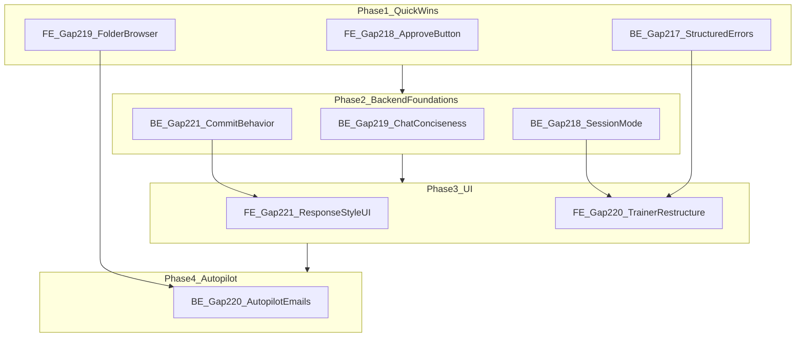

# Gap Resolution Plan — Autopilot, Audit Review, Trainer & Chat

**Created:** 2026-08-12  
**Status:** Active execution guide (supersedes stale gap lists in session chat; trackers remain source of truth for `[x]`/`[ ]` status)

This guide covers 9 open gaps across Autopilot, Audit Review, Trainer, and Chat. Follow phases in order unless noted as parallel.

**Trackers (status source of truth):**
- `apps/invoice-be/docs/be_features_tracker.md`
- `apps/invoice-fe/docs/fe_features_tracker.md`

**Related:** `implementation_plan_updated.md` (12-week MVP roadmap, retired 2026-07-27)

---

## Scope — 9 gaps in execution order

| Order | Gap | App | Area | Task |
|-------|-----|-----|------|------|
| 1 | FE 218 | invoice-fe | Audit Review | Rename "Mark Paid & Finalize" → "Approve Invoice" |
| 2 | BE 217 | invoice-be | Trainer | Structured guardrail rejection JSON on commit |
| 3 | FE 219 | invoice-fe | Autopilot | Folder browser for `source_ref` |
| 4 | BE 219 | invoice-be | Chat | Conciseness system prompt in `query_agent.py` |
| 5 | BE 221 (new) | invoice-be | Chat/Trainer | `commit-behavior` API + storage |
| 6 | BE 218 | invoice-be | Trainer | `session_mode`: qa_test vs rule_creation |
| 7 | FE 221 | invoice-fe | Trainer/Chat | Chat Response Style UI panel |
| 8 | FE 220 | invoice-fe | Trainer | UI restructure (Global + Vendor sections) |
| 9 | BE 220 | invoice-be | Autopilot | Send notification emails after sync |

**Deferred (product decision):** FE Gap 112 items 5–8 (per-alert corrections, alert allowlist, dismiss friction, outbound Trainer sandbox).

---

## Dependency graph



Phase 1 items are independent and can run in parallel. Phase 2 must complete before Phase 3.

---

## Phase 1 — Quick wins (parallel, ~1–2 days)

### 1.1 FE Gap 218 — Approve Invoice button

**Files:** `apps/invoice-fe/app/invoices/review/[id]/page.tsx`

- Change inbound button label from "Mark Paid & Finalize" to "Approve Invoice"
- Update confirmation dialog / tooltip copy on inbound flow only
- Do **not** change `PAID` status enum or `outbound-review/[id]/page.tsx`

**Tests:** `e2e/audit-review-console.spec.ts`, `npx tsc --noEmit`

**Docs:** `feature_4_auditor.md`, `fe_features_tracker.md`

---

### 1.2 BE Gap 217 — Structured guardrail rejection

**Files:** `apps/invoice-be/routers/trainer.py`

- On instruction-like rule rejection, return structured JSON:
  `{ "detail": "...", "rejection_reason": "is_instruction", "flagged_rule": "..." }`

**Tests:** `tests/test_trainer.py`

---

### 1.3 FE Gap 219 — Autopilot folder browser

**Files:** `apps/invoice-fe/app/ingestion/page.tsx`, `components/connectors/FolderTreeExplorer.tsx`

- Replace plain `source_ref` text input with folder name + Browse button
- Reuse `ConnectorBrowseBar` / `FolderTreeExplorer` pattern
- Add `selectionMode="folder"` if needed

**Tests:** `e2e/autopilot-folder-browser.spec.ts`

---

## Phase 2 — Backend foundations (~2–3 days)

### 2.1 BE Gap 219 — Chat conciseness

**Files:** `apps/invoice-be/agents/query_agent.py`

- Add brevity instruction to SQL, RAG, and CHAT system prompts

**Tests:** `tests/test_rag.py`

---

### 2.2 BE Gap 221 — Chat Response Style API

**Files:** `routers/trainer.py`, `models.py`, migration if needed

- `POST /trainer/sessions/{id}/commit-behavior`
- Store `response_length`, `tone`, `custom_instructions` separately from extraction rules
- Inject into `query_agent.py` at chat time

**Tests:** `tests/test_trainer.py`, `tests/test_rag.py`

---

### 2.3 BE Gap 218 — Trainer dual-mode session

**Files:** `services/trainer_sessions.py`, `routers/trainer.py`

- `session_mode`: `"qa_test"` | `"rule_creation"`
- `qa_test` → `run_query_agent()`; `rule_creation` → `run_trainer_agent()`

**Tests:** `tests/test_trainer.py`

---

## Phase 3 — Trainer + Chat UI (~2–3 days)

### 3.1 FE Gap 221 — Chat Response Style panel

**Files:** `components/trainer/ChatResponseStylePanel.tsx`, `app/trainer/page.tsx`, proxy route

**Depends on:** BE 221

---

### 3.2 FE Gap 220 — Trainer UI restructure

**Files:** `app/trainer/page.tsx`, `ScopeSelector.tsx`

- Global Rules + Vendor Rules sections
- Vendor sub-tabs: Test Chat / Add Rules
- Wire BE 217 structured errors into commit toast

**Depends on:** BE 218, FE 221, BE 217

---

## Phase 4 — Autopilot notifications (~1 day)

### 4.1 BE Gap 220 — Notification emails after sync

**Files:** `services/autopilot_sync.py`, `services/staff_notify.py`

- After sync, email `notify_emails` with summary; include review links when `send_approval_links=True`

**Tests:** `tests/test_autopilot.py` (mock `send_email`)

---

## Phase 5 — Integration sign-off (~1 day)

```bash
cd apps/invoice-be && uv run pytest tests/test_trainer.py tests/test_rag.py tests/test_autopilot.py tests/test_staff_notify.py -q
cd apps/invoice-fe && npx tsc --noEmit && npx playwright test e2e/audit-review-console.spec.ts e2e/autopilot-folder-browser.spec.ts
```

### Manual live checklist

| # | Screen | Expected |
|---|--------|----------|
| 1 | Audit Review | Button says "Approve Invoice" |
| 2 | Autopilot | Browse folder, save, Sync Now uses picked ID |
| 3 | Trainer Test Chat | Answers questions, no rule mutation |
| 4 | Trainer Add Rules | Corrections refine extraction |
| 5 | Trainer Response Style | Chat reflects length/tone |
| 6 | Chat | 1–3 sentence answers |
| 7 | Autopilot sync | Email with review links (if SendGrid live) |

### Documentation closure

- Mark gap `[x]` in tracker
- Update matching `feature_N_*.md`
- Update `test_coverage_map.md` + `test_evidence/`
- Tasklist: `.claude/tasklists/senior-dev-gap-resolution.md`

---

## Risks

| Risk | Mitigation |
|------|------------|
| FE 218 vs BE 218 same number | Prefix in commits: `FE Gap 218` / `BE Gap 218` |
| SendGrid not live (Gap 125) | Mock in unit tests |
| FolderTreeExplorer multi-import | Add `selectionMode="folder"` |

---

## Effort estimate: 7–10 dev days
