# Invoice AI SaaS Platform — Presentation, Demo & ER Architecture Master Guide

> **Audience:** Solution Architects, Sales Engineers, Product Managers, and Enterprise Clients.  
> **Purpose:** Comprehensive guide for presenting, demonstrating, and understanding every page, functionality, workflow, and database entity-relationship (ER) structure in the Invoice AI platform.  
> **Last Updated:** 2026-09-09

---

## Table of Contents

1. [Executive Summary & Platform Narrative](#1-executive-summary--platform-narrative)
2. [Global System Architecture Context](#2-global-system-architecture-context)
3. [Master Entity-Relationship (ER) Overview](#3-master-entity-relationship-er-overview)
4. [Page 1: Dashboard (`/dashboard` & `/outbound-dashboard`)](#4-page-1-dashboard-dashboard--outbound-dashboard)
5. [Page 2: Ingestion & Ingestion History (`/ingestion` & `/history`)](#5-page-2-ingestion--ingestion-history-ingestion--history)
6. [Page 3: Audit & Review Cockpit (`/invoices/review/[id]` & `/outbound-review/[id]`)](#6-page-3-audit--review-cockpit-invoicesreviewid--outbound-reviewid)
7. [Page 4: Trainer & Continuous Learning (`/trainer`)](#7-page-4-trainer--continuous-learning-trainer)
8. [Page 5: Chat, Analyze & Business Intelligence Insights (`/chat`)](#8-page-5-chat-analyze--business-intelligence-insights-chat)
9. [Page 6: Settings Control Plane & Integrations (`/settings`)](#9-page-6-settings-control-plane--integrations-settings)
10. [End-to-End Client Demo Script & Presentation Flow](#10-end-to-end-client-demo-script--presentation-flow)

---

## 1. Executive Summary & Platform Narrative

### What is Invoice AI?
Invoice AI is an **enterprise-grade autonomous accounts-payable (AP) and accounts-receivable (AR) financial intelligence platform**. It eliminates manual document entry, mathematically validates every figure against source scans, continuously learns vendor layout variations, and enables finance teams to converse with their financial data in real time.

### Why do organizations need it?
1. **The Cost of Manual Processing**: Manual AP processing costs $12–$15 per invoice and takes 8–15 minutes of human effort.
2. **The Fragility of Traditional OCR**: Legacy optical character recognition relies on rigid zonal coordinate templates that break whenever a vendor shifts a column or updates a logo.
3. **The Risk of Financial Leakage**: 2–4% of invoices contain subtle arithmetic, rounding, duplicate, or tax overbilling discrepancies that go unnoticed.
4. **Dispute Resolution Gridlock**: Resolving purchase order (PO) discrepancies requires hours of cross-referencing paper trails across disparate systems.

### Quantifiable Client ROI
- **85% Reduction** in end-to-end invoice turnaround time (from 15 minutes to under 5 seconds).
- **100% Elimination** of arithmetic and overbilling leakage via zero-LLM deterministic math verification.
- **Zero Ongoing Template Setup**: Multimodal foundation models parse unseen layouts out-of-the-box.
- **Continuous Learning**: Auditor corrections automatically synthesize vendor rules without engineering intervention.

---

## 2. Global System Architecture Context

The platform is architected as a cloud-native, multi-tenant microservices deployment on Microsoft Azure:

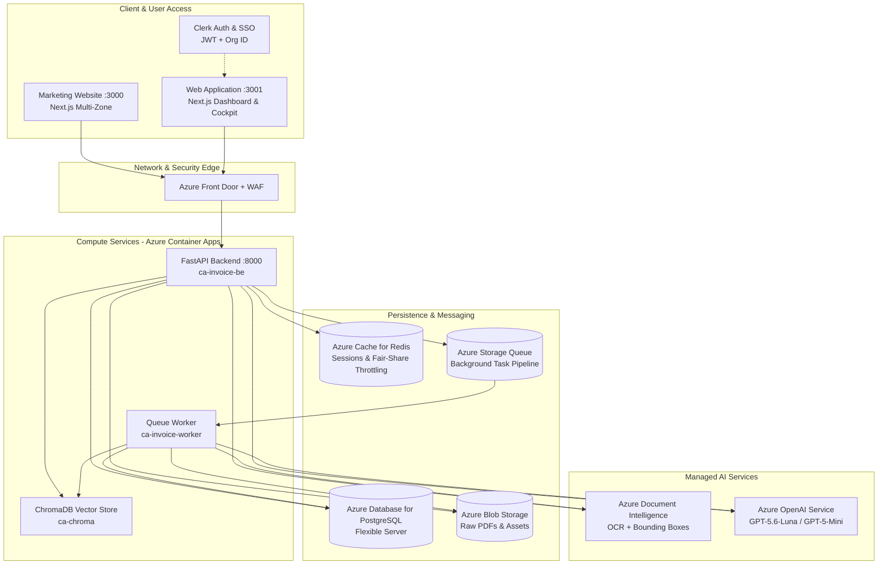

---

## 3. Master Entity-Relationship (ER) Overview

Below is the high-level relationship between the fundamental database entities enforced across PostgreSQL:

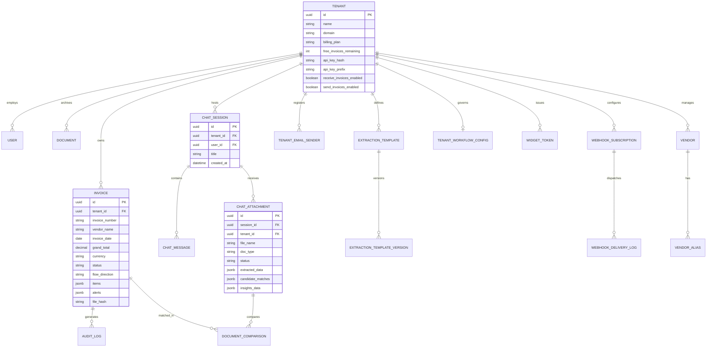

---

## 4. Page 1: Dashboard (`/dashboard` & `/outbound-dashboard`)

### 4.1 Why We Use It & Business Purpose
The Dashboard is the operational command center for financial controllers and CFOs. It provides real-time visibility into working capital, pending liabilities, processing throughput, invoice accuracy ratios, and cash-flow obligations without requiring manual data roll-ups.

### 4.2 Functionality & How It Works
- **Dual Directional Views**: Seamless toggle between **Inbound AP (Accounts Payable)** and **Outbound AR (Accounts Receivable)**.
- **Computed Platform KPIs**:
  - *Total Spend / Revenue*: Aggregated from `SUM(grand_total)` of completed invoices for the filtered period.
  - *Autonomous Accuracy %*: Calculated as `(clean_invoices / total_completed) * 100`. Demonstrates how many invoices bypassed human audit without discrepancies.
  - *Processing Velocity*: Average time taken from upload timestamp (`created_at`) to completion timestamp (`completed_at`).
  - *Overdue Liabilities*: Real-time identification of invoices whose `due_date < CURRENT_DATE` where status is not `PAID`.
- **Time-Series Charts**: Spend trends by vendor, volume by day/week, and breakdown of discrepancies.

### 4.3 Entity-Relationship (ER) Diagram: Dashboard Domain

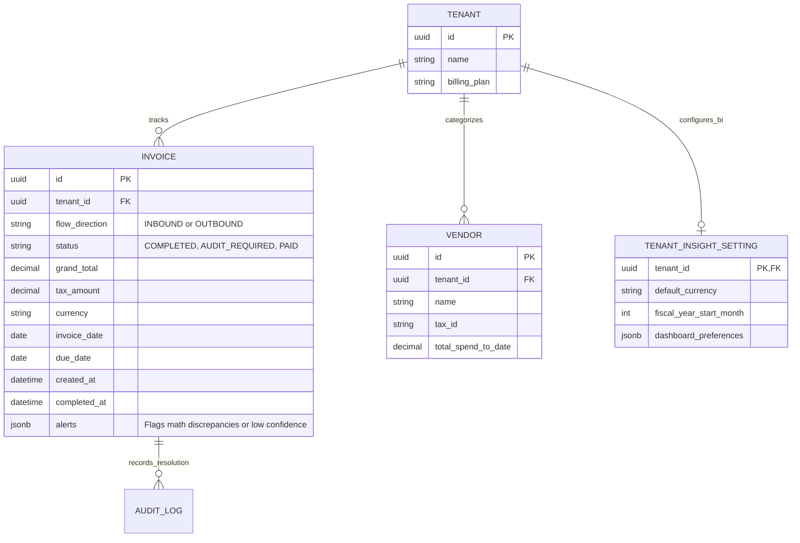

### 4.4 Functional Workflow Diagram

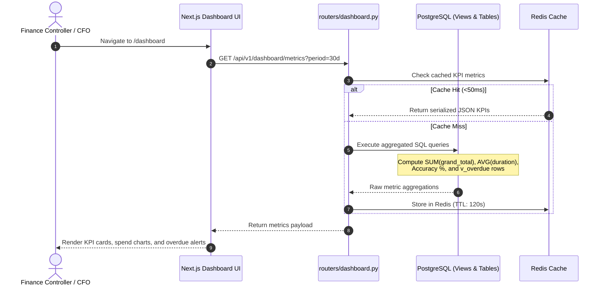

### 4.5 Demo & Presentation Script
> **Presenter Action**: Open `/dashboard`.  
> **Talking Point**: *"Here, leadership gets instant visibility into cash outlays. Notice that every figure here is computed directly from our PostgreSQL database—zero AI hallucinations. Our autonomous accuracy rating is at 98.4%, meaning over 98 out of 100 vendor invoices pass our automated arithmetic checks and get processed in under 5 seconds without a human touching them."*

---

## 5. Page 2: Ingestion & Ingestion History (`/ingestion` & `/history`)

### 5.1 Why We Use It & Business Purpose
The Ingestion portal solves the chaos of multi-channel invoice intake. Enterprises receive invoices via emails, cloud storage, manual uploads, and APIs. This portal provides a unified entry gate with automatic deduplication, format normalization, and batch tracking.

### 5.2 Functionality & How It Works
- **Multi-File Drag & Drop**: Accepts single and multi-page PDFs, TIFFs, PNGs, and JPEGs.
- **Google Drive Shortcut**: One-click browsing of connected Google Drive folders mapped in Settings.
- **Layer-1 Deduplication**: Generates a cryptographic `SHA-256` hash of the file bytes on upload. If that file hash already exists for the tenant, it is immediately marked as `DUPLICATE` without consuming AI extraction tokens.
- **Ingestion History (`/history`)**: Complete audit trail showing batch IDs, document counts, ingestion door (`manual`, `email`, `drive`, `api`, `autopilot`), and real-time processing status.

### 5.3 Entity-Relationship (ER) Diagram: Ingestion Domain

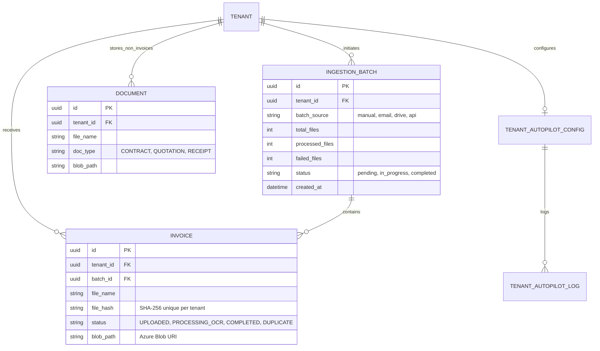

### 5.4 Functional Workflow Diagram

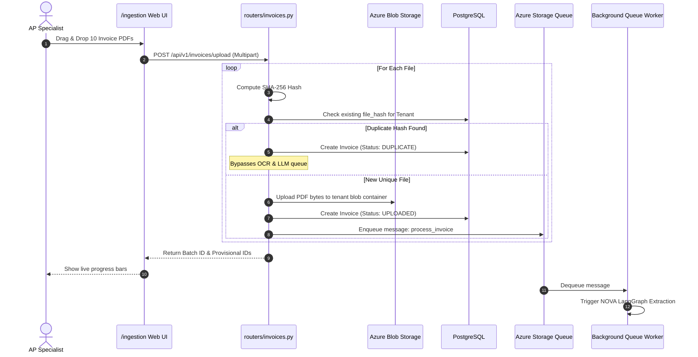

### 5.5 Demo & Presentation Script
> **Presenter Action**: Drag and drop 3 invoices on `/ingestion`. Re-drop one of the same invoices to demonstrate deduplication.  
> **Talking Point**: *"Watch how seamless intake is. You don't need to specify vendors or templates. When I drop an identical file a second time, our Layer-1 SHA-256 deduplication instantly catches it, protecting the client from paying the same bill twice and saving LLM compute."*

---

## 6. Page 3: Audit & Review Cockpit (`/invoices/review/[id]` & `/outbound-review/[id]`)

### 6.1 Why We Use It & Business Purpose
The Audit Cockpit enforces **Zero-Trust Financial Governance**. When an invoice triggers an alert (e.g., math discrepancies, low OCR confidence, missing mandatory GST/tax data), it is quarantined here. It turns painful manual error hunting into a high-speed, side-by-side verification workflow.

### 6.2 Functionality & How It Works
- **Side-by-Side PDF Viewer**: Displays the original scanned document alongside extracted structured fields with bounding-box highlights.
- **SENTINEL Verification Badges**:
  - *Totals Math Check*: Deterministically validates that $\text{Subtotal} + \text{Tax} - \text{Discount} \pm \text{Roundoff} = \text{Grand Total}$.
  - *Line Items Math Check*: Validates that each line's $\text{Quantity} \times \text{Unit Price} = \text{Amount}$.
  - *Faithfulness Check*: Verifies that the extracted grand total appears verbatim in the source OCR text.
  - *Tax Split Check*: Validates CGST + SGST = Total GST for Indian compliance.
- **One-Click Audit Actions**: Approve, Reject, or Edit fields. Editing records a before/after diff in `AuditLog`. If an auditor corrects the same field 3 times for a vendor, the system suggests a permanent rule for EVOLVE.

### 6.3 Entity-Relationship (ER) Diagram: Audit Domain

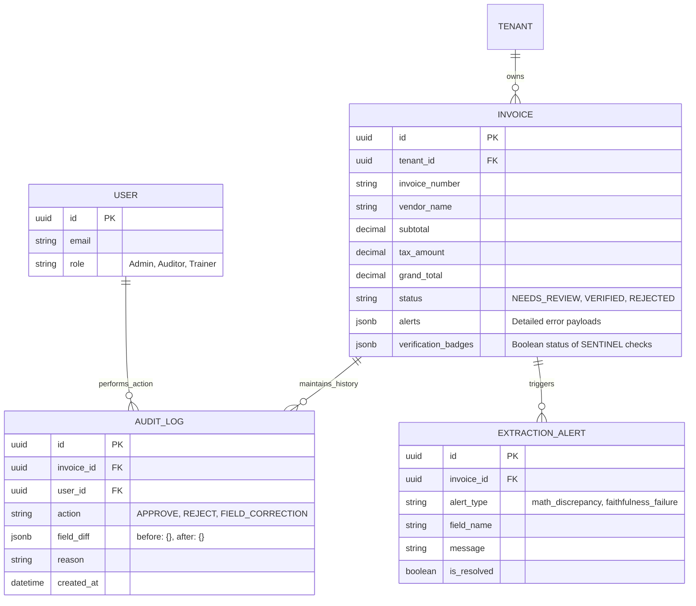

### 6.4 Functional Workflow Diagram

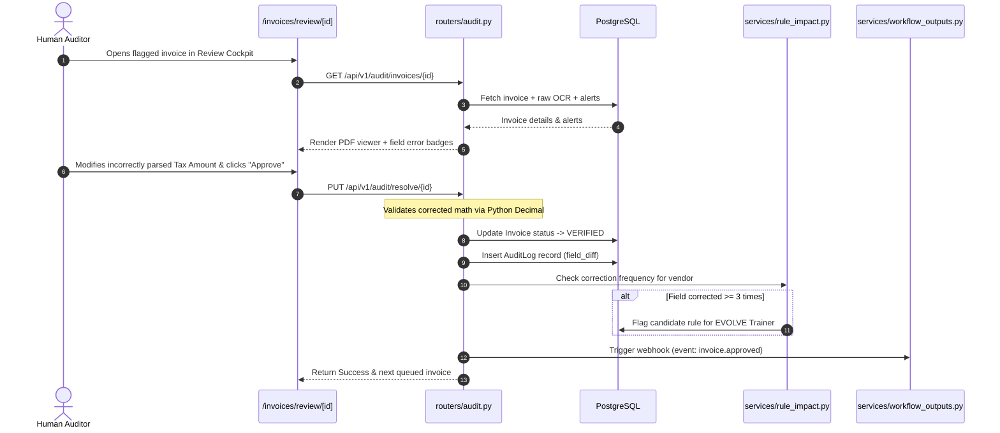

### 6.5 Demo & Presentation Script
> **Presenter Action**: Open an invoice with an intentional math discrepancy alert.  
> **Talking Point**: *"Look at this red alert badge. The vendor's printed grand total is ₹10,500, but the sum of line items is ₹10,000. Our SENTINEL agent caught this automatically. The auditor didn't have to pull out a calculator. With one click, we can correct the amount, log the audit trail, and approve it. Furthermore, every correction is tracked so the system learns from it."*

---

## 7. Page 4: Trainer & Continuous Learning (`/trainer`)

### 7.1 Why We Use It & Business Purpose
The EVOLVE Trainer represents the **self-improving brain** of the platform. In traditional OCR, when a vendor changes their invoice format, customers must wait weeks for an engineer to update coordinate scripts. The Trainer allows business users to teach the AI vendor-specific extraction rules in seconds with zero coding.

### 7.2 Functionality & How It Works
- **Redis-Backed Sandbox**: Isolates testing in a Redis session (`trainer:session:{id}`) so candidate rules never corrupt live production data.
- **Session Types**:
  - *From-Invoice Session*: Anchored to an existing flagged invoice; re-uses stored OCR text without re-running Document Intelligence.
  - *Upload Session*: Transient document testing for upcoming vendor templates.
- **Rule Impact Simulation**: Replays candidate rules against historical invoices from that vendor to verify that fixing one invoice doesn't break ten others.
- **Template Versioning & Rollback**: Every committed template increments an `ExtractionTemplateVersion`. If a rule behaves poorly in production, the admin can roll back to a previous version with a single click.

### 7.3 Entity-Relationship (ER) Diagram: Trainer Domain

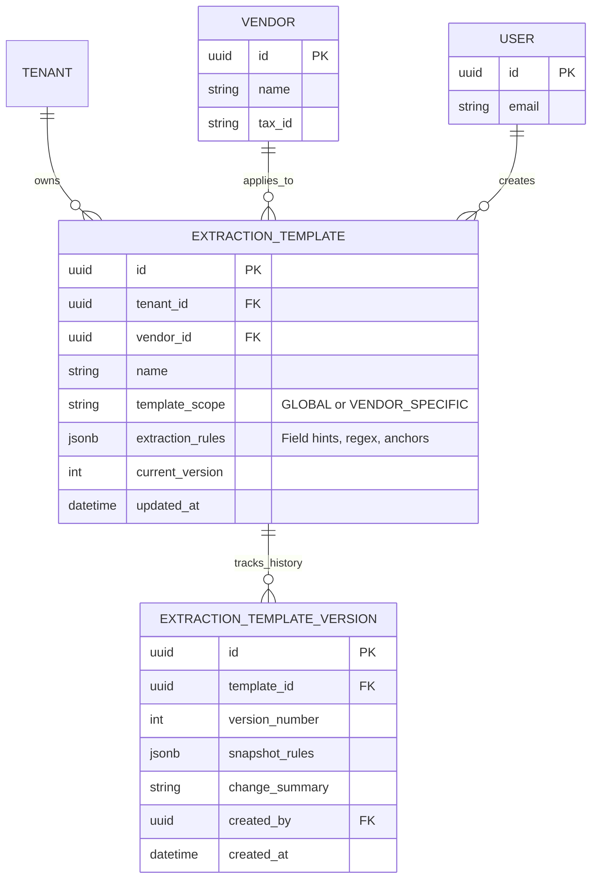

### 7.4 Functional Workflow Diagram

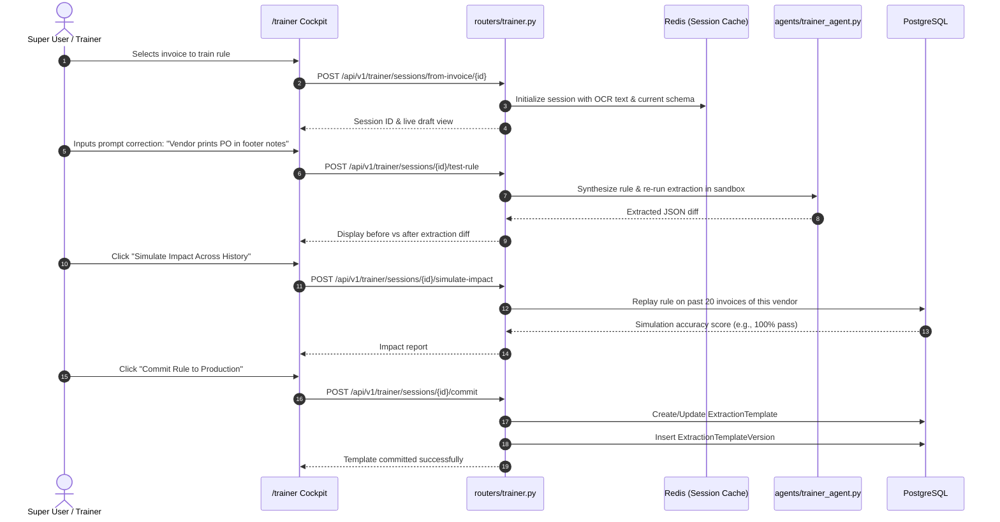

### 7.5 Demo & Presentation Script
> **Presenter Action**: Open `/trainer`. Type a natural language rule like *"Extract the vendor's Tax ID from the bottom right corner"*. Click Test.  
> **Talking Point**: *"This is our EVOLVE engine. When a vendor formats their documents abnormally, you don't submit a support ticket or hire developers. You instruct EVOLVE in plain English. The sandbox verifies it immediately, tests it across past invoices, and commits a versioned template. The platform literally gets smarter every single day."*

---

## 8. Page 5: Chat, Analyze & Business Intelligence Insights (`/chat`)

### 8.1 Why We Use It & Business Purpose
The Chat and Insights page transforms static financial ledgers into an **interactive conversation**. Instead of navigating complex ERP menus, finance executives can ask questions in natural language. Furthermore, via **Feature 26 (Chat with Attachment)** and **Feature 30 (BI Insights Bubble)**, users can drag-and-drop a Purchase Order or Bank Statement and instantly receive an automated 3-way match and discrepancy breakdown.

### 8.2 Functionality & How It Works
- **SAGE Query Routing**: Automatically routes user queries into three execution branches:
  1. *Structured Financial Queries* $\rightarrow$ Synthesizes secure SQL queries, validates AST tenant isolation, and executes against PostgreSQL.
  2. *Unstructured Context Queries* $\rightarrow$ Vector retrieval over ChromaDB (`invoice_chunks_{tenant_id}`) using BAAI/bge-m3 embeddings.
  3. *Chitchat & Platform Help* $\rightarrow$ Answers usability and documentation questions.
- **Feature 26: Chat with Attachment**:
  - 6-stage asynchronous pipeline: OCR $\rightarrow$ Extract $\rightarrow$ Vector Index $\rightarrow$ 3-Tier Match $\rightarrow$ Proactive BI Bubble $\rightarrow$ Ready.
  - **3-Tier Invoice Matching**:
    - *Tier 1*: Exact normalized PO number match.
    - *Tier 2*: Vendor name token Jaccard overlap within a 90-day date window.
    - *Tier 3*: Cosine vector similarity proposal (requires user confirmation before diffing).
- **Feature 30: Business Intelligence (BI) Bubble**:
  - Automatically renders proactive insight cards: *Agreed vs Billed*, *Terms Check*, *Net Position*, *Delivery vs Order*, *Cash Impact*, and *Discrepancy Table*.
  - **Deterministic Diffing**: Line items are compared using exact Python Decimal arithmetic—the LLM only narrates the findings.

### 8.3 Entity-Relationship (ER) Diagram: Chat & Intelligence Domain

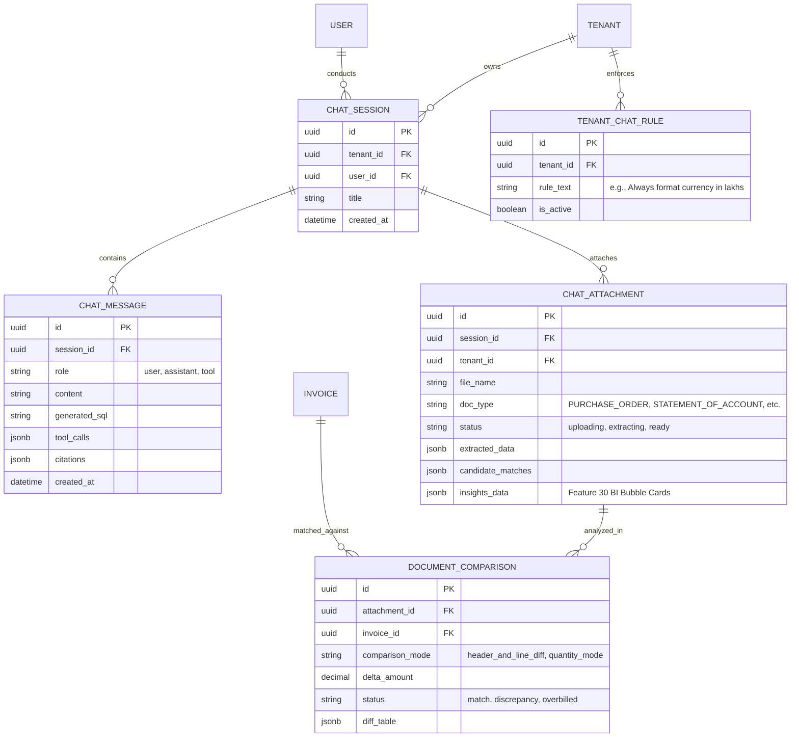

### 8.4 Functional Workflow Diagram: Chat with Attachment & Insights

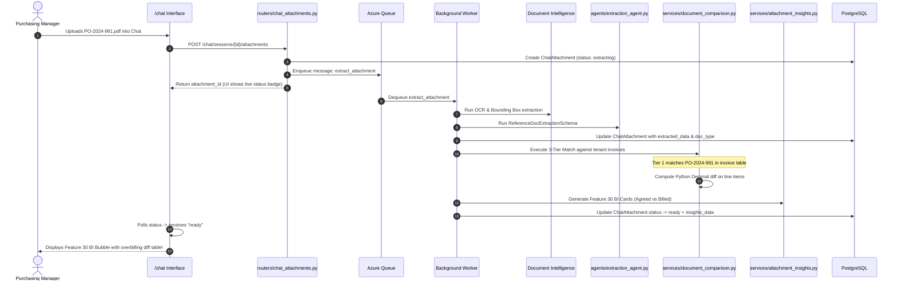

### 8.5 Demo & Presentation Script
> **Presenter Action**: Open `/chat`.  
> 1. Type: *"What was our total spend with Dell Technologies in Q3 broken down by month?"* $\rightarrow$ SAGE generates SQL, displays a clean summary table.  
> 2. Upload a Purchase Order PDF in chat. Within seconds, show the proactive BI Bubble popping up with the discrepancy card.  
> **Talking Point**: *"This is our SAGE intelligence engine. Anyone in finance can ask questions without knowing SQL. And look at what happens when I drop a vendor Purchase Order: SAGE automatically reads it, locates the corresponding invoice in our database, compares line items down to quantity and price, and alerts us if the vendor charged more than the agreed PO price."*

---

## 9. Page 6: Settings Control Plane & Integrations (`/settings`)

### 9.1 Why We Use It & Business Purpose
The Settings Control Plane gives enterprise IT and finance administrators granular control over system behavior, automation policies, security parameters, ingestion channels, and third-party webhooks.

### 9.2 Functionality & Structure of the 7 Integration Tiles

```
+---------------------------------------------------------------------------------+
|                                 /settings TILES                                 |
+---------------------------------------------------------------------------------+
|  [ Workflows ]     -> 4-Step Plug & Play Setup Wizard (Inputs/Policy/Outputs)   |
|  [ Connectors ]    -> Google Drive OAuth 2.0 & Directory Folder Mapping         |
|  [ Email Setup ]   -> Shared App Mailbox & Inbound/Outbound Authorized Sets     |
|  [ Admin Console ] -> Clerk User Management, Roles, and Permission Grants      |
|  [ Subscriptions ] -> Pricing Plans (Free/Pro/Pro Combined), PayU Quotas       |
|  [ Webhooks ]      -> Signed HMAC-SHA256 HTTP Callbacks for 9 Lifecycle Events  |
|  [ Security ]      -> Salted SHA-256 API Keys, CORS Widget Tokens, Audit Logs   |
+---------------------------------------------------------------------------------+
```

- **Tile 1: Workflows (`/settings/workflows` — Features 17 & 25)**:
  - *Inputs*: Multi-select between Email, Drive, API, or Manual upload.
  - *Audit Policy*:
    - **Full Automation**: API key has `actions` scope; clean invoices finalize autonomously.
    - **Strict Review**: API key has `readonly` scope; human must approve every invoice.
  - *Outputs*: Webhooks, Email Summaries, Google Drive Archives, or Dashboard only.
  - *Chat Access*: Dashboard, API, or Embeddable Web Widget.
- **Tile 2: Connectors (`/settings/connectors`)**:
  - Google Drive integration using `FolderTreeExplorer` for browsing remote directory trees.
  - Configures default shortcuts for Inbound AP and Outbound AR storage.
- **Tile 3: Email Setup (`/settings/email`)**:
  - Configures the shared platform mailbox (`invoices@invoiceeq.app`).
  - Manages **Inbound Authorized Senders** (vendors sending AP bills) and **Outbound Authorized Senders** (internal accounting sending AR invoices).
- **Tile 4: Security & Access Control (`/settings/security`)**:
  - Management of live tenant API keys (`inv_live_...`). Hashed via salted SHA-256 with one-time reveal upon rotation.
  - Management of public Chat Widget Tokens (`inv_wgt_...`) with CORS domain whitelisting.
- **Tile 5: Webhooks (`/settings/webhooks`)**:
  - Subscribes external ERPs to 9 invoice lifecycle events.
  - Every payload is signed with HMAC-SHA256 (`X-InvoiceAI-Signature`).

### 9.3 Entity-Relationship (ER) Diagram: Settings & Governance Domain

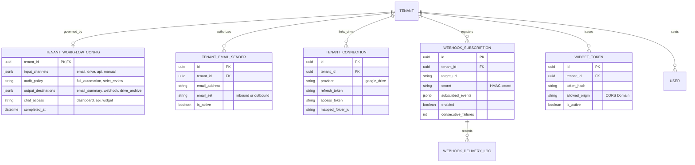

### 9.4 Functional Workflow Diagram: Plug & Play Policy Execution

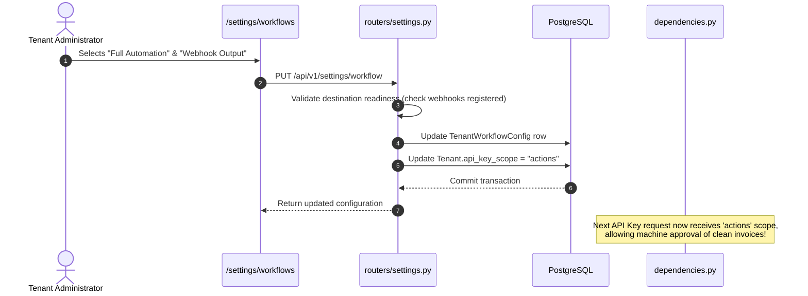

### 9.5 Demo & Presentation Script
> **Presenter Action**: Open `/settings`. Navigate to `/settings/workflows`.  
> **Talking Point**: *"Here, an enterprise sets their governance boundaries in four clicks. Do you want machines to approve invoices with 100% clean math? Select 'Full Automation'. Do you require a human sign-off on every dollar? Select 'Strict Review'. And when invoices are approved, our webhooks engine instantly pushes the structured data directly into your SAP or NetSuite ERP via signed HMAC payloads."*

---

## 10. End-to-End Client Demo Script & Presentation Flow

Follow this chronological script for a 15-minute winning client demonstration:

| Timeline | Page / Feature | Action & Visual | Key Message to Deliver |
|---|---|---|---|
| **00:00 – 02:00** | **Executive Intro** | Show [Master Architecture](#2-global-system-architecture-context) diagram | Introduce Invoice AI as an autonomous AP/AR platform that eliminates 85% of processing time with zero math leakage. |
| **02:00 – 05:00** | **Ingestion (`/ingestion`)** | Drag & drop 3 multi-page PDFs. Drop duplicate file. Show `/history`. | Multi-channel intake. Explain Layer-1 SHA-256 deduplication that blocks duplicate billing before touching the AI. |
| **05:00 – 08:00** | **Audit Cockpit (`/invoices/review/[id]`)** | Open an invoice with an alert. Point to SENTINEL math badges. | Zero-Trust Verification. The LLM never does math—hardcoded Python Decimal logic catches vendor arithmetic errors and tax splits. |
| **08:00 – 10:00** | **Trainer (`/trainer`)** | Correct a vendor field. Click "Test in Sandbox" and view historical replay. | Continuous learning (EVOLVE). The system learns vendor layout exceptions without code or engineering tickets. |
| **10:00 – 13:00** | **Chat & Insights (`/chat`)** | Ask a natural language spend query. Upload a Purchase Order PDF. | Conversational finance (SAGE). Show instant text-to-SQL spend breakdown, followed by automated 3-way matching and the Feature 30 BI Bubble. |
| **13:00 – 15:00** | **Settings (`/settings`)** | Show Workflow Wizard (Strict vs Auto) & Webhook integrations. | Enterprise governance and ERP plug-and-play readiness. |

---
*Generated 2026-09-09 — Complete Architecture & Presentation Guide.*
